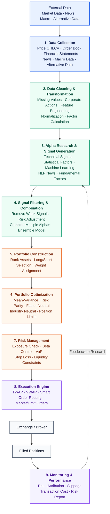

# CTA Strategy

## 完整的交易流程

## What Is a CTA Strategy?

A **CTA (Commodity Trading Advisor) strategy** is a systematic investment strategy that primarily trades **futures contracts** across multiple asset classes, including equities, fixed income, commodities, and currencies.

Despite the name, modern CTAs are **not limited to commodities**. They typically trade highly liquid futures markets such as:

- Equity index futures, such as the S&P 500 and Nasdaq
- Treasury futures
- Currency futures
- Energy futures, such as oil and natural gas
- Precious metals, such as gold and silver
- Agricultural commodities

The objective of a CTA is to generate **absolute returns** regardless of whether markets are rising or falling.

## 1. Why CTA/Momentum Strategies Work

- **Information diffusion:** Small pieces of news that are not headline-grabbing but have significant long-term macroeconomic effects may spread gradually, creating sustained buying or selling pressure. This explanation may have weakened since 2008 because modern computing and faster data distribution allow markets to incorporate news much more quickly.
- **Selective momentum capture:** Many academic studies have found that assets that performed well over the previous several months tend to continue performing well, while weak-performing assets often continue declining.
  - 大资金完成买卖需要时间。
  - 投资者存在“追涨杀跌”的心理。
  - 重大经济事件的影响通常不会在一天内结束。

Neither explanation is fully conclusive, but momentum strategies have demonstrated durable long-term profitability historically.

## 2. Long/Short Mechanics in CTA

- A **long position** seeks to profit by buying at a lower price and selling later at a higher price.
- A **short position** seeks to profit by borrowing and selling an asset, then buying it back later at a lower price.
- To deploy capital fully, portfolios may combine long and short positions—for example, using 150/50 or 200/100 structures—instead of leaving capital unallocated.
- Empirically, long positions often contribute more to P&L than short positions of a similar size, possibly because of a carry or risk-free-rate effect.

## 3. Market Participants by Holding Period

The following participants are ordered approximately from the longest to the shortest holding period:

1. **Index and passive funds:** Firms such as Vanguard and BlackRock may hold positions for years or decades. Pension funds often favor bonds because of their predictable cash flows.
2. **Active managers:** Firms such as Fidelity and PIMCO generally reposition monthly or quarterly and rely more heavily on discretionary or fundamental analysis.
3. **Hedge funds:** These funds often require high minimum investments, impose lockup periods, and charge both management and performance fees. Their holding periods commonly range from intraday to several days, depending on the strategy.
4. **Market makers:** Firms such as Optiver, Citadel Securities, IMC, and Susquehanna provide liquidity, operate over extremely short holding periods, and often seek to minimize overnight exposure.
5. **Noise traders:** Retail or uninformed order flow with no consistent holding period or reliable informational content.
