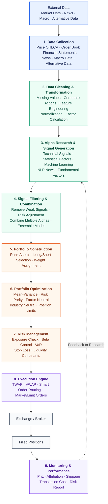

# CTA Strategy

## 完整的交易流程



## What Is a CTA Strategy?

A **CTA (Commodity Trading Advisor) strategy** is a systematic investment strategy that primarily trades **futures contracts** across multiple asset classes, including equities, fixed income, commodities, and currencies.

Despite the name, modern CTAs are **not limited to commodities**. They typically trade highly liquid futures markets such as:

- Equity index futures, such as the S&P 500 and Nasdaq
- Treasury futures
- Currency futures
- Energy futures, such as oil and natural gas
- Precious metals, such as gold and silver
- Agricultural commodities

The objective of a CTA is to generate **absolute returns** regardless of whether markets are rising or falling.

## 1. Why CTA/Momentum Strategies Work

- **Information diffusion:** Small pieces of news that are not headline-grabbing but have significant long-term macroeconomic effects may spread gradually, creating sustained buying or selling pressure. This explanation may have weakened since 2008 because modern computing and faster data distribution allow markets to incorporate news much more quickly.
- **Selective momentum capture:** Many academic studies have found that assets that performed well over the previous several months tend to continue performing well, while weak-performing assets often continue declining.
  - 大资金完成买卖需要时间。
  - 投资者存在“追涨杀跌”的心理。
  - 重大经济事件的影响通常不会在一天内结束。

Neither explanation is fully conclusive, but momentum strategies have demonstrated durable long-term profitability historically.

## 2. Long/Short Mechanics in CTA

- A **long position** seeks to profit by buying at a lower price and selling later at a higher price.
- A **short position** seeks to profit by borrowing and selling an asset, then buying it back later at a lower price.
- To deploy capital fully, portfolios may combine long and short positions—for example, using 150/50 or 200/100 structures—instead of leaving capital unallocated.
- Empirically, long positions often contribute more to P&L than short positions of a similar size, possibly because of a carry or risk-free-rate effect.

## 3. How Short Selling Works / 做空的原理

A common confusion: *how can you sell shares you do not own, and why does
"owing shares" make sense?* The answer is that a short sale is not selling out
of thin air — **you borrow the shares first**, exactly like borrowing money,
except the thing borrowed is stock. 你不是凭空卖，而是"先借来再卖"。

### The four steps / 四个步骤

```text
1. Borrow  借入   — borrow N shares from a lender (broker / long-term holder)
2. Sell    卖出   — sell those borrowed shares now, receive cash
3. Buy back 买回  — later buy N shares back from the market
4. Return  归还   — return the N shares to the lender (close the position)
```

You never create shares from nothing; you use someone else's temporarily and
return an **equal quantity of the same stock** later. Shares are fungible (every
SPY share is identical), so returning "N shares of SPY" — not the exact
certificates — settles the debt. 股票同质可替代，还等量同种即可。

### Why it makes sense — a cola analogy / 一个类比

You think cola will get cheaper next week:

```text
Today : borrow 1 case (worth $100), sell it immediately  → receive $100
Later : cola drops, buy 1 case back for $80
        return the case to the lender                     → you keep $20
```

Profit = **sell price − buy-back price**. A short position is a bet that the
price **falls**. 做空就是"赌它跌"：跌了→还债更便宜→赚；涨了→还债更贵→亏。

### Why lenders lend / 出借方图什么

Long-term holders (Vanguard, BlackRock, pension funds — the buy-and-hold group
in the next section) earn a **lending fee / interest** on stock they were going
to sit on anyway. The broker matches borrowers with lenders and holds margin.
This mature market is called **securities lending 证券借贷**.

### Why shorting is riskier than going long / 为什么做空更危险

- **Long:** the most you can lose is 100% (price goes to 0). Loss is bounded.
- **Short:** the price can rise without limit, so the shares you owe can become
  arbitrarily expensive — **loss is theoretically unbounded**. Brokers require
  **margin** and may force a **buy-in** (forced close) to protect the lender.
  This is also why the 150/50 = 200% gross book is effectively **2× leverage**,
  not free money.

### In this backtest / 在本回测中

The code does **not** model borrowing, lending fees, or margin. It simply allows
a **negative share count** (`curr_shrs < 0`) and values it at
`asset_value = curr_shrs × close`, so a short shows up as a **negative position
value (a liability)** that *gains* when price falls and *loses* when price rises.
The simplification assumes shares are always borrowable and borrow costs are
zero — fine for a teaching backtest, but real trading must account for both.
负号代表"这是做空方向、是要还的债"，不是"亏损"。

## 4. Market Participants by Holding Period

The following participants are ordered approximately from the longest to the shortest holding period:

1. **Index and passive funds:** Firms such as Vanguard and BlackRock may hold positions for years or decades. Pension funds often favor bonds because of their predictable cash flows.
2. **Active managers:** Firms such as Fidelity and PIMCO generally reposition monthly or quarterly and rely more heavily on discretionary or fundamental analysis.
3. **Hedge funds:** These funds often require high minimum investments, impose lockup periods, and charge both management and performance fees. Their holding periods commonly range from intraday to several days, depending on the strategy.
4. **Market makers:** Firms such as Optiver, Citadel Securities, IMC, and Susquehanna provide liquidity, operate over extremely short holding periods, and often seek to minimize overnight exposure.
5. **Noise traders:** Retail or uninformed order flow with no consistent holding period or reliable informational content.
