# CTA Strategy

A ground-up series on understanding CTA strategies — from *what a CTA is* through data,
signals, position sizing, backtesting, and performance evaluation. Every chapter is backed
by runnable code and real market data.

📖 **The series lives in [`docs/`](docs/). Start at [00 · Index & Learning Path](docs/00-index.md).**

---

## The Full Trading Pipeline

```mermaid
%%{init: {'theme':'base','themeVariables':{'fontSize':'11px','lineColor':'#94a3b8'},'flowchart':{'nodeSpacing':18,'rankSpacing':28,'padding':6}}}%%
flowchart LR
    EXT["External Data<br/>market · news · macro"]
    DC["1 · Collection<br/>OHLCV · order book"]
    CLEAN["2 · Cleaning<br/>corp actions · features"]
    ALPHA["3 · Alpha Research<br/>signals · factors · ML"]
    FILTER["4 · Combination<br/>filter · risk-adjust"]
    PORT["5 · Construction<br/>rank · L/S · weights"]
    OPT["6 · Optimization<br/>mean-var · risk parity"]
    RISK["7 · Risk<br/>VaR · limits · stops"]
    EXEC["8 · Execution<br/>TWAP · VWAP · routing"]
    MARKET["Exchange<br/>Broker"]
    MON["9 · Monitoring<br/>PnL · slippage · costs"]

    EXT --> DC --> CLEAN --> ALPHA --> FILTER --> PORT --> OPT --> RISK --> EXEC
    EXEC --> MARKET -- filled --> MON
    MON -. feedback .-> ALPHA

    classDef source fill:#e8f1ff,stroke:#2563eb,color:#172554,stroke-width:1.5px;
    classDef research fill:#ecfdf5,stroke:#059669,color:#064e3b,stroke-width:1.5px;
    classDef portfolio fill:#fff7ed,stroke:#ea580c,color:#7c2d12,stroke-width:1.5px;
    classDef execution fill:#f5f3ff,stroke:#7c3aed,color:#4c1d95,stroke-width:1.5px;
    classDef venue fill:#f8fafc,stroke:#475569,color:#0f172a,stroke-width:1.5px;

    class EXT,DC source;
    class CLEAN,ALPHA,FILTER research;
    class PORT,OPT,RISK portfolio;
    class EXEC,MON execution;
    class MARKET venue;
```



Stage 2 maps to [Chapter 02](docs/02-data-and-corporate-actions.md), stage 3 to [Chapter 03](docs/03-building-signals.md),
stages 4–6 to [Chapter 04](docs/04-from-signal-to-position.md), and stages 8–9 to
[Chapter 05](docs/05-understanding-backtesting.md) and [Chapter 06](docs/06-evaluating-performance.md).

## Contents

| # | Chapter | Covers | Status |
|---|---|---|---|
| 00 | [Index & Learning Path](docs/00-index.md) | How to read this series, prerequisites per chapter | ✅ |
| 01 | [What Is a CTA Strategy](docs/01-what-is-cta.md) | Definition, why momentum works, long/short mechanics, short selling, market participants | ✅ |
| 02 | [Data & Corporate Actions](docs/02-data-and-corporate-actions.md) | Fields, the 37 tickers, split adjustment, data-quality checks | ✅ |
| 03 | [Building Your Own Signal](docs/03-building-signals.md) | Hypothesis framing, bucketed bar charts, reversal, risk-adjusted momentum, rolling quantiles, fast/slow combination, EWMA, smoothing | ✅ |
| 04 | [From Signal to Position](docs/04-from-signal-to-position.md) | weight → dollar → shares, holding period, the two portfolios | ✅ |
| 05 | [Understanding Backtesting](docs/05-understanding-backtesting.md) | Every column, timing offsets, look-ahead bias | ✅ |
| 06 | [Evaluating Performance](docs/06-evaluating-performance.md) | Why a single number hides the time dimension; Sharpe, drawdown, turnover, attribution | 🟡 partial |
| 07 | [Overfitting & Robustness](docs/07-overfitting-and-robustness.md) | Train/validation/test, why time series can't be split randomly, heat-map parameter sensitivity | 🟡 partial |
| 08 | [Toolbox: pandas](docs/08-toolbox-pandas.md) | Key functions used in this project | ✅ |
| 99 | [Glossary](docs/99-glossary.md) | English–Chinese term reference | ✅ |

Per-session class notes sit alongside the chapters as standalone files — chapters are organized by
concept, notes by date:

- [Lecture 01 · Momentum, Validation, and the Bucket Chart](docs/lecture-01-momentum-and-validation.md)
- [Lecture 02 · Reversal, Portfolio Weights, and Combining Horizons](docs/lecture-02-reversal-and-signal-combination.md)

## Layout

```
CTA_Strategy/
├── README.md                   Entry point + contents (this file)
├── docs/                       The series: concepts that stay true over time
│   └── figures/                Chart source (make_figures.py) + generated light/dark PNGs
├── CTA_data/                   Daily OHLCV for 37 ETFs
│   └── _unadjusted_raw/        Pre-adjustment originals (not picked up by the loaders)
├── Backtest_prototype/         Backtest prototype code + implementation notes
├── analyze_cta_data.py         Data validation and exploration
├── backtester.ipynb            Interactive backtest
└── output/                     Generated charts and summary tables
```

## How to Run

Python 3.9+ with `pandas` and `matplotlib`.

```bash
python analyze_cta_data.py                  # data validation → output/
python Backtest_prototype/backtest.py       # momentum backtest
python docs/figures/make_figures.py         # regenerate the chapter diagrams
```
