# CTA Strategy

A ground-up series on CTA strategies — from *what a CTA is* through data, signals, position sizing,
backtesting, and evaluation. Every chapter is backed by runnable code and real market data.

📖 **Start at [00 · Index &amp; Learning Path](docs/00-index.md).**

🤖 Coding agents: read **[AGENTS.md](AGENTS.md)** first — it carries the conventions this
repository is written to.

---

## The Full Trading Pipeline

```mermaid
%%{init: {'theme':'base','themeVariables':{'fontSize':'11px','lineColor':'#94a3b8'},'flowchart':{'nodeSpacing':18,'rankSpacing':28,'padding':6}}}%%
flowchart LR
    EXT["External Data<br/>market · news · macro"]
    DC["1 · Collection<br/>OHLCV · order book"]
    CLEAN["2 · Cleaning<br/>corp actions · features"]
    ALPHA["3 · Alpha Research<br/>signals · factors · ML"]
    FILTER["4 · Combination<br/>filter · risk-adjust"]
    PORT["5 · Construction<br/>rank · L/S · weights"]
    OPT["6 · Optimization<br/>mean-var · risk parity"]
    RISK["7 · Risk<br/>VaR · limits · stops"]
    EXEC["8 · Execution<br/>TWAP · VWAP · routing"]
    MARKET["Exchange<br/>Broker"]
    MON["9 · Monitoring<br/>PnL · slippage · costs"]

    EXT --> DC --> CLEAN --> ALPHA --> FILTER --> PORT --> OPT --> RISK --> EXEC
    EXEC --> MARKET -- filled --> MON
    MON -. feedback .-> ALPHA

    classDef source fill:#e8f1ff,stroke:#2563eb,color:#172554,stroke-width:1.5px;
    classDef research fill:#ecfdf5,stroke:#059669,color:#064e3b,stroke-width:1.5px;
    classDef portfolio fill:#fff7ed,stroke:#ea580c,color:#7c2d12,stroke-width:1.5px;
    classDef execution fill:#f5f3ff,stroke:#7c3aed,color:#4c1d95,stroke-width:1.5px;
    classDef venue fill:#f8fafc,stroke:#475569,color:#0f172a,stroke-width:1.5px;

    class EXT,DC source;
    class CLEAN,ALPHA,FILTER research;
    class PORT,OPT,RISK portfolio;
    class EXEC,MON execution;
    class MARKET venue;
```



Stage 2 → [100](docs/100-dataset.md) · stage 3 → [02](docs/02-building-signals.md) ·
stages 4–6 → [03](docs/03-from-signal-to-position.md) · stages 8–9 →
[04](docs/04-understanding-backtesting.md) and [05](docs/05-evaluating-performance.md).

## Contents

| #  | Chapter | Covers | Status |
| -- | ------- | ------ | ------ |
| 00 | [Index &amp; Learning Path](docs/00-index.md) | How to read this series, prerequisites per chapter | ✅ |
| 01 | [What Is a CTA Strategy](docs/01-what-is-cta.md) | What a CTA trades, momentum, long/short mechanics, market participants | ✅ |
| — | [How a Strategy Is Built](docs/00-pipeline.md) | Orientation: how signal, strategy, backtest and momentum relate, and the order they get built in | ✅ |
| 02 | [Building Your Own Signal](docs/02-building-signals.md) | Hypothesis framing, bucketed bar charts, reversal, risk-adjusted momentum, rolling quantiles, fast/slow combination, EWMA, smoothing | ✅ |
| 03 | [From Signal to Position](docs/03-from-signal-to-position.md) | weight → dollar → shares, holding period, the two portfolios | ✅ |
| 04 | [Understanding Backtesting](docs/04-understanding-backtesting.md) | Every column, timing offsets, look-ahead bias | ✅ |
| 05 | [Evaluating Performance](docs/05-evaluating-performance.md) | Why a single number hides the time dimension; Sharpe, drawdown, turnover, attribution | 🟡 partial |
| 06 | [Overfitting &amp; Robustness](docs/06-overfitting-and-robustness.md) | Train/validation/test, why time series can't be split randomly, heat-map parameter sensitivity | 🟡 partial |

Read 01 → 06 in order. The rest is reference, consulted rather than stepped through:

| #  | Document | What it is | Status |
| -- | -------- | ---------- | ------ |
| 07 | [Toolbox: pandas](docs/07-toolbox-pandas.md) | How the non-obvious pandas calls behave | ✅ |
| 99 | [Glossary](docs/99-glossary.md) | English–Chinese term reference | ✅ |
| 100 | [The Dataset](docs/100-dataset.md) | The 37-ticker sample, split adjustment, data-quality checks | ✅ |

Chapters read in order — each ends with a **Next** block: one concrete thing to do before moving on,
plus a checklist of what you should be able to explain. Class notes are absorbed into the chapter
that owns each concept; there is no parallel per-session record.

### Jump straight to a topic

| I want to…                                          | Go to                                                                                                   |
| ---------------------------------------------------- | ------------------------------------------------------------------------------------------------------- |
| See how signal, strategy and backtest fit together | [00 · pipeline](docs/00-pipeline.md) |
| Understand what a CTA trades, and how shorting works | [01](docs/01-what-is-cta.md)                                                                             |
| Check my price data before trusting it               | [100 § 1.1](docs/100-dataset.md)                                                       |
| See what the 37 tickers actually are                 | [100 § 2](docs/100-dataset.md)                                                         |
| Test whether my signal carries information           | [02 § 4](docs/02-building-signals.md)                                                                   |
| Write down MACD, and see why it is momentum         | [02 § 10](docs/02-building-signals.md)                                                                   |
| Understand why my lowest bucket misbehaves           | [02 § 5](docs/02-building-signals.md)                                                                   |
| Make signals comparable across assets and regimes    | [02 §§ 6–7](docs/02-building-signals.md)                                                              |
| Combine a fast and slow horizon                      | [02 §§ 8–11](docs/02-building-signals.md)                                                             |
| Turn a signal into position weights                  | [03](docs/03-from-signal-to-position.md)                                                                 |
| Look up what`curr_shrs` means                      | [04 § columns](docs/04-understanding-backtesting.md)                                                    |
| Work out whether I have look-ahead bias              | [04 § offsets](docs/04-understanding-backtesting.md) · [06 § 2](docs/06-overfitting-and-robustness.md) |
| Judge an equity curve honestly                       | [05 § 1](docs/05-evaluating-performance.md)                                                             |
| Tune parameters without fooling myself               | [06 § 4](docs/06-overfitting-and-robustness.md)                                                         |
| Look up a pandas function                            | [07](docs/07-toolbox-pandas.md)                                                                          |
| Look up a term                                       | [99 · Glossary](docs/99-glossary.md)                                                                    |
| See what to build next                               | [Backtests.md § Next Steps](Backtest_prototype/Backtests.md)                                            |

## Layout

| Path                                          | What's in it                                                                                              |
| --------------------------------------------- | --------------------------------------------------------------------------------------------------------- |
| [`docs/`](docs/)                             | The series — concepts that stay true over time                                                           |
| [`docs/figures/`](docs/figures/)             | [`make_figures.py`](docs/figures/make_figures.py) + generated light/dark PNGs                            |
| [`CTA_data/`](CTA_data/)                     | Daily OHLCV for 37 ETFs                                                                                   |
| `CTA_data/_unadjusted_raw/`                 | Pre-adjustment originals — deliberately outside the loaders' glob                                        |
| [`Backtest_prototype/`](Backtest_prototype/) | [`backtest.py`](Backtest_prototype/backtest.py) + [implementation notes](Backtest_prototype/Backtests.md) |
| [`analyze_cta_data.py`](analyze_cta_data.py) | Data validation and exploration                                                                           |
| [`backtester.ipynb`](backtester.ipynb)       | Interactive backtest                                                                                      |
| `output/`                                   | Generated charts and summary tables                                                                       |

## How to Run

Python 3.9+ with `pandas` and `matplotlib`.

```bash
python analyze_cta_data.py                  # data validation → output/
python Backtest_prototype/backtest.py       # momentum backtest
python docs/figures/make_figures.py         # regenerate the chapter diagrams
```
