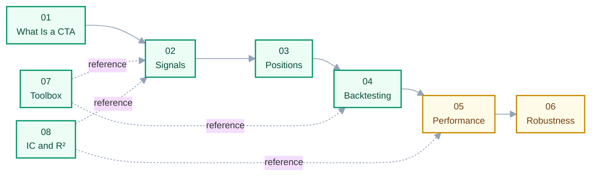

# 00 · Index & Learning Path

> **Answers:** what is in this series, what order to read it in, and the rules the writing follows.

---

## Reading Path

Green = written, yellow = partly written. **01 → 06 read in order**, each assuming the previous.
Everything from 07 up is reference, consulted rather than stepped through.

| # | Chapter | Prereq | Status |
|---|---|---|---|
| 01 | [What Is a CTA Strategy](01-what-is-cta.md) | — | ✅ |
| — | [How a Strategy Is Built](00-pipeline.md) — orientation | 01 | ✅ |
| 02 | [Building Your Own Signal](02-building-signals.md) | 01 | ✅ |
| 03 | [From Signal to Position](03-from-signal-to-position.md) | 02 | ✅ |
| 04 | [Understanding Backtesting](04-understanding-backtesting.md) | 03 | ✅ |
| 05 | [Evaluating Performance](05-evaluating-performance.md) | 04 | 🟡 §1 |
| 06 | [Overfitting & Robustness](06-overfitting-and-robustness.md) | 05 | 🟡 §§1–2, 4 |

Reference:

| # | Document | What it is | Status |
|---|---|---|---|
| 07 | [Toolbox: pandas](07-toolbox-pandas.md) | How the non-obvious pandas calls behave | ✅ |
| 08 | [IC and R²](08-ic-and-r-squared.md) | What each measures, and why a signal is judged by the first | ✅ |
| 99 | [Glossary](99-glossary.md) | EN ↔ ZH terms | ✅ |
| 100 | [The Dataset](100-dataset.md) | The 37-ticker sample and the defects it carries | ✅ |

Class notes go straight into the chapter that owns each concept — no parallel per-session record. A
lecture is an ordering of delivery, not of ideas: one session touches several topics and one topic
recurs across sessions, so filing by concept keeps each idea in one place (convention 1). New
material joins the relevant chapter; a revision edits the existing passage rather than being
appended elsewhere.

## Looking For Something Specific

| Question | Go to |
|---|---|
| What does a CTA actually trade? | [01](01-what-is-cta.md) |
| How do signal, strategy and backtest relate? | [00 · pipeline](00-pipeline.md) |
| How can you sell a stock you don't own? | [01 § short selling](01-what-is-cta.md) |
| Why does my equity curve have a vertical jump? | [100 § 1.1](100-dataset.md) |
| Does my signal carry information? | [02 § 4](02-building-signals.md) |
| Why is my R² only 0.005 — is the model useless? | [08](08-ic-and-r-squared.md) |
| How do I compute and read an IC? | [08 § 2](08-ic-and-r-squared.md) |
| Why does a 150% long leg not depend on price? | [03 § weights are money](03-from-signal-to-position.md) |
| What does `curr_shrs` mean? | [04 § columns](04-understanding-backtesting.md) |
| Do I have look-ahead bias? | [04 § offsets](04-understanding-backtesting.md), [06 § 2](06-overfitting-and-robustness.md) |
| How does `merge_asof` work? | [07](07-toolbox-pandas.md) |

## Writing Conventions

1. **Define each concept exactly once.** One home chapter per concept; others link rather than
   restate, so an edit can't leave two stale copies behind.
2. **Concepts in `docs/`, implementation notes beside the code.** What stays true regardless of this
   repo's code belongs here; what is tied to a function or parameter lives in
   [`Backtest_prototype/Backtests.md`](../Backtest_prototype/Backtests.md). Chapters link down to
   code so a change is traceable back to the docs it affects.
3. **One skeleton per chapter.** Opens with *answers / prerequisites / after reading*; closes with
   **Common pitfalls** and **Open questions**. The last matters most — stating where understanding
   stops is more credible than pretending it doesn't.
4. **English prose, original bilingual passages preserved.** New writing is English; existing Chinese
   explanations of tricky ideas stay as written.
5. **Be concise.** Cut a sentence that restates the previous one. Prefer a table to a paragraph and a
   number to an adjective.

## Numbering

The prefix makes filesystem order equal reading order, so no separate contents list can drift. `99`
is for appendices; insert between chapters as `03a`, `03b` rather than renumbering.
