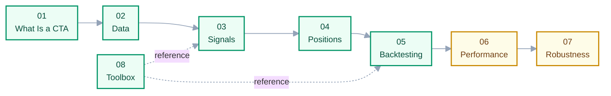

# 00 · Index & Learning Path

> **This chapter answers:** what is in this series, in what order to read it, and the rules the writing follows.
> **Prerequisites:** none.
> **After reading you can:** pick the right chapter for what you are trying to understand.

---

## Reading Path

Green = written, yellow = partly written. Chapters 01 → 07 are meant to be read in order: each one
assumes the previous. Chapter 08 is a reference to dip into, not a step in the path.

| # | Chapter | Prerequisite | Status |
|---|---|---|---|
| 01 | [What Is a CTA Strategy](01-what-is-cta.md) | — | ✅ |
| 02 | [Data & Corporate Actions](02-data-and-corporate-actions.md) | 01 | ✅ |
| 03 | [Building Your Own Signal](03-building-signals.md) | 02 | ✅ |
| 04 | [From Signal to Position](04-from-signal-to-position.md) | 03 | ✅ |
| 05 | [Understanding Backtesting](05-understanding-backtesting.md) | 04 | ✅ |
| 06 | [Evaluating Performance](06-evaluating-performance.md) | 05 | 🟡 §1 written |
| 07 | [Overfitting & Robustness](07-overfitting-and-robustness.md) | 06 | 🟡 §§1–2, 4 written |
| 08 | [Toolbox: pandas](08-toolbox-pandas.md) | — | ✅ |
| 99 | [Glossary](99-glossary.md) | — | ✅ |

## Class Notes

Per-session summaries live beside the chapters as standalone files. They record **what a session
covered, in the order it was covered**; the chapters are the synthesis, organized by concept rather
than by date. Each note opens with a map into the chapters that develop its topics.

| Note | Covers |
|---|---|
| [Lecture 01 · Momentum, Validation, and the Bucket Chart](lecture-01-momentum-and-validation.md) | Split-adjusted data, train/validation/test, the bucket chart, risk adjustment, rolling ranks, weekly 1/5 tranches, `SettingWithCopyWarning` |
| [Lecture 02 · Reversal, Portfolio Weights, and Combining Horizons](lecture-02-reversal-and-signal-combination.md) | Horizon assumptions, reversal and the AQR skip, signal → weights, regime in the equity curve, fast/slow pairing, EWMA, smoothing, the assignment |

Read a chapter to understand a topic; read a note to recall a session.

## If You Are Looking For Something Specific

| Question | Go to |
|---|---|
| What does a CTA actually trade? | [01](01-what-is-cta.md) |
| How can you sell a stock you don't own? | [01 § How Short Selling Works](01-what-is-cta.md) |
| Why does my equity curve have a vertical jump? | [02 § corporate actions](02-data-and-corporate-actions.md) |
| Why does a 150% long leg not depend on price? | [04 § weights are money](04-from-signal-to-position.md) |
| What does `curr_shrs` mean? | [05 § column definitions](05-understanding-backtesting.md) |
| Do I have look-ahead bias? | [05 § why are the values offset](05-understanding-backtesting.md) |
| How does `merge_asof` work? | [08](08-toolbox-pandas.md) |

## Writing Conventions

Four rules keep this series from decaying as it grows.

**1. Define each concept exactly once.** Every concept has one home chapter. Other chapters
link to it and do not restate it. Without this rule, the same idea gets explained in three
places, and two of them go stale after the first edit.

**2. Concepts live in `docs/`, implementation notes live next to the code.** Anything that
stays true regardless of this repo's code belongs here. Anything tied to a specific function
or parameter stays beside it — see [`Backtest_prototype/Backtests.md`](../Backtest_prototype/Backtests.md).
Chapters link down to code as `[backtest.py](../Backtest_prototype/backtest.py)`, so a code
change is traceable back to the docs it affects.

**3. Every chapter uses the same skeleton.** It opens with three lines — *this chapter answers*
/ *prerequisites* / *after reading you can* — and closes with two sections: **Common pitfalls**
and **Open questions**. The last one matters most: stating where your understanding stops is
more credible than pretending it doesn't.

**4. English prose, with the original bilingual passages preserved.** New writing is in English.
Where the earlier notes carried Chinese explanations of a tricky idea, those lines are kept as
they were rather than translated away.

## Numbering

The number prefix makes filesystem order equal reading order, so there is no separate table of
contents to keep in sync. `99` is reserved for appendices; insert a new chapter between two
existing ones as `03a`, `03b`, and so on rather than renumbering everything.
