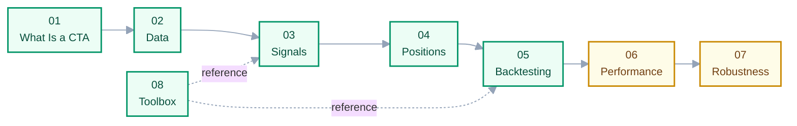

# 00 · Index & Learning Path

> **Answers:** what is in this series, what order to read it in, and the rules the writing follows.

---

## Reading Path

Green = written, yellow = partly written. 01 → 07 read in order, each assuming the previous; 08 is
reference material, not a step.

| # | Chapter | Prereq | Status |
|---|---|---|---|
| 01 | [What Is a CTA Strategy](01-what-is-cta.md) | — | ✅ |
| 02 | [Data & Corporate Actions](02-data-and-corporate-actions.md) | 01 | ✅ |
| 03 | [Building Your Own Signal](03-building-signals.md) | 02 | ✅ |
| 04 | [From Signal to Position](04-from-signal-to-position.md) | 03 | ✅ |
| 05 | [Understanding Backtesting](05-understanding-backtesting.md) | 04 | ✅ |
| 06 | [Evaluating Performance](06-evaluating-performance.md) | 05 | 🟡 §1 |
| 07 | [Overfitting & Robustness](07-overfitting-and-robustness.md) | 06 | 🟡 §§1–2, 4 |
| 08 | [Toolbox: pandas](08-toolbox-pandas.md) | — | ✅ |
| 99 | [Glossary](99-glossary.md) | — | ✅ |

Class notes go straight into the chapter that owns each concept — no parallel per-session record. A
lecture is an ordering of delivery, not of ideas: one session touches several topics and one topic
recurs across sessions, so filing by concept keeps each idea in one place (convention 1). New
material joins the relevant chapter; a revision edits the existing passage rather than being
appended elsewhere.

## Looking For Something Specific

| Question | Go to |
|---|---|
| What does a CTA actually trade? | [01](01-what-is-cta.md) |
| How can you sell a stock you don't own? | [01 § short selling](01-what-is-cta.md) |
| Why does my equity curve have a vertical jump? | [02 § 1.1](02-data-and-corporate-actions.md) |
| Does my signal carry information? | [03 § 4](03-building-signals.md) |
| Why does a 150% long leg not depend on price? | [04 § weights are money](04-from-signal-to-position.md) |
| What does `curr_shrs` mean? | [05 § columns](05-understanding-backtesting.md) |
| Do I have look-ahead bias? | [05 § offsets](05-understanding-backtesting.md), [07 § 2](07-overfitting-and-robustness.md) |
| How does `merge_asof` work? | [08](08-toolbox-pandas.md) |

## Writing Conventions

1. **Define each concept exactly once.** One home chapter per concept; others link rather than
   restate, so an edit can't leave two stale copies behind.
2. **Concepts in `docs/`, implementation notes beside the code.** What stays true regardless of this
   repo's code belongs here; what is tied to a function or parameter lives in
   [`Backtest_prototype/Backtests.md`](../Backtest_prototype/Backtests.md). Chapters link down to
   code so a change is traceable back to the docs it affects.
3. **One skeleton per chapter.** Opens with *answers / prerequisites / after reading*; closes with
   **Common pitfalls** and **Open questions**. The last matters most — stating where understanding
   stops is more credible than pretending it doesn't.
4. **English prose, original bilingual passages preserved.** New writing is English; existing Chinese
   explanations of tricky ideas stay as written.
5. **Be concise.** Cut a sentence that restates the previous one. Prefer a table to a paragraph and a
   number to an adjective.

## Numbering

The prefix makes filesystem order equal reading order, so no separate contents list can drift. `99`
is for appendices; insert between chapters as `03a`, `03b` rather than renumbering.
