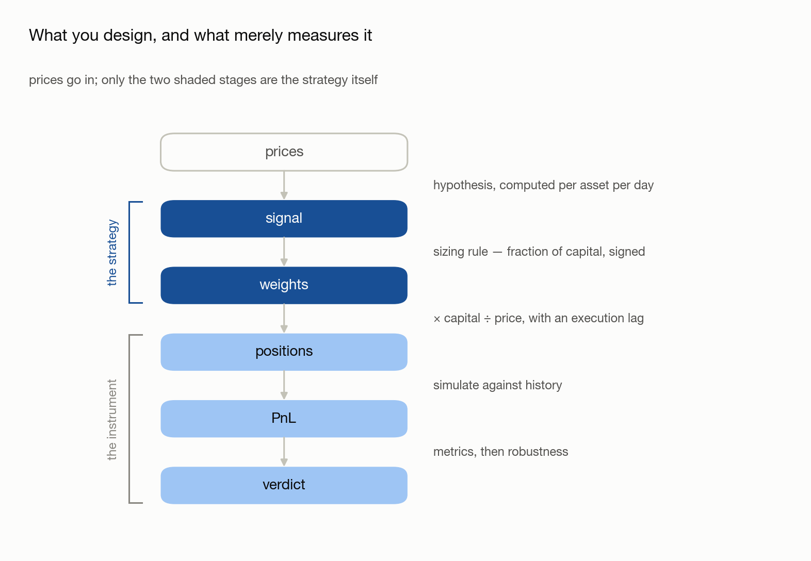

# 00 · How a Strategy Is Built

> - **Answers:** what *strategy*, *signal*, *momentum* and *backtest* each mean, how they nest, and the order the pieces get built in.
> - **Prerequisites:** [01 · What Is a CTA Strategy](01-what-is-cta.md).
> - **Read it when:** before [02](02-building-signals.md), and again whenever you lose track of which stage a problem belongs to.

**Orientation, not a step in the sequence.** The numbered chapters each go deep on one stage; this
maps them onto one another so you can see what is being built and why in that order.

---

## 1. Four Words That Get Used Loosely

**Definition (Signal).** A *signal* is a number computed for each asset on each day, expressing a
hypothesis about that asset's future return. It ranks or scores — it does not say how much to buy.

**Definition (Momentum).** *Momentum* is one particular hypothesis — that recent relative
performance persists. It is therefore one **family of signals**, not a synonym for signal.

**Definition (Sizing rule).** A *sizing rule* converts signals into **weights**: what fraction of
capital each asset should carry, including sign.

**Definition (Strategy).** A *strategy* is a signal plus a sizing rule — together, a complete
mapping from observable history to a position in every market, every day.

**Definition (Backtest).** A *backtest* is a simulation that applies a strategy's positions to
historical prices and returns the profit and loss it would have produced. It is a **measuring
instrument**, not part of the strategy.

They nest like this — momentum sits three levels down, which is why "my momentum strategy lost
money" is an ambiguous sentence:

```text
strategy
 ├── signal ─────────── momentum is one choice here
 │                      (others: carry, value, mean reversion)
 └── sizing rule ────── equal weight, risk parity, signal-proportional

backtest                measures a strategy; interchangeable with it
 └── metrics ────────── Sharpe, drawdown, turnover
```

| Term | Answers | Output |
| --- | --- | --- |
| **Signal** | which assets look attractive | one number per asset per day |
| **Sizing rule** | how much capital each one gets | one weight per asset per day |
| **Strategy** | signal + sizing | one position per asset per day |
| **Backtest** | what would this have earned | a PnL series |
| **Metrics** | was that any good | Sharpe, drawdown, turnover |

## 2. Why the Backtest Sits Outside the Strategy

**Claim.** The backtester must not know which signal it is running.

This is a design constraint, not a derivation. Two things follow from it, and both are the reason
to accept it:

- **You can change one without touching the other.** A new hypothesis means editing the signal
  function alone; a fee model means editing the simulator alone. If the two are entangled, every
  experiment risks breaking the measuring instrument, and you can no longer tell whether a result
  moved because the idea changed or because the ruler did.
- **It keeps the comparison honest.** Two signals judged by the *same* simulator differ only in the
  signal. If each carries its own execution assumptions, the comparison silently measures those
  assumptions too.

**Note.** The practical test: if you cannot swap the signal by changing one function, the
separation has leaked. In this project it holds — the multi-asset backtester is a loop over the
single-asset one and contains no strategy logic at all. See
[Backtest Prototype — Implementation Notes](../Backtest_prototype/Backtests.md).

## 3. The Build Order

Each stage consumes the previous stage's output. The strategy is the first half; the second half
only measures it.

<picture>
  <source media="(prefers-color-scheme: dark)" srcset="figures/strategy-pipeline-dark.png">
  
</picture>

| # | Stage | What happens | Chapter |
| --- | --- | --- | --- |
| 0 | **Validate the data** | Confirm prices are continuous and corporate actions are adjusted | [100](100-dataset.md) |
| 1 | **State a hypothesis, compute a signal** | Turn an intuition into a number, then test that it carries information | [02](02-building-signals.md) |
| 2 | **Size the positions** | Signal → weights → dollars → shares | [03](03-from-signal-to-position.md) |
| 3 | **Simulate** | Apply the positions to history with realistic timing | [04](04-understanding-backtesting.md) |
| 4 | **Evaluate** | Reduce the PnL series to numbers you can judge | [05](05-evaluating-performance.md) |
| 5 | **Attack the result** | Ask how much of it is signal and how much is search | [06](06-overfitting-and-robustness.md) |

**Note (Stage 0 is not optional).** Every later stage inherits whatever is wrong with the data. An
unadjusted split is the largest move in the sample by construction, so a trend follower reads it as
the strongest signal it has ever seen — and the equity curve will look *better*, not worse.

**Note (Test the signal before you backtest it).** Stage 1 ends with a check — sort assets into
buckets by signal value and look at the mean forward return per bucket. It is cheaper than a
backtest, and a monotone staircase is much harder to fool yourself with than a rising equity curve.
A signal that fails here will not be rescued by anything downstream.

## 4. Where Each Stage Fails

The stages fail in different ways, and the symptoms are easy to misattribute — the most common
mistake is reading a data defect as a code bug.

| Stage | Failure | What you see | Where it is treated |
| --- | --- | --- | --- |
| Data | Unadjusted corporate action | A vertical step in the equity curve | [100 § 1.1](100-dataset.md) |
| Signal | No information | Flat or non-monotone buckets | [02 § 4](02-building-signals.md) |
| Sizing | Exposure not what you think | Gross or net drifts from target | [03](03-from-signal-to-position.md) |
| Simulation | Look-ahead bias | Implausibly smooth, high Sharpe | [04](04-understanding-backtesting.md) |
| Evaluation | One number hides the path | Good Sharpe, unlivable drawdown | [05](05-evaluating-performance.md) |
| Robustness | Parameters were searched | Result vanishes out of sample | [06](06-overfitting-and-robustness.md) |

**Note.** The order is forced in one direction — you cannot evaluate before simulating, or simulate
before sizing. The one shortcut is that stage 1 can be validated *without* stages 2–4, and it
should be.

---

## Common pitfalls

| Belief | Correction |
| --- | --- |
| "Momentum is a strategy." | It is a hypothesis, so a family of signals. A strategy also needs a sizing rule. |
| "The backtest is part of the strategy." | It is the instrument that measures one. Changing it changes your ruler, not your idea. |
| "A signal is good if the backtest looks good." | Test the signal on its own first; an equity curve is far easier to rationalize. |
| "Bad data makes results look bad." | An unadjusted split usually makes them look *better*. |
| "Fix the numbers at the end." | Every stage inherits the previous one's defects. Nothing downstream repairs stage 0. |

## Next → [02 · Building Your Own Signal](02-building-signals.md)

Before moving on, write down — in one sentence each — the hypothesis you want to test, the number
that would express it, and the observation that would prove it wrong. Chapter 02 starts from
exactly that.

You should be able to explain:

- [ ] Why momentum, signal and strategy are three different levels, not synonyms
- [ ] Why the backtester must not know which signal it is running
- [ ] Which stage a vertical jump in the equity curve belongs to

[← Index](00-index.md)
