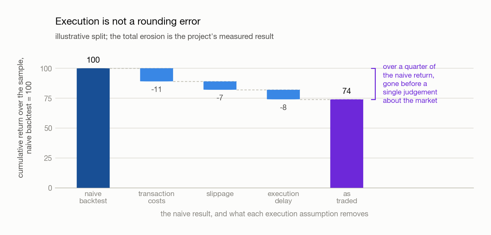
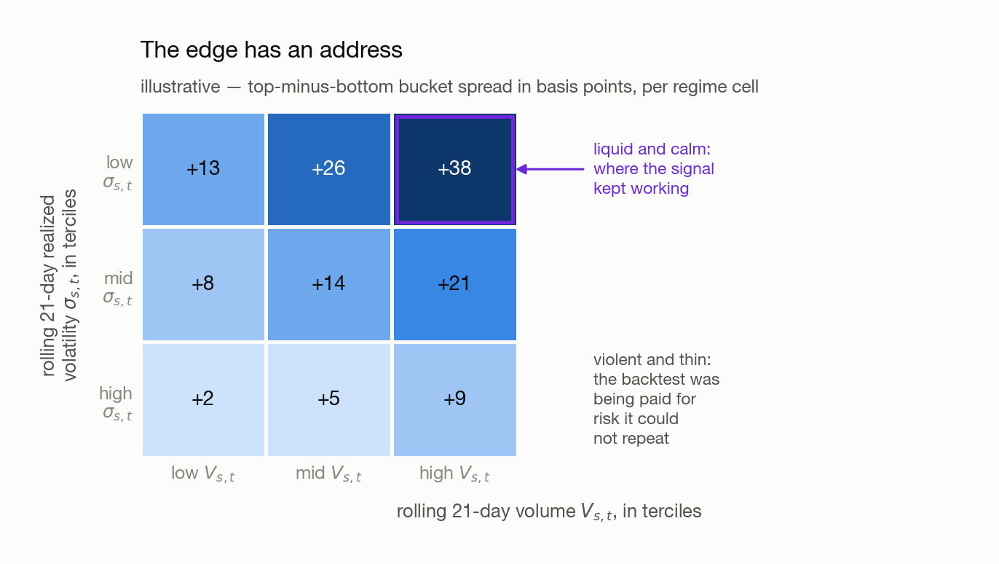
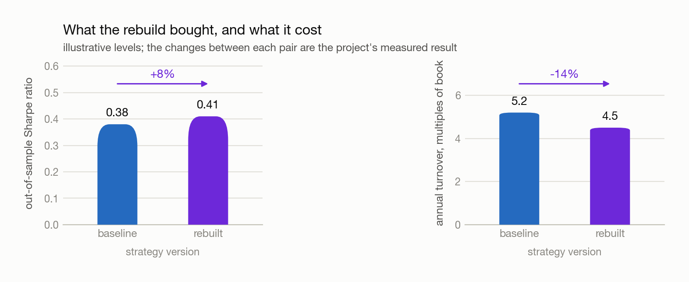

# 00 · How a Strategy Is Built

## 1. The Story

I wanted to know whether a documented edge survives the part of trading that no paper reports, so I
built the most ordinary trend follower I could: a 21-day momentum signal and a MACD fast-minus-slow
leg over 37 daily ETF series, sized cross-sectionally long against short, held five days as
overlapping tranches, and run through a backtester I wrote myself so that every assumption in it was
one I had chosen. The first version was frictionless — it traded at the same close that produced the
signal — and its equity curve rose.

Then I charged it for trading. Transaction costs, slippage, and an execution delay that stops a
signal dated `t` from trading before `t+1` removed **over a quarter** of the naïve return between
them. The next question was where the surviving return had come from, so I built rolling volume and
rolling realized volatility per asset, cut both into terciles, and re-ran the signal test inside each
of the nine regime cells. The edge was not spread evenly: it concentrated in the high-volume,
low-volatility cells and was close to nothing in the opposite corner — the same fact as the cost
finding seen from the other side, since thin, violent markets are exactly where a trend signal flips
most often and where each flip costs most.

So I rebuilt against that diagnosis rather than going looking for a new signal: regime-aware
features, volatility scaling so each position contributes comparable risk, and a turnover control
that rebalances only when the target has moved far enough to pay for the trade. Out-of-sample Sharpe
rose 8 percent and annual turnover fell 14 percent against the same baseline. Both are small
numbers, and they are the right kind of small — the strategy trades *less* and earns *slightly more*,
which is the signature of removing cost rather than adding fit.

**Note.** The percentages are this project's, measured on this sample; the chapters teach the method,
not the number. The prototype in this repository is deliberately behind the story — it runs a plain
five-day cross-sectional momentum and posts a near-zero Sharpe, because its job is the mechanics.
→ [Implementation Notes](../Backtest_prototype/Backtests.md)

## 2. The Build Order, Step by Step

The story above used *signal*, *prediction*, *position* and *strategy* as though they were near
enough the same thing. They are not: a model finds the pattern, a prediction states the judgement, a
signal picks the direction, a position sizes the bet, and the backtest asks whether any of it
survives. Keeping them apart matters because they fail independently — the quarter of the return
that vanished in Act II was lost entirely at the backtest stage, and most of what the rebuild won
back in Act IV was won at the position stage, with the prediction itself barely moving.

The chain below is those layers made concrete as eight stages. Each does one thing, answers one
question, and hands one object to the next. The question is the gate: a stage that fails it is not
repaired by anything downstream.

<picture>
  <source media="(prefers-color-scheme: dark)" srcset="figures/build-order-dark.png">
  
</picture>

| # | Stage | The question it asks | Hands on |
| - | --- | --- | --- |
| 0 | **Validate the data** | Can I trust a single number in this dataset? | Trusted data |
| 1 | **Compute a signal** | Is a higher signal followed by a higher forward return? | Edge confirmed |
| 2 | **Size the positions** | How much do I bet, and is the exposure what I think it is? | A sized book |
| 3 | **Simulate under execution** | How much of it survives costs, slippage and delay? | An honest PnL |
| 4 | **Evaluate** | Is it any good, and where exactly does it fail? | A verdict |
| 5 | **Attack the result** | How much is edge, and how much is search? | A diagnosis |
| 6 | **Rebuild against the diagnosis** | Does the edge improve where the diagnosis said it would? | A better signal |
| 7 | **Try a model** | Does a learned prediction beat the rule? | — |

Stage 6 is a return to the start, not an end: the diagnosis re-enters at stage 1 as a better signal
and at stage 2 as a better-sized one, and stages 3 to 5 then run again untouched. That is what makes
the baseline-versus-rebuild comparison mean anything — what was measured moved, the measurement did
not.

### 2.1 Stage 0 · Validate the data

**Does.** Confirm the price series are continuous, adjust corporate actions, and hand-check that the
forward return is aligned with the signal that labels it.

**Judged by.** No gaps, zeros or negative prices; split-adjusted consistency; an alignment verified
on a handful of rows by eye.

**Note.** An unadjusted split is the largest move in the sample by construction, so a trend follower
reads it as its strongest signal ever — and the equity curve looks *better*, not worse. Five sector
SPDRs still carry one, effective 2025-12-05.

→ [100 · The Dataset](100-dataset.md)

### 2.2 Stage 1 · Compute a signal

**Does.** Turn the intuition into a number — momentum is the trailing 21-day mean of daily returns,
MACD a fast average minus a slow one — then test whether that number carries information. The test
is the bucket plot: rank dates by signal, file them into G1 … G5, and plot the mean forward return
each bucket delivered with the standard error of that mean as the error bar.

**Judged by.** Bucket monotonicity, the G5 − G1 spread against its error bars, a two-sample t-score
on head against tail, and the turnover the signal implies before any cost is modelled.

**Note.** This is the cheapest test in the chain and the one place a Sharpe must not appear — it
folds mean, volatility and financing rate into a number you cannot decompose. A signal that fails
here is rescued by nothing downstream.

→ [02 § 3.2](02-testing-a-signal.md) for the test · [03](03-shaping-the-lookback.md) for the lookback

### 2.3 Stage 2 · Size the positions

**Does.** Signal → target weights → dollar exposure → shares, with risk limits, carrying the
position as a signed quantity. Portfolio 1 longs 150 percent of the positive-momentum assets and
shorts 50 percent of the negative ones; Portfolio 2 sorts on the cross-sectional median instead, so
an asset can be shorted with positive momentum. The five-day hold is implemented as overlapping
tranches, so weights evolve smoothly rather than jumping every fifth day.

**Judged by.** Gross exposure (about 2.0), net exposure (about +1.0 and about 0 respectively), and
turnover — the $\text{TO}$ that stage 3 will charge for.

**Note.** At a 150/50 book the risk-free-rate question becomes concrete, which the signal stage never
had to answer.

→ [04 · From Signal to Position](04-from-signal-to-position.md)

### 2.4 Stage 3 · Simulate under execution

**Does.** Apply the sized positions to history under the constraints a real book faces: an execution
delay (a signal dated `t` trades a day later), an approximate execution price, transaction costs,
slippage, and the turnover the rebalancing implies.

<picture>
  <source media="(prefers-color-scheme: dark)" srcset="figures/execution-haircut-dark.png">
  
</picture>

**Claim.** The drag is not a fixed haircut on the result — it scales with how much the book trades,
so the faster the signal, the more of its own edge it spends.

**Proof.** Write turnover as the total absolute weight change, $\text{TO} = \sum_t \sum_s | w_{s,t} - w_{s,t-1} |$,
where $s$ indexes the asset, $t$ the date, and $w_{s,t}$ is asset $s$'s target weight on date $t$ as
a fraction of capital. With a round-trip cost $\gamma$ per dollar traded,
$\text{PnL}_{\text{net}} = \text{PnL}_{\text{gross}} - \gamma \text{TO}$. The first term is a
property of the signal alone; the second is a property of how the signal is traded, and no measure
of signal quality enters it.

**Judged by.** Honesty rather than goodness: the drag from each assumption measured separately, and
a look-ahead check whose single entry point is the alignment of the forward return with the signal.

**Note (Delay is a different mechanism from cost).** Cost subtracts a known quantity. Delay
subtracts nothing — it *changes which trade happens*, swapping the return from `t` for the return
from `t+1`. Small for a signal that decays over weeks, most of the edge for one that decays over
days.

→ [05 · Understanding Backtesting](05-understanding-backtesting.md)

### 2.5 Stage 4 · Evaluate

**Does.** Reduce the PnL series to the numbers a practitioner quotes — annualized return, Sharpe,
maximum drawdown, hit rate, turnover — and read them *beside* the equity curve, never instead of it.

**Judged by.** The headline statistics and the drawdowns they hide: a Sharpe of 0.2 is either steady
earnings or one great quarter followed by five years of bleeding, and one number cannot tell you
which.

**Note.** The useful output here is not the verdict but the list of periods where the strategy did
not work. That list is what stage 5 conditions on.

→ [06 · Evaluating Performance](06-evaluating-performance.md)

### 2.6 Stage 5 · Attack the result

**Does.** Ask how much survives once you stop believing it — across years, markets, searched
parameters, and regimes. Cut the sample by rolling volume $V_{s,t}$ and rolling realized volatility
$\sigma_{s,t}$, re-run the stage 1 test inside each cell, split out of sample with a purge and
sometimes an embargo, and deflate the Sharpe for the number of variants tried.

<picture>
  <source media="(prefers-color-scheme: dark)" srcset="figures/regime-map-dark.png">
  
</picture>

**Judged by.** Out-of-sample performance, the deflated Sharpe, parameter sensitivity — a broad
plateau of neighbouring good parameters is more believable than one bright cell — and whether the
regime split is monotone rather than a single lucky corner.

**Note.** A conditional finding is a hypothesis, not a licence. Two axes at three buckets each is
nine cells, and the best of nine is the one most likely to be luck; the conditional result has to
survive the same attack as the unconditional one.

→ [07 · Overfitting &amp; Robustness](07-overfitting-and-robustness.md) ·
[04 · Volatility Regimes](04-volatility-regimes.md)

### 2.7 Stage 6 · Rebuild against the diagnosis

**Does.** Spend the diagnosis. Feed the regime measures into the signal, size on
$w_{s,t} \propto \frac{x_{s,t}}{\sigma_{s,t}}$ so each position contributes comparable risk, and add
a deadband $\eta$ so a target that has barely moved does not trigger a trade that cannot pay for
itself. Then re-run stages 2 to 5 with nothing else altered.

<picture>
  <source media="(prefers-color-scheme: dark)" srcset="figures/rebuild-scorecard-dark.png">
  
</picture>

**Judged by.** Out-of-sample Sharpe and annual turnover against the *same* baseline on the *same*
split. A comparison against a re-tuned baseline is not a comparison.

**Note.** If the Sharpe rises and the turnover does not fall, the diagnosis was probably not what
fixed it. And every extra parameter tried here is one stage 5 must deflate for — change one thing
per lap.

→ [04 § 5](04-volatility-regimes.md)

### 2.8 Stage 7 · Try a model

**Does.** Replace the rule with a learned prediction on the same features, then run the *same*
sizing, backtest and metrics. Keep the two objects apart: a **prediction** estimates a future
quantity, a **signal** is the long/short/flat decision made from it, and converting one to the other
needs a trading rule — a threshold, a sign, a ranking. A model replaces the rule, not the chain.

**Judged by.** The test IC — rank correlation between prediction and forward return, per date — its
mean, and its mean divided by its own standard deviation.

**Note.** Expect predictions far narrower than reality: at tiny $R^2$ a 2.5 percent spread of returns
yields predictions inside ±0.5 percent, so an absolute threshold never fires. Threshold on the
prediction's own quantiles instead.

→ [09 · IC and R²](09-ic-and-r-squared.md)

## 3. Where Each Stage Fails

The stages fail in different ways, and the symptoms are easy to misattribute — the most common
mistake is reading a data defect as a code bug.

| Stage | Failure | What you see | Where it is treated |
| --- | --- | --- | --- |
| Data | Unadjusted corporate action | A vertical step in the equity curve | [100 § 1.1](100-dataset.md) |
| Signal | No information | Flat or non-monotone buckets | [02 § 3.2](02-testing-a-signal.md) |
| Sizing | Exposure not what you think | Gross or net drifts from target | [04](04-from-signal-to-position.md) |
| Simulation | Look-ahead bias | Implausibly smooth, high Sharpe | [05](05-understanding-backtesting.md) |
| Evaluation | One number hides the path | Good Sharpe, unlivable drawdown | [06](06-evaluating-performance.md) |
| Robustness | Parameters were searched | The result vanishes out of sample | [07](07-overfitting-and-robustness.md) |
| Rebuild | The fix was fitted to the diagnosis | Sharpe rises but turnover does not fall | [07](07-overfitting-and-robustness.md) |
| Model | Fitted to the sample | Good IC in train, none in test | Out-of-sample split |

**Note.** The order is forced in one direction — you cannot evaluate before simulating, or simulate
before sizing. Two things cut across it: stage 1 can be validated *without* stages 2–4 and should
be, since it is the cheapest test available; and stage 6 re-enters at stage 1 rather than continuing
forward, which is why the second lap costs a fraction of the first.

## Appendix · Notation

| Symbol | Meaning | First used |
| --- | --- | --- |
| $s$, $t$ | The asset, and the date — as in [02](02-testing-a-signal.md) | § 2.4 |
| $w_{s,t}$ | Target weight of asset $s$ on date $t$, as a fraction of capital | § 2.4 |
| $x_{s,t}$ | The raw signal value for that asset on that date | § 2.7 |
| $\text{TO}$ | Turnover — total absolute weight change over the sample | § 2.3 |
| $\gamma$ | Round-trip cost per dollar traded: commission, spread and slippage | § 2.4 |
| $V_{s,t}$ | Rolling 21-day mean volume, standing for liquidity | § 2.6 |
| $\sigma_{s,t}$ | Rolling 21-day realized volatility for that asset | § 2.6 |
| $\eta$ | Deadband — the weight change below which no trade is placed | § 2.7 |
| $R^2$ | Fraction of return variance a model explains | § 2.8 |

**Note (Collisions avoided).** Three symbols are deliberately not the obvious ones.
[04](04-volatility-regimes.md) already spends $\tau$ on an option's time to expiry and $c$ on its
regime multiplier, so turnover is written $\text{TO}$ and the cost rate $\gamma$; and
[02 § 1.1](02-testing-a-signal.md)'s $\delta$ is the tolerance on *net exposure*, a different
tolerance from this chapter's deadband, which is therefore $\eta$. Uppercase $V_{s,t}$ is one
asset's volume; [04 § 4.1](04-volatility-regimes.md)'s lowercase $v_t$ is a market-wide volatility
index. $\sigma_{s,t}$ is reused from [02 § 4](02-testing-a-signal.md) on purpose — it is the same
object, one asset's trailing volatility — and is not 04's market-wide $\sigma^{\text{real}}_t$.

[← Index](00-index.md)
