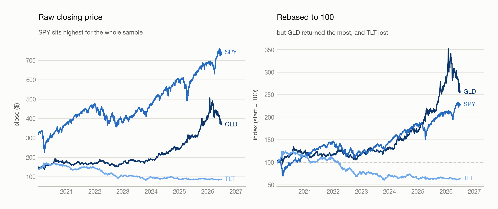

# 01 · What Is a CTA Strategy

> - **Answers:** what a CTA is, why it might make money, how long/short works, and who else is trading.
> - **Prerequisites:** none — first chapter.
> - **After reading:** explain what a CTA does, and why a short sale is not selling out of thin air.

---

## 1. What

**Definition (CTA strategy).** A *CTA (Commodity Trading Advisor) strategy* is a rule-based
strategy that trades **futures** systematically across asset classes — equities, fixed income,
commodities, currencies — targeting **absolute return**, independent of market direction.

**Note.** The name is a historical artifact. Modern CTAs are not commodity-only; typical markets
are equity-index futures, Treasuries, FX, energy, metals, and agriculture.

### What it trades

"S&P 500" names three different objects. Only two of them can be traded.

| Layer            | Example       | What it is                                            | Tradeable |
| ---------------- | ------------- | ----------------------------------------------------- | --------- |
| **Index**  | SPX, NDX      | A published number computed from its constituents     | No        |
| **ETF**    | SPY, VOO, QQQ | A fund holding the constituents; its own shares trade | Yes       |
| **Future** | ES, NQ        | A contract to settle at a future date; holds nothing  | Yes       |

**Definition (Index).**

$$
I_t  =  \frac{M_t}{D_t}, \qquad\qquad M_t  =  \sum_i N_i  P_{it}
$$

where $P_{it}$ is the price of constituent $i$, $N_i$ its float-adjusted share count, $M_t$ the
total float capitalisation, and $D_t > 0$ the *divisor*.

**Claim.** Index returns are the capitalisation-weighted average of constituent returns; the
divisor sets only the level.

Both halves follow from `I` being a *sum divided by a constant*. A constituent's dollar move is
`N_i × (price change)`, so its share of the index move is its share of total capitalisation:

$$
r_I  =  \sum_i w_{it}  r_i , \qquad w_{it} = \frac{N_i P_{it}}{M_t} , \qquad \sum_i w_{it} = 1 .
$$

And `D` divides `I` at both dates, so it cancels from the ratio — it can shift the level anywhere
without touching a single return.

**Note (Two consequences).**

- **The top names dominate.** At $w \approx 0.07$ against $w \approx 0.0002$, the largest
  constituent carries roughly **350×** the index impact of the smallest. This is not an average of
  500 *prices*.
- **The level is arbitrary.** $D$ cancels from returns, so the scale is whatever the base period
  set it to — for the S&P 500, 1941–43 = 10. **Compare returns, never levels.**

A price level is meaningful only against that same series' own history. Across tickers it carries
no information at all — what each ETF's share price happens to be was fixed by how the fund was
structured at inception. Dividing every series by its own first observation removes that
arbitrariness:

| Ticker | Raw close, start | Raw close, end | Rebased | Return            |
| ------ | ---------------- | -------------- | ------- | ----------------- |
| SPY    | 325.05           | 740.83         | 227.9   | **+127.9%** |
| TLT    | 137.10           | 87.35          | 63.7    | **−36.3%** |
| GLD    | 143.97           | 368.49         | 255.9   | **+155.9%** |

SPY has the highest closing price on every single day of the sample, yet GLD returned more. The
end level alone cannot tell you this; you need the start it is measured against.

<picture>
  <source media="(prefers-color-scheme: dark)" srcset="figures/levels-vs-rebased-dark.png">
  
</picture>

## 2. Why

### Why futures rather than ETFs

| Reason                       | Futures                                                                  | ETFs                                                |
| ---------------------------- | ------------------------------------------------------------------------ | --------------------------------------------------- |
| **Symmetry**           | Shorting costs nothing extra                                             | Shorting needs borrowed shares, a fee, availability |
| **Coverage**           | Deep markets in all four asset classes                                   | Poor in commodities and FX                          |
| **Capital efficiency** | Margin ≈ 5–10% of notional; spare cash earns**collateral yield** | Full notional tied up                               |

Symmetry is decisive: a strategy that must go short as freely as long cannot tolerate the
asymmetry. The cost is that futures expire, so a continuous series has to be stitched together
from contracts — see [02](02-data-and-corporate-actions.md).

### Why momentum might work

Two contested explanations, no proof. Momentum has been durably profitable regardless.

- **Information diffusion.** Unglamorous macro news spreads gradually, creating sustained
  pressure. Possibly weakened since 2008, as computing and data distribution got faster.
- **Selective momentum capture.** Winners keep winning and losers keep losing — because large
  positions take time to build and unwind, investors chase winners, and major events do not
  resolve in a single day.

[03](03-building-signals.md) turns this from a story into something testable.

### Why the short leg is the fragile one

**Claim.** For a static position, a long's loss is bounded by its outlay; a short's is not.

**Proof.** With signed share count $s$, entry price $P_0 > 0$ and exit price $P_T$, the payoff is

$$
\text{PnL}(P_T)  =  s  (P_T - P_0), \qquad P_T \in [0, \infty)
$$

the domain being half-open because a price cannot go negative.

- **Long, $s > 0$.** $\text{PnL}$ is increasing in $P_T$, so its infimum is at the left
  endpoint: $\text{PnL} \geq s(0 - P_0) = -s P_0$, exactly the amount paid.
- **Short, $s < 0$.** $\text{PnL}$ is decreasing in $P_T$, and the domain has no right
  endpoint, so $\text{PnL} \to -\infty$ as $P_T \to \infty$.

The asymmetry is in the **domain**, not the payoff — both are lines of slope $|s|$. The floor
exists only because prices are floored at zero.

<picture>
  <source media="(prefers-color-scheme: dark)" srcset="figures/payoff-asymmetry-dark.png">
  
</picture>

**Note.** Hence margin requirements and forced buy-ins — and why a 150/50 book, 200% gross, is
**2× leverage** rather than free money.

## 3. How

### Borrowing the shares

**Definition (Long).** Buy first, sell later. Profit is the sell price minus the buy price.

**Definition (Short).** Borrow and sell first, buy back and return later. Profit is the sell price
minus the buy-back price.

A short is not selling out of thin air — the shares are borrowed before they are sold:

```text
1. Borrow    — borrow N shares from a lender (broker / long-term holder)
2. Sell      — sell them now, receive cash
3. Buy back  — later buy N shares back from the market
4. Return    — return the N shares, closing the position
```

**Note.**

- **You never create shares.** They are fungible, so returning "N shares of SPY" — not specific
  certificates — settles the debt.
- **Lenders are paid.** Long-term holders earn a **lending fee** on stock they were going to sit
  on anyway.
- **The broker sits in the middle,** matching the two sides and holding margin. The market for
  this is **securities lending**.

### How a short is represented

A short needs no separate machinery. Carry the position as a **signed quantity** and let the sign
do the work: a negative share count valued at the market price is a **negative position value**,
which rises exactly when the price falls.

**Note (Sign convention).** A negative position value is a **liability** — a debt owed — not a
loss already taken.

**Note (Static versus constant-exposure shorts).** The proof above holds the share count fixed at
entry. A book that instead maintains a constant *dollar* exposure buys the short back down as it
moves against it, so the unbounded loss is never realised. That daily rebalancing is an **implicit
risk control**: the proof is right, but a constant-exposure book is not running the position it
describes.

→ How this project implements it, with the accounting derivation and the measured gap between the
two: [Backtest Prototype — Implementation Notes](../Backtest_prototype/Backtests.md).

## 4. Who Else Is Trading

| Participant           | Examples                              | Typical hold             |
| --------------------- | ------------------------------------- | ------------------------ |
| Index / passive funds | Vanguard, BlackRock                   | Years to decades         |
| Active managers       | Fidelity, PIMCO                       | Monthly to quarterly     |
| Hedge funds           | —                                    | Intraday to several days |
| Market makers         | Optiver, Citadel Securities, IMC, SIG | Seconds to minutes       |
| Noise traders         | Retail, uninformed flow               | No consistent horizon    |

---

## Background

General finance knowledge needed to read this chapter, not part of its argument.

### What is the relationship between futures/options and asset classes?

They answer different questions, so they are not alternatives to one another.

- **Asset class** — *what* underlying market you are exposed to.
- **Instrument** — *how* you hold that exposure: cash, futures, or options.

Futures are not an asset class, and options are not a rival one. Every asset class trades in every
instrument:

| Asset class               | Typical underlying    | Futures                    | Options       |
| ------------------------- | --------------------- | -------------------------- | ------------- |
| **Equities**        | S&P 500, Nasdaq 100   | ES, NQ                     | options on ES |
| **Fixed income**    | US Treasuries, Bunds  | ZN (10-year), ZB (30-year) | options on ZN |
| **Commodities**     | Crude oil, gold, corn | CL, GC, ZC                 | options on CL |
| **Currencies (FX)** | EUR/USD, USD/JPY      | 6E, 6J                     | options on 6E |

The same exposure, three wrappers:

```text
Equities ──┬── cash     buy SPY
           ├── futures  buy ES
           └── options  buy an ES call
```

So in the opening definition — *"trades **futures** systematically **across asset classes**"* —
the three parts are independent: **futures** is the wrapper, **across asset classes** is the
breadth of underlying markets, and **systematically** means by rule or model rather than
discretion.

### Which asset class does a bond belong to?

**Fixed income.** Treasuries, corporate, municipal and high-yield bonds all sit there.

- "Fixed" describes the **contract** — a scheduled coupon and the return of principal — not a
  fixed price.
- Bond prices still move, with interest rates, credit risk and time to maturity. That variation is
  what makes them a trend market at all.
- Treasury futures trade at 2-, 5-, 10- and 30-year maturities, so a CTA picks the *maturity* it
  wants exposure to.

### Why do CTAs use futures rather than options?

|                         | Futures                                                       | Options                                     |
| ----------------------- | ------------------------------------------------------------- | ------------------------------------------- |
| Exposure                | **Linear** — PnL moves one-for-one with the underlying | Non-linear; depends on strike and moneyness |
| Extra drivers           | None                                                          | Implied volatility, time decay, strike      |
| What you are betting on | Direction                                                     | Direction**and** volatility           |

An option position is partly a volatility trade whether you intended it or not. Linear exposure is
what lets one risk framework size 37 positions on the same scale.

**Example.** A trend follower might simultaneously hold long ES, short ZN, long GC, short 6J — all
four are futures, and all four are different asset classes.

---

## Common pitfalls

| Belief                                              | Correction                                                                   |
| --------------------------------------------------- | ---------------------------------------------------------------------------- |
| "CTA means commodities only."                       | Historical artifact; main exposures are equity-index, rate, and FX futures.  |
| "Futures and options are asset classes."            | They are instruments. Every asset class trades in both — see Background.    |
| "You can buy the S&P 500."                          | You buy an ETF or a future*tracking* it. The index is a number.            |
| "The index is at 5000, so the market is expensive." | The base scale is arbitrary (1941–43 = 10). Only returns are interpretable. |
| "The index is the average of 500 stocks."           | It is a cap-weighted average of 500*returns*; the top names dominate.      |
| "A negative position means I lost money."           | The sign encodes direction — a debt — not P&L.                             |
| "150/50 is free extra return."                      | 200% gross is 2× leverage; risk scales with it.                             |

## Open questions

- Longs out-contribute same-size shorts — carry / risk-free-rate effect, or just equities' long-run positive drift?
- If information diffusion weakened after 2008, what keeps momentum alive since?
- Constant-dollar exposure quietly caps short losses. Realistic model of a CTA, or a risk control the backtest gets for free?

---

## Next → [02 · Data &amp; Corporate Actions](02-data-and-corporate-actions.md)

Before moving on, **rebase all 37 tickers to 100** and find the best and worst performer over the
sample. Then open `CTA_data/_manifest.csv` and note which are equity, rate, commodity, and FX
exposures. Chapter 02 is about trusting that data before building anything on it.

You should be able to explain:

- [ ] What a CTA actually trades, and why the name is misleading
- [ ] Why the divisor cancels out of index *returns* but sets the *level*
- [ ] Where the short's unbounded loss comes from, and why constant-dollar exposure never realises it

[← Index](00-index.md)
