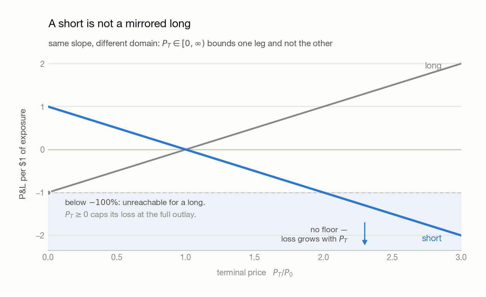

# 01 · What Is a CTA Strategy

> **Answers:** what a CTA is, why it might make money, how long/short works, and who else is trading.
> **Prerequisites:** none — first chapter.
> **After reading:** explain what a CTA does, and why a short sale is not selling out of thin air.

---

## 1. What

**Definition (CTA strategy).** A *CTA (Commodity Trading Advisor) strategy* is a rule-based
strategy that trades **futures** systematically across asset classes — equities, fixed income,
commodities, currencies — targeting **absolute return**, independent of market direction.

**Note.** The name is a historical artifact. Modern CTAs are not commodity-only; typical markets
are equity-index futures, Treasuries, FX, energy, metals, and agriculture.

### What it trades

"S&P 500" names three different objects. Only two of them can be traded.

| Layer | Example | What it is | Tradeable |
| --- | --- | --- | --- |
| **Index** | SPX, NDX | A published number computed from its constituents | No |
| **ETF** | SPY, VOO, QQQ | A fund holding the constituents; its own shares trade | Yes |
| **Future** | ES, NQ | A contract to settle at a future date; holds nothing | Yes |

**Definition (Index).** `I_t = M_t / D_t`, where `M_t = Σ_i N_i · P_it` is total float
capitalisation across constituents `i`, and `D_t > 0` is the *divisor*.

**Claim.** Index returns are the capitalisation-weighted average of constituent returns; the
divisor sets only the level.

**Proof.** With `D` constant, `I_{t+1}/I_t = M_{t+1}/M_t`. Since `M_{t+1} − M_t = Σ_i N_i P_it·r_i`,
dividing through by `M_t` gives `r_I = Σ_i w_it · r_i`, where `w_it = N_i P_it / M_t` and
`Σ_i w_it = 1`. `D` cancels.

**Note (Two consequences).** The top names dominate: at `w ≈ 7%` against `w ≈ 0.02%`, the largest
constituent carries roughly **350×** the index impact of the smallest — this is not an average of
500 *prices*. And since `D` cancels from returns, the **level is arbitrary** (the S&P 500 base is
1941–43 = 10), so compare returns, never levels. Rebased to 100 at 2020-01-02 this sample ends at
SPY 227.9, TLT 63.7, GLD 255.9 — which the raw closes of 740.83, 87.35 and 368.49 tell you nothing
about.

## 2. Why

### Why futures rather than ETFs

| Reason | Futures | ETFs |
| --- | --- | --- |
| **Symmetry** | Shorting costs nothing extra | Shorting needs borrowed shares, a fee, availability |
| **Coverage** | Deep markets in all four asset classes | Poor in commodities and FX |
| **Capital efficiency** | Margin ≈ 5–10% of notional; spare cash earns **collateral yield** | Full notional tied up |

Symmetry is decisive: a strategy that must go short as freely as long cannot tolerate the
asymmetry. The cost is that futures expire, so a continuous series has to be stitched together
from contracts — see [02](02-data-and-corporate-actions.md).

### Why momentum might work

Two contested explanations, no proof. Momentum has been durably profitable regardless.

- **Information diffusion.** Unglamorous macro news spreads gradually, creating sustained
  pressure. Possibly weakened since 2008, as computing and data distribution got faster.
- **Selective momentum capture.** Winners keep winning and losers keep losing — because large
  positions take time to build and unwind, investors chase winners, and major events do not
  resolve in a single day.

[03](03-building-signals.md) turns this from a story into something testable.

### Why the short leg is the fragile one

**Claim.** For a static position, a long's loss is bounded by its outlay; a short's is not.

**Proof.** With signed share count `s`, entry `P₀ > 0` and exit `P_T`, the payoff is
`PnL(P_T) = s · (P_T − P₀)` on the half-open domain `P_T ∈ [0, ∞)`, since a price cannot go
negative. For `s > 0` the payoff increases in `P_T`, so `PnL ≥ s(0 − P₀) = −s·P₀`, exactly the
amount paid. For `s < 0` it decreases in `P_T`, and the domain has no right endpoint, so
`PnL → −∞`.

The asymmetry is in the **domain**, not the payoff — both are lines of slope `|s|`. The floor
exists only because prices are floored at zero.

<picture>
  <source media="(prefers-color-scheme: dark)" srcset="figures/payoff-asymmetry-dark.png">
  
</picture>

**Note.** Hence margin requirements and forced buy-ins — and why a 150/50 book, 200% gross, is
**2× leverage** rather than free money.

## 3. How

### Borrowing the shares

**Definition (Long).** Buy first, sell later. **Definition (Short).** Borrow and sell first, buy
back and return later. A short is not selling out of thin air:

```text
1. Borrow    — borrow N shares from a lender (broker / long-term holder)
2. Sell      — sell them now, receive cash
3. Buy back  — later buy N shares back from the market
4. Return    — return the N shares, closing the position
```

**Note.** Shares are fungible, so returning "N shares of SPY" — not specific certificates —
settles the debt. Lenders are long-term holders earning a **lending fee** on stock they were going
to sit on anyway; the broker matches the two sides and holds margin. The market is **securities
lending**.

### In the backtester

No borrowing, fees, or margin are modelled. The code simply allows a **negative share count**.

**Claim.** In [`backtester`](../Backtest_prototype/backtest.py), a position with `curr_shrs < 0`
gains exactly when the close falls — with no branch special-casing shorts.

**Proof.** Open `s` shares at execution price `p₀`, hold to a close `p₁` with no further trades.
Following the code in order: `cash_spend = s·p₀`, so `net_cash = −s·p₀`; `asset_value = s·p₁`; and
`portfolio = net_cash + asset_value = s(p₁ − p₀)` — the same expression as above. For `s < 0`,
`portfolio > 0 ⟺ p₁ < p₀`.

**Note (Sign convention).** A negative `asset_value` is a **liability**, not a loss. Shares are
assumed always borrowable at zero cost: fine for teaching, not for trading. Accounting detail:
[05](05-understanding-backtesting.md).

**Note (The proof's assumption bites).** Shorting \$1 of SPY across the sample, as it rose ×2.28,
loses **−1.2791** as a static position but only **−0.9385** in the backtester. Holding constant
*dollar* exposure trims the short as it moves against you, so the unbounded loss above is never
realised. The proof is right; the backtester is not running the position it describes.

## 4. Who Else Is Trading

| Participant | Examples | Typical hold |
| --- | --- | --- |
| Index / passive funds | Vanguard, BlackRock | Years to decades |
| Active managers | Fidelity, PIMCO | Monthly to quarterly |
| Hedge funds | — | Intraday to several days |
| Market makers | Optiver, Citadel Securities, IMC, SIG | Seconds to minutes |
| Noise traders | Retail, uninformed flow | No consistent horizon |

---

## Common pitfalls

| Belief | Correction |
| --- | --- |
| "CTA means commodities only." | Historical artifact; main exposures are equity-index, rate, and FX futures. |
| "You can buy the S&P 500." | You buy an ETF or a future *tracking* it. The index is a number. |
| "The index is at 5000, so the market is expensive." | The base scale is arbitrary (1941–43 = 10). Only returns are interpretable. |
| "The index is the average of 500 stocks." | It is a cap-weighted average of 500 *returns*; the top names dominate. |
| "A negative position means I lost money." | The sign encodes direction — a debt — not P&L. |
| "150/50 is free extra return." | 200% gross is 2× leverage; risk scales with it. |

## Open questions

- Longs out-contribute same-size shorts — carry / risk-free-rate effect, or just equities' long-run positive drift?
- If information diffusion weakened after 2008, what keeps momentum alive since?
- Constant-dollar exposure quietly caps short losses. Realistic model of a CTA, or a risk control the backtest gets for free?

---

## Next → [02 · Data & Corporate Actions](02-data-and-corporate-actions.md)

Before moving on, **rebase all 37 tickers to 100** and find the best and worst performer over the
sample. Then open `CTA_data/_manifest.csv` and note which are equity, rate, commodity, and FX
exposures. Chapter 02 is about trusting that data before building anything on it.

You should be able to explain:

- [ ] What a CTA actually trades, and why the name is misleading
- [ ] Why the divisor cancels out of index *returns* but sets the *level*
- [ ] Where the short's unbounded loss comes from, and why the backtester never realises it

[← Index](00-index.md)
