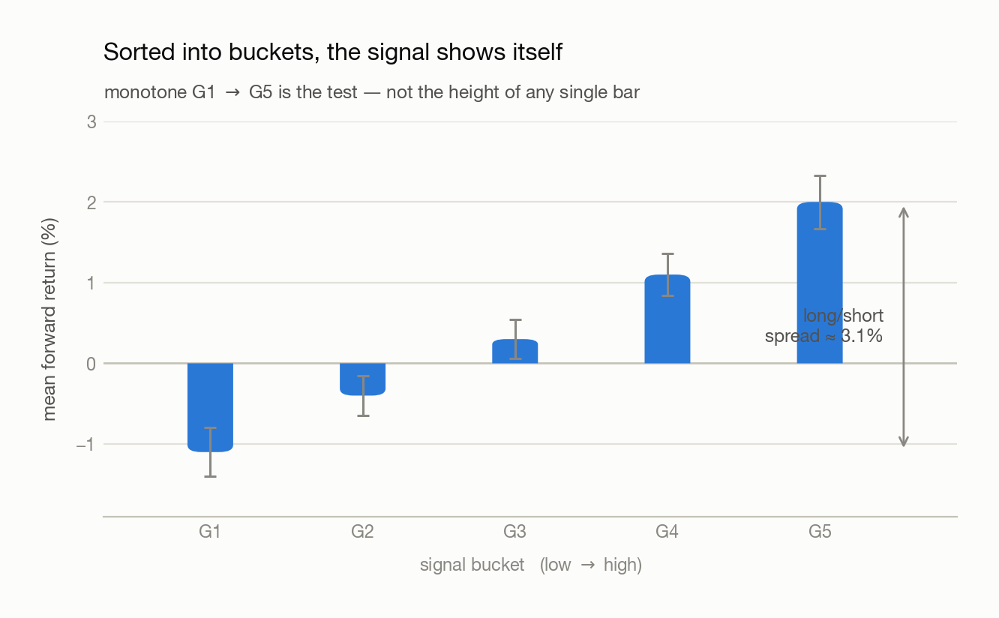
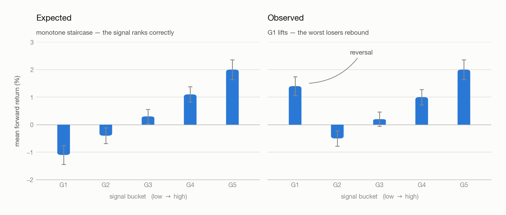

# 02 · Building Your Own Signal

> - **Answers:** how to turn an intuition into a computable signal, and how to tell whether it carries information before backtesting it.
> - **Prerequisites:** [01 · What Is a CTA Strategy](01-what-is-cta.md); the data it runs on is [100 · The Dataset](100-dataset.md).
> - **After reading:** state a signal as a hypothesis, test it with a bucket chart, normalize it, and combine horizons without drowning in noise.

---

## 1. A signal is a hypothesis, not a formula

### The simplest signal — the sign of the last return

**Definition (Binary momentum).** The simplest member of the family — carry the sign of the last
period's return, and nothing else:

$$
MOM_{s,t}  =  \text{sign}\left( r_{s,t-1} \right)
$$

where $s$ indexes the asset and $t$ the date, $r_{s,t-1}$ is that asset's return over the period
just ended, and $MOM_{s,t}$ is the signal it produces for today. The signal takes the value +1
(long) or −1 (short), with nothing in between.

### Why the sign alone is not enough

**Note (What the sign discards).** Two assets that rose 20% and 10% over the same window produce
the *same* signal, so a book built on it holds them in the same size. Trend **strength** is thrown
away; only trend **direction** survives.

<picture>
  <source media="(prefers-color-scheme: dark)" srcset="figures/binary-momentum-dark.png">
  
</picture>

### What to keep instead

**Note (Two repairs).** Neither is obviously right, and both are tested the same way — § 4's bucket
chart.

- **Keep the value, not the sign** — the definition below, which stays proportional to how strongly
  the asset trended.
- **Make the value comparable first** — divide by volatility, so a 20% move in a quiet market
  outranks a 20% move in a violent one (§ 6).

**Definition (Momentum).** Averaging over $N$ periods rather than one, and keeping the value rather
than its sign:

$$
\textbf{signal:}\quad MOM_{s,t}  =  \text{Avg}\left(r_{s,t-i}\right),\qquad i = 1 \ldots N
$$

with $N$ the lookback length in periods and $i$ the lag inside it, so the average runs over the $N$
returns ending yesterday.

$$
\textbf{hypothesis:}\quad MOM \uparrow  \Longrightarrow  \text{return} \uparrow
\qquad\qquad
\textbf{consequence:}\quad MOM_{s,t}  \propto  w_{s,t}  \propto  \text{return}
$$

Here $w_{s,t}$ is the **weight** — the size of the position the book takes in asset $s$ on date $t$.
The third line is what makes the signal tradeable: it doesn't just correlate with return, it says
**how much** to allocate. Whether the surviving magnitude should reach the position at all is
[03](03-from-signal-to-position.md)'s decision, not this chapter's.

Write the hypothesis first because it tells you what would falsify it. A signal you cannot falsify
is a plot you will rationalize either way.

## 2. Horizons travel — but verify

A signal that works yearly is assumed to work monthly and quarterly, since a long trend is short
fluctuations accumulating in one direction. That is a prior, not a fact.

When a horizon test comes back non-monotone, don't discard the signal — re-read the source paper's
assumptions (universe, period, skip, weighting). Most "it doesn't work" results are "I implemented
a different signal than the one tested."

## 3. Why the scatter plot disappoints

§ 1 asserted $MOM_{s,t} \propto w_{s,t} \propto \text{return}$. The obvious way to check a proportionality is
to plot one against the other, so the scatter of signal against forward return is where everyone
starts — and it is the right place to start. It just almost never answers the question.

**Claim.** The scatter cannot confirm or refute a real signal, because the correlation a real
signal carries sits below the threshold at which the eye resolves a trend.

**Proof.** The two quantities are measurable and they do not overlap.

| | Correlation | Reads as |
| --- | --- | --- |
| Obvious at a glance | ~80% | a line with scatter around it |
| Convincing | 40–50% | a visibly tilted cloud |
| The eye's floor | ~30% | a trend you can just about argue for |
| **What a working signal carries** | **10–15%** | an undifferentiated cloud |

Since 15% < 30%, a signal that works and a signal that does not produce the same picture.
**The absence of a visible trend is therefore not evidence of anything.**

<picture>
  <source media="(prefers-color-scheme: dark)" srcset="figures/scatter-ladder-dark.png">
  
</picture>

**Note (Why transparency does not rescue it).** The usual first fix is to drop the marker opacity —
`alpha=0.01` — so that overlapping points reveal density rather than a solid mass. It is worth
doing and it occasionally exposes a faint tilt or a thinned corner. But it treats the symptom: the
scatter spends all its resolution on individual noisy points, when the thing being claimed is about
their **average** behaviour. Density plotting shows the same information more legibly; it does not
add any.

**Note (Look at it anyway, first).** None of this argues for skipping the scatter. On the rare
occasion something *is* readable — a curve, a cluster, one corner plainly empty — it beats any
summary statistic, because it gives the *shape* and not just the strength. Plot it, spend thirty
seconds, move on when it comes back a cloud. The mistake is concluding anything **from** the cloud.

### What sorting recovers

**Claim.** Sorting by the signal and averaging within groups detects a relationship the scatter
cannot, because averaging shrinks the noise while leaving the signal intact.

**Proof.** One **observation** is one asset on one date. Write $x$ for its signal value and $y$ for
its forward return, and suppose the relationship is exactly linear, $y = \beta x + \epsilon$, with
$\beta$ the slope being claimed and $\epsilon$ the noise, of standard deviation
$\sigma_\epsilon$. Take a group of $m$ observations sharing a similar signal value. Their
mean forward return still has expectation $\beta$ times their mean signal — the relationship is
untouched — while the noise around that mean has standard deviation $\sigma_\epsilon / m^{1/2}$. At
$m = 300$ the noise is 17 times smaller, so the group means separate cleanly even though no
individual point ever did.

**Note.** This is why the next section sorts into buckets rather than fitting a line. The scatter
asks each point to carry the argument alone; the bucket chart lets 300 of them share it.

## 4. The bucketed bar chart — the core method

1. Sort observations by signal value.
2. Cut into groups G1 (low) → G5 (high).
3. Take each group's **mean forward return**.
4. Plot as bars **with error bars**.

```python
buckets = pd.qcut(signal.stack(), 5, labels=["G1","G2","G3","G4","G5"])
grouped = fwd_return.stack().groupby(buckets)
means, errs = grouped.mean(), grouped.sem()
means.plot.bar(yerr=errs)
```

<picture>
  <source media="(prefers-color-scheme: dark)" srcset="figures/bucket-chart-dark.png">
  
</picture>

**Reading it.** Monotone G1 → G5 means the signal carries information. Monotonicity is the test, not
the height of any one bar — a tall G5 with G1–G4 scrambled is usually small-sample noise.

**It prices the trade.** Long the top bucket, short the bottom: the expected spread is the gap
between those bars. G5 at +2% and G1 at −1% is worth about 3%.

**Why it beats the scatter.** Each bar is a cross-sectional portfolio held at every date, averaged
down the time axis — so it answers "how often does this rank correctly?", which is what determines
whether the strategy earns.

Error bars are not decoration: they stop you reading a 2-observation bucket as a result.

## 5. Reversal — why the lowest bucket misbehaves

On raw momentum the staircase usually breaks at the **bottom** bucket: the biggest losers bounce
rather than keep losing.

<picture>
  <source media="(prefers-color-scheme: dark)" srcset="figures/reversal-buckets-dark.png">
  
</picture>

**Reversal**: over short horizons extreme moves partially undo themselves, and it strengthens with
data frequency — at fine resolution prices zigzag rather than trend.

**The standard fix, and why not to copy it blindly.** AQR skips the most recent month, reasoning
that a trend must *form* before it is tradeable. The skip is real, but treating it as settled has
drawn pushback: reversal is a second source of return, not noise. **Momentum money and reversal
money are both money** — try to earn both.

**Make the skip empirical.** The fix is a `shift`, but its size is measured, not inherited — 1 day,
1 week, 1 month? Run the bucket chart at each and watch G1.

The whiteboard's other note, `risk-adjusted MOM → rolling quantile`, is the recipe for a broken
bucket chart: standardize (§6), then bucket by rolling quantile (§7).

## 6. Risk-adjusted momentum

Raw momentum is not comparable across time or assets. 2% monthly momentum in the 2021 inflation
regime is unremarkable; the same 2% in the 2023 rate-hike drawdown is strong. Same number, different
meaning — and 2% for SHY is not 2% for UNG.

Divide by volatility:

$$
MOM^{\text{risk-adj}}_{s,t}  =  \text{Avg}\left(\frac{r_{s,t-i}}{\sigma_{s,t}}\right),\qquad i = 1 \ldots N
$$

where $\sigma_{s,t}$ is asset $s$'s volatility — the standard deviation of its returns — estimated
from data strictly before $t$, since a denominator that peeks at the future contaminates the signal
as surely as a numerator would (§ 12). Which estimate belongs there is still open.

Every asset and period lands on one scale — approximately standard normal — so values compare. Two
students both score 80, but on different exams against different cohorts; without a common baseline
the two 80s are not the same achievement.

## 7. The bucketing trap, and the rolling-quantile fix

Bucketing the standardized signal on **fixed intervals** (−2 to +2 in equal steps) starves the tails:
a normal distribution puts almost everything in the middle, so the two buckets you actually trade
become the least reliable bars, and one event can swing them.

<picture>
  <source media="(prefers-color-scheme: dark)" srcset="figures/signal-distribution-dark.png">
  
</picture>

Ranking the **whole history** into equal groups is worse — it leaks the future, since whether today
counts as "high" would depend on next year's extremes. Clean-looking and meaningless.

**Correct: at each `t`, rank only against history strictly before `t`** — a **rolling quantile**,
expanding or fixed-window. Honest, and better balanced than fixed intervals, though not perfectly
equal and it discards some magnitude information.

No single view suffices; produce all three:

| View                     | Shows                           | Hides                                   |
| ------------------------ | ------------------------------- | --------------------------------------- |
| Raw-value buckets        | The signal at its natural scale | Not comparable across regimes or assets |
| Standardized buckets     | Regime-neutral comparison       | Sparse, unreliable tails                |
| Rolling-quantile buckets | No look-ahead, balanced groups  | Magnitude information                   |

A fourth angle: cross-sectional ranking — each asset against its peers that day rather than its own
past. That is the Portfolio 1 vs Portfolio 2 distinction in [03](03-from-signal-to-position.md).

## 8. Combining a slow and a fast horizon

One lookback forces a choice between stable and timely. Instead use a **fast momentum to time the
turns in a slow one** — MACD's structure, where a short EMA crossing a long one marks the entry
earlier.

**Ratio.** Conventionally about **2:1** (MACD's 26/12), but that is a starting point: find the pairing
by **grid search**, read as a **heat map**. A real edge is a contiguous warm region; one hot cell is
an artifact.

**Where it pays.** Best in **commodities** — supply-and-demand cycles drive long, persistent trends.
Equities second. **Bonds** weakest, being the most arbitraged, so deviations close fastest.

## 9. EWMA instead of a simple moving average

An SMA weights a price from 60 days ago exactly as much as yesterday's. To weight recent prices more:

```python
signal = returns.ewm(halflife=H).mean()
```

Tune the **half-life** $H$ — the lag at which a return's weight has decayed to half the weight given
to the newest one. Candidates are fractions of the lookback (1/2, 1/3, 1/5, 1/8). Grid-search them.

MACD's 9-day signal line is an **empirical solution** — a value that fit historical data, nothing
more. Every parameter here has that status, which is why they belong in
[06](06-overfitting-and-robustness.md) rather than being accepted on authority.

## 10. MACD, stated precisely

§ 8 and § 9 both gestured at MACD. Written out, it is three series built from two exponential
moving averages of the **price**:

**Definition (MACD).** For a fast and a slow span $n_f < n_s$, each with its own smoothing constant
$\alpha = 2/(\text{span}+1)$:

$$
\text{MACD}_t = \text{EMA}_{n_f}(P)_t - \text{EMA}_{n_s}(P)_t , \qquad
\text{signal}_t = \text{EMA}_9(\text{MACD})_t , \qquad
\text{hist}_t = \text{MACD}_t - \text{signal}_t
$$

where $P_t$ is the price on date $t$ and $\text{EMA}_n(P)_t$ its exponential moving average over
span $n$. The asset subscript is dropped throughout — MACD is computed one asset at a time.
Conventionally $n_f = 12$, $n_s = 26$, and 9 for the signal line.

| Series                | Reads as                                 | Sign means                 |
| --------------------- | ---------------------------------------- | -------------------------- |
| **MACD line**   | recent average price versus a longer one | trend direction            |
| **Signal line** | a smoothed MACD                          | the level MACD is crossing |
| **Histogram**   | MACD minus its own smoothing             | trend *acceleration*       |

**Claim.** MACD is a momentum signal. It is a weighted sum of past returns, differing from a
lookback mean only in the shape of the weights.

**Proof.** Each EMA is a weighted average of past prices whose weights sum to one, so their
difference has weights summing to **zero**:

$$
\text{MACD}_t = \sum_i c_i P_{t-i} , \qquad
c_i = \alpha_f (1-\alpha_f)^i - \alpha_s (1-\alpha_s)^i , \qquad \sum_i c_i = 0 .
$$

Here $\alpha_f$ and $\alpha_s$ are the smoothing constants of the fast and slow EMA, and $c_i$ is
the net weight MACD places on the price $i$ days ago.

A zero-sum weighting is unchanged when every price is shifted by a constant, so subtract $P_t$
from each term. Writing $P_t - P_{t-i}$ as the sum of the last $i$ price changes — write
$\Delta_{t-j} = P_{t-j} - P_{t-j-1}$ for the change at lag $j$ — and collecting the coefficient of
that change:

$$
\text{MACD}_t = \sum_j k_j \Delta_{t-j} , \qquad
k_j = \sum_{i \leq j} c_i = (1-\alpha_s)^{j+1} - (1-\alpha_f)^{j+1} .
$$

The $k_j$ are the **kernel** — the weight each past price change carries into today's value.
Since $\alpha_f > \alpha_s$, every $k_j \geq 0$: MACD is a **non-negative** weighted sum of past
price changes, exactly like a lookback mean.

**Note (What actually differs).** The kernel. A 21-day momentum weights the last 21 returns
equally and everything older at zero; MACD's weights rise from a small value at lag 0, peak around
lag 8, and decay without ever reaching zero. It therefore discounts *yesterday* relative to last
week — deliberately, since the newest return is the noisiest — and never fully forgets.

<picture>
  <source media="(prefers-color-scheme: dark)" srcset="figures/signal-kernels-dark.png">
  
</picture>

**Note (From value to rule).** Three common rules, in increasing order of information kept:

- **Zero-line.** Long when $\text{MACD}_t > 0$. This is a slow trend filter.
- **Crossover.** Long when $\text{hist}_t > 0$, i.e. MACD is above its own signal line. Earlier,
  and noisier — the churn this creates is § 11's subject.
- **Proportional.** Use the standardized MACD value as the position size directly, keeping the
  magnitude that the two rules above throw away. See [03](03-from-signal-to-position.md).

**Note.** All three still have to pass § 4's bucket test before they earn a backtest, and 12/26/9
are fitted constants, not theory — § 9.

## 11. Volatility clustering, and smoothing the fast leg

Volatility arrives in clusters. A fast signal is exposed: short-lived noise flips it long/short, and
the churn eats the return in transaction costs before any edge is realized.

Fix: **smooth the fast signal** to filter the shortest cycles.

**Constraint:** the smoothing window must be **shorter than the signal's own period**. Smooth with a
long window and you have not denoised it — you have built another slow signal and lost the
timeliness the fast leg existed for.

## 12. Information availability

Everything above assumes the signal at `t` uses only data knowable at `t`. Look-ahead bias is born
here; the execution offsets in [04](04-understanding-backtesting.md) are the second line of defense
and cannot rescue a signal contaminated at construction. The rolling-quantile rule (§7) and the
train/validation/test split ([06](06-overfitting-and-robustness.md)) are the same discipline.

## Appendix · Notation

Every symbol used above, collected. Throughout, $s$ indexes the asset and $t$ the date; both are
dropped where a formula concerns one asset on one day.

| Symbol | Means | First used |
| --- | --- | --- |
| $s$ | asset — one of the 37 ETFs | § 1 |
| $t$ | date, counted in periods (days here) | § 1 |
| $r_{s,t}$ | return of asset $s$ over period $t$ | § 1 |
| $MOM_{s,t}$ | the momentum signal for asset $s$ on date $t$ | § 1 |
| $N$ | lookback length, in periods | § 1 |
| $i$ | lag inside the lookback, $1 \ldots N$ | § 1 |
| $w_{s,t}$ | weight — the position size given to asset $s$ on date $t$ | § 1 |
| $x$, $y$ | one observation's signal value and its forward return | § 3 |
| $\beta$ | slope of forward return on signal | § 3 |
| $\epsilon$ | noise around that line | § 3 |
| $\sigma_\epsilon$ | standard deviation of that noise | § 3 |
| $m$ | observations sharing a bucket | § 3 |
| G1 … G5 | buckets, lowest to highest signal value | § 4 |
| $\sigma_{s,t}$ | volatility of asset $s$, estimated on data before $t$ | § 6 |
| $H$ | EWMA half-life, in periods | § 9 |
| $P_t$ | price on date $t$ | § 10 |
| $n_f$, $n_s$ | fast and slow EMA spans, conventionally 12 and 26 | § 10 |
| $\alpha$ | EMA smoothing constant, $2/(\text{span}+1)$ | § 10 |
| $\alpha_f$, $\alpha_s$ | the fast and slow EMA's own smoothing constants | § 10 |
| $c_i$ | MACD's net weight on the price at lag $i$ | § 10 |
| $\Delta_{t-j}$ | one-period price change at lag $j$ | § 10 |
| $k_j$ | kernel — MACD's weight on the price change at lag $j$ | § 10 |

**Note (Collisions to watch).** $\sigma_\epsilon$ (§ 3, noise around a fitted line) and
$\sigma_{s,t}$ (§ 6, an asset's volatility) are different quantities; so are $w_{s,t}$ (a position)
and $k_j$ (a kernel weight), which is why the latter is not written $w$. Chapter [01](01-what-is-cta.md)
uses $s$ for a signed share count — here it is always the asset.

---

## Common pitfalls

- **Reading a scatter as evidence.** At 10–15% correlation it looks identical either way.
- **Judging a bucket chart by its best bar.** Monotonicity is the test.
- **Dropping the error bars.** The extreme buckets are where samples are thinnest.
- **Discarding a signal when buckets aren't monotone.** Check the source's assumptions first — a lifted G1 usually means reversal, not a dead signal.
- **Inheriting AQR's one-month skip untested.** Measure the right lag for your data.
- **Treating reversal as noise.** It is a second source of return.
- **Fixed-interval buckets on a standardized signal.** The tails you trade end up empty.
- **Ranking against the full history.** Pure look-ahead.
- **Comparing raw momentum across regimes or assets.** 2% in 2021 ≠ 2% in 2023; SHY ≠ UNG.
- **Smoothing a fast signal with a long window.** That converts it into a slow one.
- **Treating MACD as a different species from momentum.** Same weighted sum of past returns, different kernel.
- **Reading MACD's 26/12/9 as theory.** They are fitted values. So are yours.

## Open questions

- Which volatility estimate goes in the risk-adjustment denominator — trailing realized over the same lookback, longer, or slower? The lecture didn't pin it down.
- The right reversal skip for this 37-ETF universe, which may differ by asset class.
- How many buckets? With 37 assets, five leaves ~7 names per bucket per day.
- Rolling-quantile window length — too short is noisy, too long spans the regimes standardization was meant to separate.
- Does the bucket spread survive transaction costs? The chart prices the gross edge only.
- Would a volatility *forecast* filter noise better than trailing realized vol?

---

## Next → [03 · From Signal to Position](03-from-signal-to-position.md)

Before moving on, **build the 21-day momentum signal and plot its bucket chart three ways** — raw
values, standardized, and rolling quantile — then compare them. Chapter 03 assumes you have a signal
you already believe in.

You should be able to explain:

- [ ] Why a scatter plot proves nothing at a realistic 10–15% correlation
- [ ] Why the bottom bucket lifts, and how you would measure the right skip
- [ ] Why fixed-interval buckets starve the tails and full-history ranking leaks the future
- [ ] Why MACD is momentum with a hump-shaped kernel rather than a separate indicator

[← 01](01-what-is-cta.md) · [Index](00-index.md) · reference: [07 · Toolbox](07-toolbox-pandas.md)
