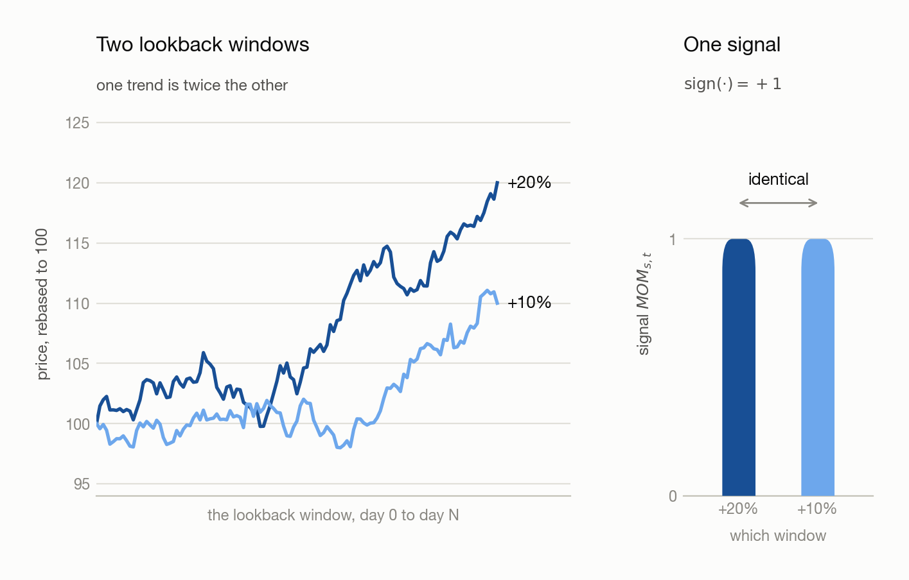
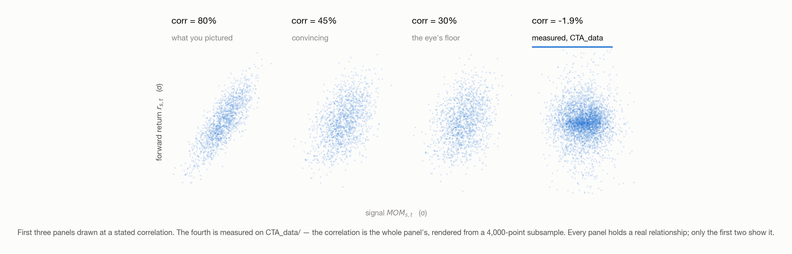
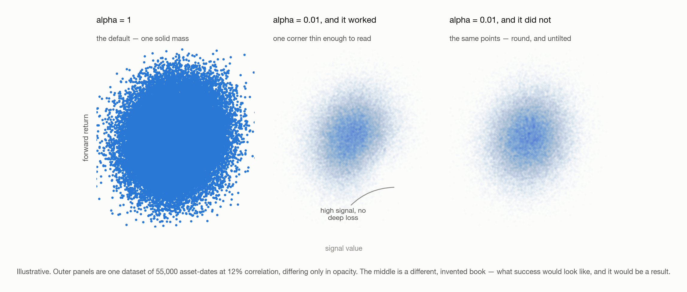
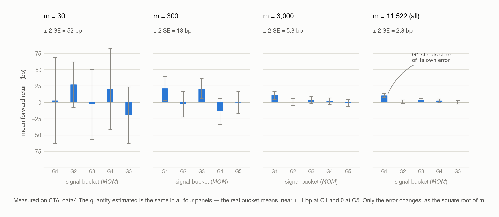
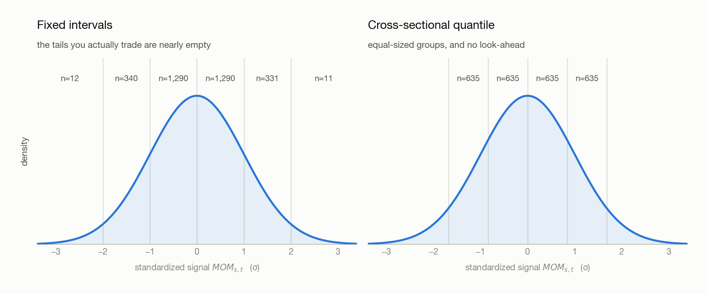
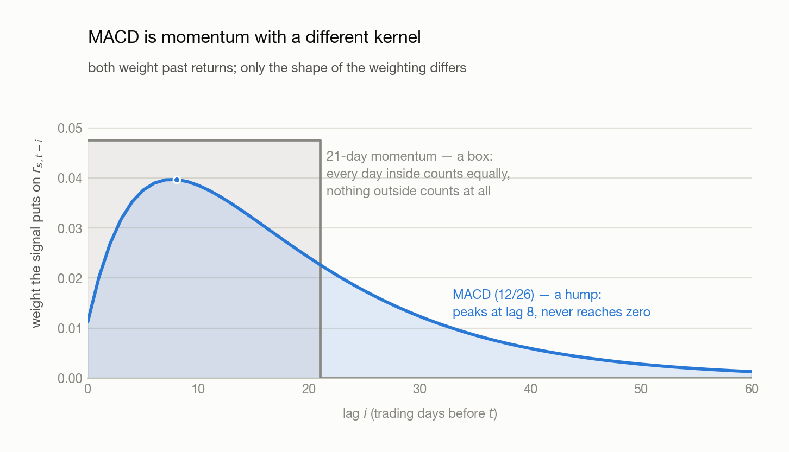

# 02 · Building Your Own Signal

> - **Answers:** how to turn an intuition into a computable signal, and how to tell whether it carries information before backtesting it.
> - **Prerequisites:** [01 · What Is a CTA Strategy](01-what-is-cta.md); the data it runs on is [100 · The Dataset](100-dataset.md).
> - **After reading:** state a signal as a hypothesis, test it with a bucket chart, normalize it, and combine horizons without drowning in noise.

---

## 1. A signal is a hypothesis, not a formula

### The simplest signal — the sign of the last return

**Definition (Binary momentum).** The simplest member of the family — carry the sign of last
period's return, and nothing else:

$$
MOM_{s,t}  =  \text{sign}\left( r_{s,t-1} \right)
$$

where $s$ indexes the asset and $t$ the date, $r_{s,t-1}$ is that asset's return over the period
just ended, and $MOM_{s,t}$ the signal it produces for today — either +1 (long) or −1 (short), with
nothing in between.

### Why the sign alone is not enough

Two assets that rose 20% and 10% over the same window produce the *same* signal, so a strategy
built on it takes the same size in both. Trend **strength** is thrown away; only trend **direction**
survives.

<picture>
  <source media="(prefers-color-scheme: dark)" srcset="figures/binary-momentum-dark.png">
  
</picture>

### What to keep instead

Neither repair below is obviously right, and both are tested the same way — § 3.2's bucket chart.

- **Keep the value, not the sign** — the definition below, which stays proportional to how strongly
  the asset trended.
- **Make the value comparable first** — divide by volatility, so a 20% move in a quiet market
  outranks a 20% move in a violent one (§ 4).

**Definition (Momentum).** Averaging over $N$ periods rather than one, and keeping the value rather
than its sign:

$$
\textbf{signal:}\quad MOM_{s,t}  =  \text{Avg}\left(r_{s,t-i}\right),\qquad i = 1 \ldots N
$$

with $N$ the lookback length and $i$ the lag inside it — the average runs over the $N$ returns
ending yesterday.

$$
\textbf{hypothesis:}\quad MOM \uparrow  \Longrightarrow  \text{return} \uparrow
\qquad\qquad
\textbf{consequence:}\quad MOM_{s,t}  \propto  w_{s,t}  \propto  \text{return}
$$

Here $w_{s,t}$ is the **weight** — the position size given to asset $s$ on date $t$. That third
line is what makes the signal tradeable: it doesn't merely correlate with return, it says **how
much** to allocate; how far the magnitude reaches the position is
[03](03-from-signal-to-position.md)'s decision.

Write the hypothesis first: it names what would falsify the signal, and one you cannot falsify is a
plot you will rationalize either way.

## 2. What you hoped for, and what you get

### The plot everyone draws first

§ 1's hypothesis says forward return rises with the signal, so the first move is to plot one against
the other. The picture you had in mind is the leftmost panel below. What comes back — for well over
99% of the scatters you will ever draw — is the rightmost.

<picture>
  <source media="(prefers-color-scheme: dark)" srcset="figures/scatter-ladder-dark.png">
  
</picture>

### Why the real one is a cloud

**Claim.** The scatter can neither confirm nor refute a signal, because the correlation a working
signal carries sits below the threshold at which the eye resolves a trend.

**Proof.** Both numbers are readable off the panels above: the eye stops resolving a tilt somewhere
around 30%, and a working signal carries 10–15%. Since 15% < 30%, a signal that works and a signal
that does not produce the same picture — **the absence of a visible trend is not evidence of
anything.**

So why is the correlation only 10–15%? Because the quantity being plotted is mostly not the signal.

**Claim.** Split the forward return into the part the signal reaches and the part it does not,
$y = \beta x + \epsilon$. If $\epsilon$ is uncorrelated with $x$, the signal owns exactly
$\rho^2$ of the return's variance, where $\rho$ is their correlation.

**Proof.** Uncorrelated components add their variances,

$$
\text{Var}(y) = \beta^2 \text{Var}(x) + \text{Var}(\epsilon)
$$

and on one regressor with an intercept the explained share is $R^2 = \rho^2$. At $\rho = 0.12$,
$R^2 = 0.0144$ — which does not mean "right 1.4% of the time", but: of the variation in forward
return from one observation to the next, 1.44% is linear in the signal and 98.56% is not.

**Example.** Everything below is **one asset's own** forward return, never a portfolio's. Take a
daily return standard deviation of $\sigma_y = 0.012$ — 120 bp, typical for a single equity ETF,
a **basis point** being 0.01%:

| Component             | Size                            | At 12% correlation |
| --------------------- | ------------------------------- | ------------------ |
| Total return          | $\sigma_y$                    | 120 bp             |
| What the signal moves | $\rho \sigma_y$               | **14.4 bp**  |
| What it does not      | $\sigma_y (1 - \rho^2)^{1/2}$ | **119 bp**   |

Across an x-axis running from $-2\sigma_x$ to $+2\sigma_x$ the trend line climbs about 58 bp end
to end, while at every $x$ the points scatter over roughly 476 bp. **A 0.6% slope inside a 4.8%
cloud** — that ratio *is* the picture.

**Note (And it is worse than that).** Part of those 119 bp is not the market's doing: pooling UNG
with SHY, and 2021 with 2023, adds spread that standardization (§ 4) removes. Nor is a larger
$\rho$ on offer — a predictor correlating 50% with next month's return would be arbitraged away
long before you found it in 37 liquid ETFs. 10–15% is a competitive market's ceiling, not a
shortfall in craft.

## 3. Two ways out of the cloud

The scatter is unreadable, but the signal may still be in it. There are two things to try, and only
the second one works.

### 3.1 Turn down `alpha`

`alpha` is a marker's opacity. At `alpha=0.01` a single point is invisible and only *overlap*
renders, so the chart becomes a density map instead of a mass of ink — below, the left panel is the
before and the other two are both the after.

**Note (Not the other alphas).** matplotlib's opacity keyword: not a regression intercept, not the
excess return a manager is paid for, not § 8's smoothing constant $\alpha$. Code font is the tell.

<picture>
  <source media="(prefers-color-scheme: dark)" srcset="figures/alpha-opacity-dark.png">
  
</picture>

Sometimes it is enough — the middle panel, where high signal against a badly negative return has
thinned enough to read. A signal that only rules something *out* is still tradeable.

**Why it usually fails.** Three reasons that compound:

- **The density comes back smooth.** 55,000 asset-dates average into a clean bivariate blob, and
  opacity renders that faithfully. A smooth density has no feature.
- **The tilt is finer than the ink.** § 2's band is eight times taller than the trend line's whole
  rise, so the lean is smaller than the markers drawn over it.
- **It treats the symptom.** The scatter spends its resolution on individual noisy points when the
  claim is about their **average**; no rendering choice changes what is being rendered.

**Note (Look first anyway).** Always draw it. On the rare occasion something *is* readable — a
curve, an empty corner — it beats every statistic, because it gives the *shape*. The mistake is
concluding anything **from** a cloud.

### 3.2 Beta Method

**The construction.** Six steps, and the figure below is the same six read left to right.

1. **Draw** five observations at random — one observation being one asset on one date. The left
   column marks fifteen of them, three draws' worth, all in one colour: any five will do.
2. **Rank** those five by signal value, highest to lowest.
3. **Assign** them to slots — highest signal into G5, next into G4, down to G1.
4. **Record** the forward return each one went on to deliver, filed under its slot. Steps 2–4 are
   one line in the middle column: five points, one per slot.
5. **Repeat** steps 1–4 a few hundred times. The middle column draws six of them.
6. **Average** everything filed under G1, then G2, and so on — five numbers, drawn in the right
   column as five bars with the error on each.

<picture>
  <source media="(prefers-color-scheme: dark)" srcset="figures/bucket-construction-dark.png">
  
</picture>

**The sort key is the signal, never the return.** Steps 2 and 3 order by $MOM_{s,t}$, known at
$t$; step 4 only *records* what followed. So G1 holds the lowest-**signal** observations, not the
worst performers.

**Example.** One draw of five, invented:

| | Signal | Forward return |
| --- | --- | --- |
| A | +2.1% | −0.4% |
| B | −1.8% | +0.9% |
| C | +0.6% | +1.3% |
| D | +3.4% | +0.2% |
| E | −0.9% | −1.1% |

Filled by signal, and then by forward return instead:

| Slot | Sorted by **signal** | filed return | Sorted by **return** | filed return |
| --- | --- | --- | --- | --- |
| G5 | D | +0.2% | C | +1.3% |
| G4 | A | −0.4% | B | +0.9% |
| G3 | C | +1.3% | D | +0.2% |
| G2 | E | −1.1% | A | −0.4% |
| G1 | B | +0.9% | E | −1.1% |

The left pair is what step 4 files: a mess, which is what one draw looks like at 12% correlation.
The right pair is flawless — and would be flawless for **any** signal, including one out of a random
number generator, because each bar is reporting the sort key back to you. **The staircase is
evidence only because the thing sorted on and the thing measured are different, and the second was
not knowable when the first was computed.**

**The staircase belongs to step 6.** The figure's top row runs the steps where the answer is known
and every draw of five comes out ordered. The bottom row runs them on § 2's real scatter, where the
six draws cross and tangle — at 12% correlation not one of them should be monotone.

**Claim.** Averaging within a group shrinks the noise and leaves the signal untouched, which is what
step 5 buys.

**Proof.** Take $m$ observations sharing a similar signal value. Their mean return still has
expectation $\beta$ times their mean signal, while the noise around it falls to
$\sigma_\epsilon / m^{1/2}$:

|        | One observation | Mean of 300                        |
| ------ | --------------- | ---------------------------------- |
| Signal | 14.4 bp         | 14.4 bp                            |
| Noise  | 119 bp          | $119 / 300^{1/2} \approx 6.9$ bp |
| Ratio  | 1 : 8           | **2 : 1**                    |

<picture>
  <source media="(prefers-color-scheme: dark)" srcset="figures/noise-shrinks-dark.png">
  
</picture>

The true bars are identical in all four panels — near −20 bp at G1 and +20 bp at G5. Only the error
moves, and at $m = 5$ it is larger than the whole staircase. **Sample size is not a detail of the
recipe; it is the reason the recipe works.**

**Note (Where that overstates it).** The $m^{1/2}$ assumes independence. Overlapping windows and
assets that move together push the effective count well below $m$, so the noise does not really
reach 7 bp. The logic survives: averaging cancels noise and leaves systematic signal.

## 4. Risk-adjusted momentum

Raw momentum is not comparable across time or assets. 2% monthly momentum in the 2021 inflation
regime is unremarkable; the same 2% in the 2023 rate-hike drawdown is strong. Same number, different
meaning — and 2% for SHY is not 2% for UNG.

Divide by volatility:

$$
MOM^{\text{risk-adj}}_{s,t}  =  \text{Avg}\left(\frac{r_{s,t-i}}{\sigma_{s,t}}\right),\qquad i = 1 \ldots N
$$

where $\sigma_{s,t}$ is that asset's volatility, estimated on data strictly before $t$ — a
denominator that peeks at the future contaminates the signal as surely as a numerator would (§ 10).

Every asset and period now lands on one scale, so values compare — two students both scoring 80 on
different exams against different cohorts have not achieved the same thing.

## 5. One dataset, three ways to cut it

§ 3.2 took the five buckets as given. Forming them is a separate choice, and there are three
defensible ones. Below they are run on identical data — the same 30 assets, the same rows, the same
forward returns, carrying the same risk-adjusted edge from the first day to the last. Only the cut
changes.

<picture>
  <source media="(prefers-color-scheme: dark)" srcset="figures/three-bucketings-dark.png">
  
</picture>

**Read the counts, not the bars.** All three staircases are monotone, and all three would pass
§ 3.2's test unchanged. Everything that separates them is in the two lines printed underneath.

| Cut | What it answers | What it distorts |
| --- | --- | --- |
| **Raw values** | What the signal looks like at its own natural scale, before any modelling choice is imposed on it | The buckets sort on **volatility**. G1 and G5 are 90% and 88% violent-era observations against a 57% base rate, so the staircase is largely a volatility sort wearing the signal's name |
| **Standardized, fixed intervals** | Whether the edge survives once every era is put on a common scale (§ 4) | It **starves the tails**: 1,047 and 999 observations in the two buckets you would trade, against 12,886 in the middle one you would not. Trailing volatility also lags a regime break, so the tails still tilt violent at 80% and 79% |
| **Rolling quantile** | Whether the ordering holds using only what was knowable at the time — the only one of the three with no look-ahead | It **discards magnitude**. A signal at the 95th percentile of its own past ranks identically whether it is +2% or +20%, and that difference carried information |

None of the three dominates, so produce all three and read them against each other. A staircase that
survives all three cuts is a different claim from one that appears in only the first.

### Why the whole-history ranking leaks

The obvious repair for starved tails is to rank every observation and split into equal fifths. That
fixes the counts and breaks something worse. Take one asset's momentum in time order —
`+1%, +2%, −1%, −2%, +4%, +5%, +3%`.

Ranked as a whole, the leading 1% sits fifth of seven and lands in a low bucket. But on the day it
was observed only 1% and 2% existed, and against that history 1% was **high**. It reads as
unremarkable only because of the 5% that had not happened yet. Sorting is where look-ahead gets in,
and it gets in silently — the resulting chart looks cleaner, not dirtier.

**Correct: at each `t`, rank only against history strictly before `t`.** The same 1% then goes to a
high bucket early in the sample and a low one late, which is exactly right, because it carried
different information on those two dates.

<picture>
  <source media="(prefers-color-scheme: dark)" srcset="figures/signal-distribution-dark.png">
  
</picture>

**Note (Two costs of the rolling window).** Early observations are ranked against almost no history,
so the first stretch of the sample is unusable and needs a burn-in. And the window length is a
choice: expanding uses everything but makes the rank's precision drift upward over the sample, while
a fixed window keeps precision uniform and tracks regime changes, at the price of forgetting.

### What none of the three shows

The composition that separates the three panels appears only in the printed counts — **a bar chart
cannot show who is inside a bucket.** Neither can any of them show when the edge happened, or what
the distribution inside a bar looks like. Those need different plots: the same chart on subsamples,
and the spread of returns within a bucket rather than its mean.

A fourth angle sits outside this list: cross-sectional ranking — each asset against its peers that
day rather than against its own past. That is the Portfolio 1 vs Portfolio 2 distinction in
[03](03-from-signal-to-position.md).

## 6. Combining a slow and a fast horizon

One lookback forces a choice between stable and timely. Instead use a **fast momentum to time the
turns in a slow one** — MACD's structure, where a short EMA crossing a long one marks the entry
earlier.

**Ratio.** Conventionally about **2:1** (MACD's 26/12), but that is a starting point: find the pairing
by **grid search**, read as a **heat map**. A real edge is a contiguous warm region; one hot cell is
an artifact.

**Where it pays.** Best in **commodities** — supply-and-demand cycles drive long, persistent trends.
Equities second. **Bonds** weakest, being the most arbitraged, so deviations close fastest.

## 7. EWMA instead of a simple moving average

An SMA weights a price from 60 days ago exactly as much as yesterday's. To weight recent prices more:

```python
signal = returns.ewm(halflife=H).mean()
```

Tune the **half-life** $H$ — the lag at which a return's weight has decayed to half the weight given
to the newest one. Candidates are fractions of the lookback (1/2, 1/3, 1/5, 1/8). Grid-search them.

MACD's 9-day signal line is an **empirical solution** — a value that fit historical data, nothing
more. Every parameter here has that status, which is [06](06-overfitting-and-robustness.md)'s
subject rather than something to accept on authority.

## 8. MACD, stated precisely

Written out, MACD is three series built from two exponential moving averages of the **price**.

**Definition (MACD).** For a fast and a slow span $n_f < n_s$, each with its own smoothing constant
$\alpha = 2/(\text{span}+1)$:

$$
\text{MACD}_t = \text{EMA}_{n_f}(P)_t - \text{EMA}_{n_s}(P)_t , \qquad
\text{signal}_t = \text{EMA}_9(\text{MACD})_t , \qquad
\text{hist}_t = \text{MACD}_t - \text{signal}_t
$$

where $P_t$ is the price on date $t$ and $\text{EMA}_n(P)_t$ its exponential moving average over
span $n$. The asset subscript is dropped throughout — MACD is computed one asset at a time.
Conventionally $n_f = 12$, $n_s = 26$, and 9 for the signal line.

| Series                | Reads as                                 | Sign means                 |
| --------------------- | ---------------------------------------- | -------------------------- |
| **MACD line**   | recent average price versus a longer one | trend direction            |
| **Signal line** | a smoothed MACD                          | the level MACD is crossing |
| **Histogram**   | MACD minus its own smoothing             | trend acceleration         |

**Claim.** MACD is a momentum signal. It is a weighted sum of past returns, differing from a
lookback mean only in the shape of the weights.

**Proof.** Each EMA is a weighted average of past prices whose weights sum to one, so their
difference weights the price $i$ days ago by $c_i$, and those weights sum to **zero**:

$$
\text{MACD}_t = \sum_i c_i P_{t-i} , \qquad
c_i = \alpha_f (1-\alpha_f)^i - \alpha_s (1-\alpha_s)^i , \qquad \sum_i c_i = 0 .
$$

A zero-sum weighting is unchanged when every price shifts by a constant, so subtract $P_t$ from each
term and write $P_t - P_{t-i}$ as a sum of one-period changes
$\Delta_{t-j} = P_{t-j} - P_{t-j-1}$. Collecting the coefficient of the change at lag $j$ gives the
**kernel** $k_j$:

$$
\text{MACD}_t = \sum_j k_j \Delta_{t-j} , \qquad
k_j = \sum_{i \leq j} c_i = (1-\alpha_s)^{j+1} - (1-\alpha_f)^{j+1} .
$$

Since $\alpha_f > \alpha_s$, every $k_j \geq 0$: MACD is a non-negative weighted sum of past price
changes, exactly like a lookback mean.

**Note (What actually differs).** The kernel. A 21-day momentum weights the last 21 returns
equally and everything older at zero; MACD's weights rise from a small value at lag 0, peak around
lag 8, and decay without ever reaching zero. It therefore discounts *yesterday* relative to last
week — deliberately, since the newest return is the noisiest — and never fully forgets.

<picture>
  <source media="(prefers-color-scheme: dark)" srcset="figures/signal-kernels-dark.png">
  
</picture>

Three common rules, in increasing order of information kept. All
three still have to pass § 3.2's bucket test before they earn a backtest.

| Rule         | Go long when                            | Costs                                                            |
| ------------ | --------------------------------------- | ---------------------------------------------------------------- |
| Zero-line    | MACD is above zero                      | a slow trend filter, late                                        |
| Crossover    | the histogram is above zero             | earlier, noisier — the churn is § 9's subject                 |
| Proportional | always, sized by the standardized value | none of the magnitude, but see[03](03-from-signal-to-position.md) |

## 9. Volatility clustering, and smoothing the fast leg

Volatility arrives in clusters, and a fast signal is exposed: short-lived noise flips it
long/short, and the churn eats the return in transaction costs before any edge is realized. Fix:
**smooth the fast signal** to filter the shortest cycles.

**Constraint:** the smoothing window must be **shorter than the signal's own period**. Smooth with a
long one and you have not denoised the signal — you have built another slow one and lost the
timeliness the fast leg existed for.

## 10. Information availability

Everything above assumes the signal at `t` uses only data knowable at `t`. Look-ahead bias is born
here; the execution offsets in [04](04-understanding-backtesting.md) are the second line of defense
and cannot rescue a signal contaminated at construction. The rolling-quantile rule (§5) and the
train/validation/test split ([06](06-overfitting-and-robustness.md)) are the same discipline.

## Background

### If momentum averages returns, where is the magnitude — isn't the signal still ±1?

No. The two definitions in § 1 differ by one operation: binary momentum wraps the return in
`sign()`, plain momentum does not. An average of returns is an ordinary decimal — `Avg` spelled out
is a sum over the window, the lag $i$ counting backwards from yesterday:

$$
MOM_{s,t} = \frac{1}{N}\sum_{i=1}^{N} r_{s,t-i}
$$

At $N = 21$ that is last month's average daily move. Over a five-day lookback:

| Asset | Last five returns            | Avg → the signal | After`sign()` |
| ----- | ---------------------------- | ----------------- | --------------- |
| A     | +3%, +2%, +4%, +1%, +2%      | **+0.024**  | +1              |
| B     | +1%, −0.5%, +1%, 0%, +0.5%  | **+0.004**  | +1              |
| C     | −2%, −3%, −1%, −2%, −2% | **−0.020** | −1             |

The right column is binary momentum, and it cannot tell A from B. In the left column A is **six
times** B — that ratio *is* the magnitude, and since the signal is proportional to the weight, A is
held six times larger. Nothing is lost: the sign still carries direction, the absolute value adds
strength on top.

One caveat, which is § 4's subject: 0.024 means nothing on its own. 2.4% for SHY and 2.4% for UNG
are not the same trend, and neither are 2021's and 2023's. Only *relative* sizes are ever used.

## Appendix · Notation

Throughout, $s$ indexes the asset and $t$ the date; both are dropped where a formula concerns one
asset on one day.

| Symbol                                          | Means                                                                                                                         | First used |
| ----------------------------------------------- | ----------------------------------------------------------------------------------------------------------------------------- | ---------- |
| $s$, $t$                                    | the asset, and the date in periods (days here)                                                                                | § 1       |
| $r_{s,t}$, $MOM_{s,t}$, $w_{s,t}$         | that asset's return in that period, the momentum signal it produces, and the position size that signal earns                  | § 1       |
| $N$, $i$                                    | lookback length, and the lag inside it running 1 to N                                                                         | § 1       |
| $x$, $y$, $\beta$, $\epsilon$           | one observation's signal value and forward return, the slope between them, and the part of the return the signal cannot reach | § 2       |
| $\rho$, $R^2$                               | their correlation, and its square — the share of the return's variance the signal explains                                   | § 2       |
| $\sigma_x$, $\sigma_y$, $\sigma_\epsilon$ | standard deviation of the signal, of the return, and of the unreachable part                                                  | § 2       |
| $m$                                           | observations sharing a bucket                                                                                                 | § 3.2 |
| G1 … G5                                        | the buckets, lowest to highest signal value                                                                                   | § 3.2 |
| $\sigma_{s,t}$                                | one asset's volatility, estimated on data before that date                                                                    | § 4       |
| $H$                                           | EWMA half-life, in periods                                                                                                    | § 7       |
| $P_t$, $\Delta_{t-j}$                       | price on that date, and the one-period change at that lag                                                                     | § 8      |
| $n_f$, $n_s$                                | fast and slow EMA spans, conventionally 12 and 26                                                                             | § 8      |
| $\alpha_f$, $\alpha_s$                      | their smoothing constants, two over span plus one                                                                             | § 8      |
| $c_i$, $k_j$                                | MACD's net weight on the price at that lag, and its kernel weight on the price change                                         | § 8      |

**Note (Collisions to watch).** Three quantities wear a $\sigma$ and they are not interchangeable:
$\sigma_y$ is the spread of forward return across the pooled cloud (§ 2), $\sigma_\epsilon$ the
part of it the signal cannot reach (§ 2), and $\sigma_{s,t}$ one asset's trailing volatility on one
date (§ 4). Likewise $w_{s,t}$ is a position and $k_j$ a kernel weight, which is why the latter is
not written $w$. And § 3.1's `alpha` is a plotting keyword, not $\alpha$ the smoothing constant
and not a regression intercept — code font against maths is the tell. Chapter
[01](01-what-is-cta.md) uses $s$ for a signed share count; here it is always the asset.

---

## Next → [03 · From Signal to Position](03-from-signal-to-position.md)

Before moving on, **build the 21-day momentum signal and plot its bucket chart three ways** — raw
values, standardized, and rolling quantile — then compare them. Chapter 03 assumes you have a signal
you already believe in.

You should be able to explain:

- [ ] Why a scatter plot proves nothing at a realistic 10–15% correlation
- [ ] Why the sort key must be the signal and never the forward return
- [ ] Why fixed-interval buckets starve the tails and full-history ranking leaks the future
- [ ] Why MACD is momentum with a hump-shaped kernel rather than a separate indicator

[← 01](01-what-is-cta.md) · [Index](00-index.md) · reference: [07 · Toolbox](07-toolbox-pandas.md)
