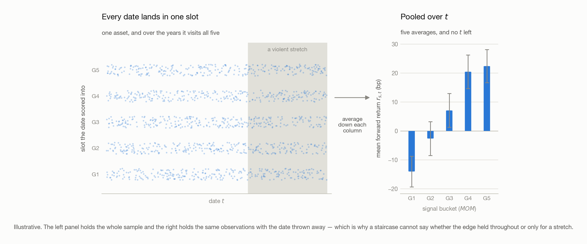

# 02 · Testing a Signal

> - **Answers:** why one correlation is the only number deciding whether a strategy makes money, and how to measure it long before a backtest.
> - **Prerequisites:** [01 · What Is a CTA Strategy](01-what-is-cta.md); the data it runs on is [100 · The Dataset](100-dataset.md).
> - **After reading:** state a signal as a hypothesis, measure whether it carries information with a bar plot, and say what that plot cannot tell you.

---

## 1. A signal is a hypothesis, not a formula

### 1.0 The three objects

Everything in this chapter is built from three numbers, one of each per asset per date.

| Object | Symbol | What it is | Known at $t$ ? |
| --- | --- | --- | --- |
| **Weight** | $w_{s,t}$ | the share of capital held in asset $s$ on date $t$, signed — negative is a short | **yes**, you choose it |
| **Signal** | $MOM_{s,t}$ | a number computed from data available at $t$, meant to say something about what comes next | **yes**, you compute it |
| **Forward return** | $r_{s,t}$ | what the asset then goes on to deliver while the position is held | **no** — this is the unknown |

**Note (Scope).** This chapter describes **one asset at a time**: a single series of dates, each
carrying that asset's own signal and its own forward return. That restriction is not a
simplification — assets have different volatilities, so their raw signals are not on one scale and
cannot be compared until § 4 puts them there. Combining several assets into one book comes after
that, in [04](04-from-signal-to-position.md).

**Definition (Binary momentum).** The simplest member of the family — the sign of last period's
return, and nothing else:

$$
MOM_{s,t}  =  \text{sign}\left( r_{s,t-1} \right)
$$

where $s$ indexes the asset and $t$ the date, $r_{s,t-1}$ is that asset's return over the period
just ended, and $MOM_{s,t}$ is either +1 (long) or −1 (short), with nothing in between.

#### Why the sign alone is not enough

A window in which the asset rose 20% and one in which it rose 10% produce the *same* signal, so a
strategy built on it takes the same size in both. Trend **direction** survives; trend **strength**
is thrown away.

<picture>
  <source media="(prefers-color-scheme: dark)" srcset="figures/binary-momentum-dark.png">
  
</picture>

**Definition (Momentum).** Averaging over $N$ periods rather than one, and keeping the value rather
than its sign:

$$
MOM_{s,t}  =  \text{Avg}\left(r_{s,t-i}\right),\qquad i = 1 \ldots N
$$

with $N$ the lookback length and $i$ the lag inside it — the average runs over the $N$ returns
ending yesterday. What it keeps is a magnitude proportional to how strongly the asset trended.

### 1.1 Why studying the signal is the same as studying the portfolio

A signal is not a strategy: it earns nothing and cannot be held. The reason to spend a chapter on
one runs backwards, from what you are actually paid on.

**Start from the portfolio, because that is what you optimize.**

$$
R_t  =  \sum_s w_{s,t} r_{s,t}
$$

$R_t$ is the portfolio's return on date $t$, summed over every asset in the universe. Of the two
factors in each term only one is yours — $r_{s,t}$ is the market's answer, and it arrives after the
weight is already set. **So the whole of portfolio construction is the choice of $w_{s,t}$.**

**But the weights are not free.** Two sums over the book are fixed before any signal is consulted:

$$
\textbf{net:}\quad \sum_s w_{s,t} = 1
\qquad\qquad
\textbf{gross:}\quad \sum_s |w_{s,t}| = G
$$

$G$ is the gross target; the net holds at 1 only to within a tolerance $\delta$, since rebalancing
is discrete and the book drifts between trades. The two sums are independent:

| Sum | What it fixes | Typical value |
| --- | --- | --- |
| **Net**, $\sum_s w_{s,t}$ | how much *market* the book carries — the directional bet, since longs and shorts cancel here | 100% long-biased, $\approx 0$ market-neutral |
| **Gross**, the same sum over absolute weights | how much *leverage* is deployed, longs and shorts adding rather than cancelling | 200% (a 150/50 book) or 300% |

A book holding one asset at 100% and a book long 200% / short 100% carry the same net and three
times the position — which is why both sums have to be stated, and why gross is never free
([01](01-what-is-cta.md)).

**The weights are where the signal enters.** You want weight where the forward return is about to be
high, and that is precisely the number you do not have. The signal is the stand-in you put in its
place, which means setting $w_{s,t} \propto MOM_{s,t}$.

**Claim.** Under that rule the portfolio's expected return is proportional to the correlation
between the signal and the forward return, and to nothing else that can change its sign.

<b>Proof.</b> expected portfolio return factorises into a leverage scale, two volatilities, and the signal-return correlation — and only the last can be negative

Take the signal and the return as centred. With $w_{s,t} \propto MOM_{s,t}$,

$$
E[R_t]  \propto  \sum_s E[MOM_{s,t} r_{s,t}]  =  \sum_s \rho_s \sigma_{MOM,s} \sigma_{r,s}
$$

using $E[xy] = \rho \sigma_x \sigma_y$ for centred $x$ and $y$, where $\rho_s$ is the correlation
between asset $s$'s signal and its forward return and $\sigma_{MOM,s}$, $\sigma_{r,s}$ their standard
deviations. The dropped constant is a leverage choice and the volatilities are measurable properties
of the asset — all three positive whatever the signal does. **Only $\rho_s$ can carry a sign, so only
$\rho_s$ decides whether the portfolio makes money or loses it.**

**Note (The constraints do not disturb this).** Reaching a legal weight vector means **shifting**
the signal until the net lands right and **scaling** until the gross does — both affine with a
positive scale, under which correlation is unchanged: $\rho(a + bx, y) = \rho(x, y)$ for $b > 0$. The
$\rho$ measured on the raw signal is therefore the $\rho$ governing the constrained portfolio, which
is what lets the rest of the chapter ignore weights altogether; [04](04-from-signal-to-position.md)
carries out both operations.

Everything collapses to that one number, and it is a number about the signal alone:

$$
\textbf{hypothesis:}\quad MOM \uparrow  \Longrightarrow  \text{return} \uparrow
\qquad\qquad
\textbf{that is:}\quad \rho > 0
$$

Three things follow, and between them they set the shape of the rest of the chapter.

| Consequence                                                                                                                                                                                                    | Dealt with in |
| -------------------------------------------------------------------------------------------------------------------------------------------------------------------------------------------------------------- | ------------- |
| **The portfolio never has to be built to test the signal.** Measure $\rho$ between the signal and the forward return directly, and you have measured the strategy                                      | § 2, § 3    |
| **Magnitude reaches the position, not just direction.** $w \propto MOM$ means a signal twice as large takes a position twice as large — which is what binary momentum throws away                     | § 1.0        |
| **At equal $\rho$ a volatile asset contributes more than a quiet one**, since each term carries $\sigma_{MOM,s} \sigma_{r,s}$ alongside $\rho_s$. Ranking raw signals therefore ranks volatilities | § 4          |

**Write the hypothesis before the code.** It names what would falsify the signal, and one you
cannot falsify is a plot you will rationalize either way.

## 2. What you hoped for, and what you get

### The plot everyone draws first

§ 1's hypothesis says forward return rises with the signal, so the first move is to plot one against
the other. The picture you had in mind is the leftmost panel below. What comes back — for well over
99% of the scatters you will ever draw — is the rightmost.

<picture>
  <source media="(prefers-color-scheme: dark)" srcset="figures/scatter-ladder-dark.png">
  
</picture>

### Why the real one is a cloud

**Claim.** The scatter can neither confirm nor refute a signal, because the correlation a working
signal carries sits below the threshold at which the eye resolves a trend.

**Proof.** Both numbers are readable off the panels above: the eye stops resolving a tilt somewhere
around 30%, and a working signal carries 10–15%. Since 15% < 30%, a signal that works and a signal
that does not produce the same picture — **the absence of a visible trend is not evidence of
anything.**

So why is the correlation only 10–15%? Because the quantity being plotted is mostly not the signal.

**Claim.** Split the forward return into the part the signal reaches and the part it does not,
$y = \beta x + \epsilon$. If $\epsilon$ is uncorrelated with $x$, the signal owns exactly
$\rho^2$ of the return's variance, where $\rho$ is their correlation.

<b>Proof.</b> uncorrelated parts add their variances, so the explained share is exactly the squared correlation — 1.44% of it at 12%

Uncorrelated components add their variances,

$$
\text{Var}(y) = \beta^2 \text{Var}(x) + \text{Var}(\epsilon)
$$

and on one regressor with an intercept the explained share is $R^2 = \rho^2$. At $\rho = 0.12$,
$R^2 = 0.0144$ — which does not mean "right 1.4% of the time", but: of the variation in forward
return from one observation to the next, 1.44% is linear in the signal and 98.56% is not.

**Example.** Everything below is **one asset-date's** forward return, never a portfolio's. Take a
daily return standard deviation of $\sigma_y = 0.012$ — 120 bp, typical for a single equity ETF,
a **basis point** being 0.01%:

| Component             | Size                            | At 12% correlation |
| --------------------- | ------------------------------- | ------------------ |
| Total return          | $\sigma_y$                    | 120 bp             |
| What the signal moves | $\rho \sigma_y$               | **14.4 bp**  |
| What it does not      | $\sigma_y (1 - \rho^2)^{1/2}$ | **119 bp**   |

Across an x-axis running from $-2\sigma_x$ to $+2\sigma_x$ the trend line climbs about 58 bp end
to end, while at every $x$ the points scatter over roughly 476 bp. **A 0.6% slope inside a 4.8%
cloud** — that ratio *is* the picture.

**Note (And it is worse than that).** Part of those 119 bp is not the market's doing: pooling a
calm 2021 with a violent 2023 adds spread that standardization (§ 4) removes. Nor is a larger
$\rho$ on offer — a predictor correlating 50% with next month's return would be arbitraged away
long before you found it in anything liquid. 10–15% is a competitive market's ceiling, not a
shortfall in craft.

## 3. Two ways out of the cloud

The scatter is unreadable, but the signal may still be in it. There are two things to try, and only
the second one works.

### 3.1 Turn down `alpha`

`alpha` is a marker's opacity. Turn it far enough down — `alpha=0.05` on a few thousand points,
lower still on more — and a single point becomes nearly invisible, so only *overlap* renders and the
chart is a density map rather than a mass of ink. Below, the left panel is the before and the other
two are both the after.

**Note (Not the other alphas).** matplotlib's opacity keyword: not a regression intercept, not the
excess return a manager is paid for, not [03](03-shaping-the-lookback.md)'s smoothing constant
$\alpha$. Code font is the tell.

<picture>
  <source media="(prefers-color-scheme: dark)" srcset="figures/alpha-opacity-dark.png">
  
</picture>

Sometimes it is enough — the middle panel, where high signal against a badly negative return has
thinned enough to read. A signal that only rules something *out* is still tradeable.

**Why it usually fails.** Three reasons that compound:

- **The density comes back smooth.** Tens of thousands of asset-date cells average into a clean
  bivariate blob, and opacity renders that faithfully. A smooth density has no feature.
- **The tilt is finer than the ink.** § 2's band is eight times taller than the trend line's whole
  rise, so the lean is smaller than the markers drawn over it.
- **It treats the symptom.** The scatter spends its resolution on individual noisy points when the
  claim is about their **average**; no rendering choice changes what is being rendered.

**Note (Look first anyway).** Always draw it. On the rare occasion something *is* readable — a
curve, an empty corner — it beats every statistic, because it gives the *shape*. The mistake is
concluding anything **from** a cloud.

### 3.2 Beta Method

Stop asking each point what it did, and ask each *group* of points what they did on average. The
answer comes back as a **bar plot**, and the rest of § 3 is about reading that one chart.

#### 3.2.1 What a bar plot is

**Definition (Bar plot).** Five bars. The horizontal axis is the **signal**, coarsened into five
ordered slots G1 … G5; the vertical axis is the **mean forward return** of the observations filed
into each slot. Every observation lands in exactly one bar, and the error bar on it is the standard
error of that mean.

**Note (A bucket holds dates, not assets).** G5 is not a set of assets. It holds the **dates** on
which this one asset's signal stood in the top fifth of its own history, and G1 the dates on which
it stood in the bottom fifth. One asset passes through every bucket as the years go by, and the
whole chart describes that asset alone.

Five steps build it:

1. **Fix one asset.** Its history gives one signal $MOM_{s,t}$ and one forward return $r_{s,t}$ per
   date.
2. **Rank the dates by signal value**, highest to lowest.
3. **File each date** into one of five slots by that rank: the highest fifth into G5, down to G1.
4. **Record** under each slot the forward return that date went on to deliver.
5. **Average** the returns filed under each slot.

**Note (Step 2 is where this chapter's one defect lives).** Ranked on *what*, exactly? Take the raw
momentum value and everything above still runs — but the asset's own volatility changes over the
years, so +2% is a strong month in a calm tape and a quiet one in a violent tape, and step 3 files
them into the same slot as if they were the same event. § 4 is the correction, and until it lands
the plot below should be read as machinery rather than as a result.

The figure runs those five left to right, so five dates drawn at random contribute one observation
per slot — the population, each draw sitting at the slots its five dates fell into, and the average
of many with the error on it.

<picture>
  <source media="(prefers-color-scheme: dark)" srcset="figures/bucket-construction-dark.png">
  
</picture>

**The sort key is the signal, never the return.** Step 2 orders by $MOM_{s,t}$, which is known at
$t$; step 3 only *records* what followed. G1 therefore holds the lowest-**signal** observations, not
the worst performers.

**Example.** Five dates from one asset's history, invented, filed both ways:

| Date | Signal | Forward return | Slot by signal | Slot by return |
| --- | --- | --- | --- | --- |
| $t_1$ | +2.1% | −0.4% | G4 | G2 |
| $t_2$ | −1.8% | +0.9% | G1 | G4 |
| $t_3$ | +0.6% | +1.3% | G3 | G5 |
| $t_4$ | +3.4% | +0.2% | G5 | G3 |
| $t_5$ | −0.9% | −1.1% | G2 | G1 |

Read down *slot by signal* and the returns come out unordered — which is exactly what five dates
look like at 12% correlation. Read down *slot by return* and the ordering is perfect, and would be perfect
for **any** signal including one straight out of a random number generator, because each bar is then
reporting the sort key back to you. **The staircase is evidence only because the thing sorted on and
the thing measured are different, and the second was not knowable when the first was computed.**

One bar therefore carries three pieces of information: which fifth of the signal's range it stands
for, the average return that fifth went on to earn, and how much of that average is sampling noise.

#### 3.2.2 How the bar plot shows a trend

**The trend is the ordering, not the heights.** § 1's hypothesis was *higher signal, higher forward
return*; on a bar plot that is precisely the statement G1 < G2 < G3 < G4 < G5. A single bar's level
moves with where the boundaries are cut (§ 4) — the ordering is what does not.

Two further readings carry information, and nothing else on the chart does:

| Read                                                | What it establishes                                                                                                         |
| --------------------------------------------------- | --------------------------------------------------------------------------------------------------------------------------- |
| **G5 − G1, measured against the error bars** | the size of the edge next to what noise alone would draw. A rise that fits inside one error bar is not evidence of anything |
| **The direction of the slope**                | a*descending* staircase is not a dead signal — it is the same edge carrying the opposite sign                            |

A scrambled middle does not disqualify a signal: clean tails around a muddled G2–G4 is a common
shape and a perfectly tradeable one, since the tails are where the positions go.

On direction, adopt a convention and keep it: **leave the signal's sign alone and let the chart come
out upside down.** Flipping a signal the moment its staircase descends is cheap, and a dozen signals
later you will not remember which ones you flipped. Read a descending staircase as *this works,
traded short*, and carry the sign in the strategy rather than in the signal definition.

**Claim.** The ordering surfaces at all only because of step 4 — averaging shrinks the noise and
leaves the signal untouched.

<b>Proof.</b> averaging leaves the signal where it was and divides the noise by the square root of m, turning 1 : 8 into 2 : 1

Take $m$ observations sharing a similar signal value. Their mean return still has expectation
$\beta$ times their mean signal — they were chosen for having nearly the same signal, so averaging
them changes it barely at all — while the noise around it falls to $\sigma_\epsilon / m^{1/2}$:

|        | One observation | Mean of 300                        |
| ------ | --------------- | ---------------------------------- |
| Signal | 14.4 bp         | 14.4 bp                            |
| Noise  | 119 bp          | $119 / 300^{1/2} \approx 6.9$ bp |
| Ratio  | 1 : 8           | **2 : 1**                    |

The left column is the scatter of § 2 and the right column is one bar of the chart. Nothing was
added — only the noise was taken away.

<picture>
  <source media="(prefers-color-scheme: dark)" srcset="figures/noise-shrinks-dark.png">
  
</picture>

The true bars are identical in all four panels — near −20 bp at G1 and +20 bp at G5. Only the error
moves, and at $m = 5$ it is larger than the whole staircase. **Sample size is not a detail of the
recipe; it is the reason the recipe works.**

**Note (Where that overstates it).** The $m^{1/2}$ assumes independence, and one asset's history
violates it twice over: overlapping lookback windows share most of their inputs, and returns
cluster in time, so consecutive observations are near-copies rather than independent draws. Both
push the effective count well below $m$, and the noise does not really reach 7 bp. The logic
survives: averaging cancels noise and leaves systematic signal.

#### 3.2.3 What the bar plot cannot show

Every date contributes one observation — its signal's score, and the return that followed. Step 5
flattens all of them onto one picture, five slots wide.

<picture>
  <source media="(prefers-color-scheme: dark)" srcset="figures/bucket-time-collapse-dark.png">
  
</picture>

Step 5 integrates over $t$, and an integral hands back an area, never the shape of the function
underneath it. A staircase that is monotone over twenty years is equally consistent with an edge
that held throughout and with one that worked for five years and was flat for fifteen.

| Not on the chart                                                  | Where to look instead                                   |
| ----------------------------------------------------------------- | ------------------------------------------------------- |
| **When** the edge happened                                  | the equity curve of[05](05-understanding-backtesting.md) |
| **Who** is inside a bucket — which dates, which regime      | the dates behind each bar, tabulated rather than averaged         |
| **The spread** of returns behind a bar, as against its mean | the distribution within a bucket, not its mean          |
| **How independent** the observations are                    | overlapping windows, per the Note above                 |

## 4. Step 2, corrected — risk-adjusted momentum

**This section repairs § 3.2, it does not extend it.** Every piece of machinery there survives: the
sort key is knowable at $t$, the returns are recorded honestly, and the averaging shrinks noise
exactly as the proof says. What § 3.2 never settled is *what step 2 ranks*, and ranking the raw
momentum value produces a chart about something other than the signal.

Raw momentum is not comparable **across time**, and § 3.2 compares nothing else: its five slots sort
one asset's own dates against one another. 2% in the calm 2021 tape and 2% in the 2023 rate-hike
drawdown are different events, and filing them into the same slot says they are the same.

The identical failure reappears one step later, **across assets**, the moment you want more than one
name in a book — and there it is an assumption you have to state rather than a fact. A universe of
five hundred large-cap equities might plausibly sit on one scale already. A CTA universe does not:
50 bp in a session is an ordinary day for an equity index and, for a Treasury future, an event that
would lead the news. 2% monthly momentum in a Treasury ETF is a large move; the same 2% in a
semiconductor ETF is a quiet month. Rank the two against each other on raw momentum and the
semiconductor wins every time — not because its trend is stronger but because everything about it is
larger.

Divide by volatility:

$$
MOM^{\text{risk-adj}}_{s,t}  =  \text{Avg}\left(\frac{r_{s,t-i}}{\sigma_{s,t}}\right),\qquad i = 1 \ldots N
$$

where $\sigma_{s,t}$ is that asset's volatility, estimated on data strictly before $t$ — a
denominator that peeks at the future contaminates the signal as surely as a numerator would (§ 5).

Every date, and later every asset, now lands on one scale, so § 3.2's slots compare like with
like — two students both scoring 80 on different exams against different cohorts have not achieved
the same thing.

**Note (A second route to the same plane).** Dividing by $\sigma_{s,t}$ is not the only way. You can
also replace the value outright by **its percentile against that asset's own past**, which lands
every date on $[0, 1]$ by construction and needs no volatility estimate at all. Either route hands
step 2 something it can legitimately rank.

**Example.** Two assets, each with five past signal values and one for today:

| Asset | Its own past signals | Today | Beats | Percentile |
| --- | --- | --- | --- | --- |
| A | −10, 8, 4, 0, −5 | **+7** | four of five | **80** |
| B | −100, −80, 90, −60, 20 | **−70** | two of five | **40** |

Raw, `+7` against `−70` is not a comparison anybody should make. As percentiles, 80 against 40 is —
and it says A is the stronger trend *relative to its own history*, which is the only sense in which
the question has an answer. The cost is the one every rank charges: the magnitudes are gone.

**Note (Which cut to use once it is scored).** The percentile route hands back a uniform score, so
cutting at the quintiles gives five equal groups for free. The volatility route does not: a
standardized signal is roughly normal, so cutting it at fixed intervals such as ±1 and ±2 leaves
almost everything in the middle and starves the two tails you would actually trade. Cut it at its
quintiles instead.

**The rule this section leaves behind.** Every signal is either **standardized** or **scored against
its own past** before it is compared to anything. A raw momentum value is never ranked against
another date, and never against another asset — the comparison is meaningless in both directions,
and the resulting bar plot reports volatility while wearing the signal's name.

## 5. Information availability

Everything above assumes the signal at `t` uses only data knowable at `t`. Look-ahead bias is born
here; the execution offsets in [05](05-understanding-backtesting.md) are the second line of defense
and cannot rescue a signal contaminated at construction. The rolling-quantile rule (§5) and the
train/validation/test split ([07](07-overfitting-and-robustness.md)) are the same discipline.

## Background

### If momentum averages returns, where is the magnitude — isn't the signal still ±1?

No. The two definitions in § 1 differ by one operation: binary momentum wraps the return in
`sign()`, plain momentum does not. An average of returns is an ordinary decimal — `Avg` spelled out
is a sum over the window, the lag $i$ counting backwards from yesterday:

$$
MOM_{s,t} = \frac{1}{N}\sum_{i=1}^{N} r_{s,t-i}
$$

At $N = 21$ that is last month's average daily move. Over a five-day lookback:

| Asset | Last five returns            | Avg → the signal | After`sign()` |
| ----- | ---------------------------- | ----------------- | --------------- |
| A     | +3%, +2%, +4%, +1%, +2%      | **+0.024**  | +1              |
| B     | +1%, −0.5%, +1%, 0%, +0.5%  | **+0.004**  | +1              |
| C     | −2%, −3%, −1%, −2%, −2% | **−0.020** | −1             |

The right column is binary momentum, and it cannot tell A from B. In the left column A is **six
times** B — that ratio *is* the magnitude, and since the signal is proportional to the weight, A is
held six times larger. Nothing is lost: the sign still carries direction, the absolute value adds
strength on top.

One caveat, which is § 4's subject: 0.024 means nothing on its own. 2.4% earned in a calm year and
2.4% earned in a violent one are not the same trend. Only *relative* sizes are ever used.

### After I compute momentum on day $t$, which return does it get paired with?

Not necessarily the next one. Three spans sit on the timeline, in this order:

| Span                    | What it holds                                                                       | Typical size          |
| ----------------------- | ----------------------------------------------------------------------------------- | --------------------- |
| **Lookback**      | the$N$ returns the signal averages, ending at $t-1$                             | 20–250 periods       |
| **Gap**           | $g$ periods thrown away — neither averaged into the signal nor scored against it | 0, a week, or a month |
| **Paired return** | $r_{s,t+g}$, the one period the signal is judged on                               | one period            |

<picture>
  <source media="(prefers-color-scheme: dark)" srcset="figures/signal-return-alignment-dark.png">
  
</picture>

The gap is the only free choice of the three. The `-1` in **12-1 momentum** is exactly this gap: a
twelve-month window stopping one month short of today.

**Why leave one at all.** Not executability — § 1's window already ends at $t-1$, so $g = 0$ is
knowable in time and anything tighter is look-ahead (§ 5). Executability fixes the floor at zero;
**reversal** decides everything above it.

**Reversal is not an anomaly, it is the normal state of the tape.** A trend that has just formed
hands a little of it back, and at daily frequency that rebate is large enough to cancel the edge
outright — which is how a real signal arrives at the bar plot looking flat, or upside down. Three
mechanisms produce it, and they are not equally fragile:

| Mechanism | What happens | Competed away? |
| --- | --- | --- |
| **Bid–ask bounce** | Closes print alternately at the bid and the ask, oscillating around the true mid — negative serial correlation by construction | **No.** A measurement artefact; no price moved |
| **Paying for liquidity** | An order that must fill now pushes price past fair value, and whoever takes the other side is repaid when it returns | **No.** A fee for a service actually rendered |
| **Overreaction** | News is over-extrapolated, then partly corrected | **Yes** — the only part that decays |

Two of the three are not mistakes, which is why reversal survives competition instead of being
arbitraged into nothing. It also **strengthens as you sample finer**: the bounce is a roughly fixed
number of ticks per trade while the trend grows with the horizon, so at one day the bounce dominates
and at one month it is rounding error. That ratio is what sets $g$.

**What the gap costs.** It removes the opening of the trend along with the rebate, so a longer $g$
is a staler signal. That makes $g$ a **hyperparameter**, and running it at a day, a week and a month
and keeping whichever bar plot looks best is what [07](07-overfitting-and-robustness.md) warns
about. Set it from your trading frequency and a prior on how long the rebate lasts.

The lower panel is also where § 3.2.2's caveat comes from: step one date forward and the lookback
keeps all but one of its cells, so neighbouring signals are near-copies and the effective sample
sits well below $m$.

## Appendix · Notation

Throughout, $s$ indexes the asset and $t$ the date. The signal is computed per asset, so $s$ is
dropped wherever a formula never leaves one asset; it carries weight everywhere the assets are
ranked against each other.

| Symbol                                                                                                            | Means                                                                                                                         | First used |
| ----------------------------------------------------------------------------------------------------------------- | ----------------------------------------------------------------------------------------------------------------------------- | ---------- |
| $s$, $t$                                                                                                      | the asset, and the date in periods (days here)                                                                                | § 1       |
| $r_{s,t}$, $MOM_{s,t}$, $w_{s,t}$                                                                           | that asset's return in that period, the momentum signal it produces, and the share of capital that signal earns it            | § 1.0     |
| $R_t$                                          | the portfolio's return on that date,$\sum_s w_{s,t} r_{s,t}$ | § 1.1                                                                                                                        |            |
| $G$, $\delta$                                                                                                 | the gross-exposure target the weights must sum in absolute value to, and the tolerance allowed on the net                     | § 1.1     |
| $\rho_s$, $\sigma_{MOM,s}$, $\sigma_{r,s}$                                                                  | one asset's signal-return correlation, and the standard deviations of its signal and its forward return                       | § 1.1     |
| $N$, $i$                                                                                                      | lookback length, and the lag inside it running 1 to N                                                                         | § 1.0     |
| $x$, $y$, $\beta$, $\epsilon$                                                                             | one observation's signal value and forward return, the slope between them, and the part of the return the signal cannot reach | § 2       |
| $\rho$, $R^2$                                                                                                 | their correlation, and its square — the share of the return's variance the signal explains                                   | § 2       |
| $\sigma_x$, $\sigma_y$, $\sigma_\epsilon$                                                                   | standard deviation of the signal, of the return, and of the unreachable part                                                  | § 2       |
| $m$                                                                                                             | observations sharing a bucket                                                                                                 | § 3.2     |
| G1 … G5                                                                                                          | the buckets, lowest to highest signal**within a date**                                                                  | § 3.2     |
| $\sigma_{s,t}$                                                                                                  | one asset's volatility, estimated on data before that date                                                                    | § 4       |
| $g$                                                                                                             | gap length — periods between the end of the signal's window and the return it is scored on                                   | Background |

**Note (Collisions to watch).** $R_t$ is the portfolio's return on a date (§ 1.1) and $R^2$ a share
of variance (§ 2); they share a letter and nothing else.

Three quantities wear a $\sigma$ and are not interchangeable: $\sigma_y$ is the spread of forward
return across the pooled cloud (§ 2) — the sample-wide version of § 1.1's per-date $\sigma_{r,s}$ —
$\sigma_\epsilon$ is the part of it the signal cannot reach (§ 2), and $\sigma_{s,t}$ is one asset's
trailing volatility on one date (§ 4).

Lowercase $g$ is the gap, unrelated to the buckets G1 … G5, and lowercase $\delta$ is the tolerance
on net exposure (§ 1.1), unrelated to [03](03-shaping-the-lookback.md)'s $\Delta$. Section 3.1's
`alpha` is a plotting keyword, not a smoothing constant and not a regression intercept — code font
against maths is the tell. Chapter [01](01-what-is-cta.md) uses $s$ for a signed share count; here it
is always the asset.

---

## Next → [03 · Shaping the Lookback](03-shaping-the-lookback.md)

Before moving on, **build the 21-day momentum signal on a single ETF, score it both ways — divided
by trailing volatility, and as a percentile against its own past — and plot the bucket chart for
each.** Chapter 03 then asks what shape the lookback itself should have.

You should be able to explain:

- [ ] Why a scatter plot proves nothing at a realistic 10–15% correlation
- [ ] Why the sort key must be the signal and never the forward return
- [ ] Why a gap sits between the signal's window and the return it is scored on, and what that gap costs
- [ ] Why a bucket holds dates rather than assets, and that the time axis is what pooling costs
- [ ] Why a raw signal is never compared to anything, across dates or across assets

[← 01](01-what-is-cta.md) · [Index](00-index.md) · reference: [08 · Toolbox](08-toolbox-pandas.md)
