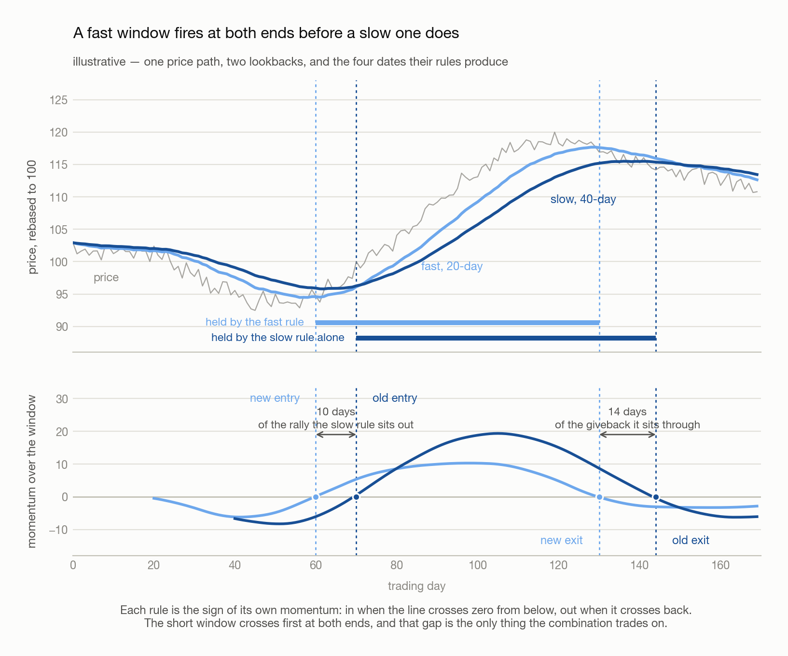
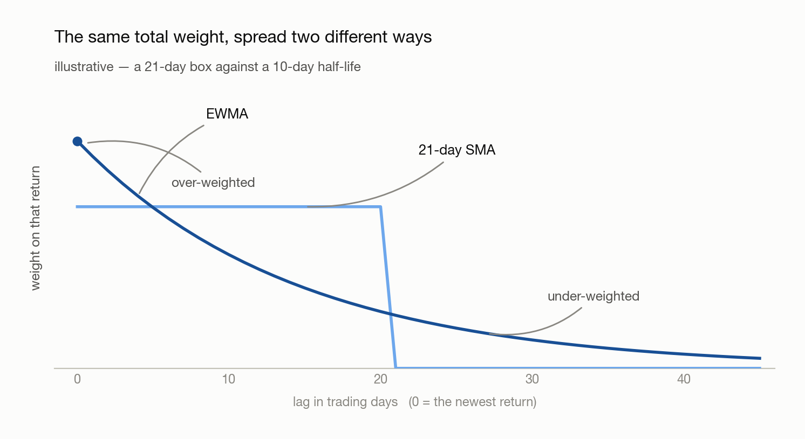
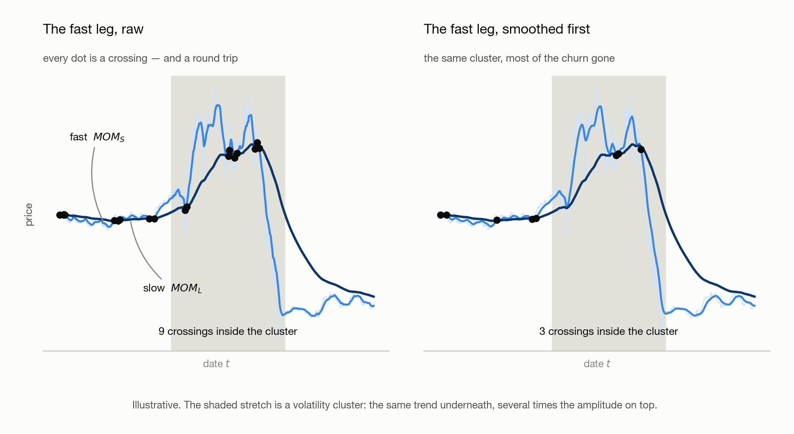

# 03 · Shaping the Lookback

> - **Answers:** how long a lookback to use, how to weight the returns inside it, what MACD is once the chart-package vocabulary is stripped away, and why no setting of any of them stops the signal churning when the market gets loud.
> - **Prerequisites:** [02 · Testing a Signal](02-testing-a-signal.md) — every section here hands you a knob, and 02's bar plot is the only gauge that reads one.
> - **After reading:** pair a fast horizon with a slow one, replace a boxcar average with an EWMA, read MACD as a weighted sum of past returns, and say why the fast leg has to be smoothed.

---

[02](02-testing-a-signal.md) left two blanks inside its own definition. Writing momentum as
$\text{Avg}(r_{s,t-i})$, $i = 1 \ldots N$ fixes neither the length of the window nor the weight each
return carries inside it — the average is a boxcar only because nobody said otherwise.

This chapter fills both, in that order, and then does two further things with the result. § 1 takes
the window and answers it with a *pair* rather than a number; § 2 takes the weights and replaces the
box with a decay. § 3 shows that MACD is those two answers already combined, so the indicator needs
no theory of its own. § 4 is the one movement that is not a blank: **a failure mode that survives
every setting of both**, because it belongs to the market rather than to the parameters. The repair
§ 4 can offer is local; the repair it cannot offer is [04](04-volatility-regimes.md).

Every answer in §§ 1–3 is a **parameter**, and no parameter here is settled by convention. MACD's
26/12/9 fit somebody's historical data once; the fast/slow ratio and the half-life are grid-searched.
What settles them is 02's bar plot, which is why that chapter comes first.

## 1. Combining a slow and a fast horizon

### 1.1 Why two windows beat one

One lookback forces a choice between stable and timely. A long window rides a trend without being
shaken out of it but arrives late at both ends; a short one turns on time, and turns on noise too.
Rather than choose, carry both and let the **fast window time the turns of the slow one**.

Each rule is still the sign of its own momentum, so each fires when its own line crosses zero. Draw
the two over the same price path and the short window crosses first at both ends — that gap, and
nothing else, is what the combination trades on.

<picture>
  <source media="(prefers-color-scheme: dark)" srcset="figures/fast-times-slow-dark.png">
  
</picture>

**What the early signal means.** A fast momentum turning up while the slow one is still negative is
not only an arithmetic consequence of the shorter window. It is the first evidence that flow has
changed direction — that whoever was selling has stopped, or something large has started buying —
while the move is still too small to register over a quarter. The same reading runs the other way
and matters more there: a fast leg rolling over while the slow one is still positive is what a large
holder beginning to leave looks like from outside. Waiting for the slow window to agree means
selling to them on the way out.

### 1.2 Finding the pairing

The pairing is found by experiment, not chosen. Put the slow lookback $N_s$ on one axis and the
fast one $N_f$ on the other, run [02](02-testing-a-signal.md)'s bar-plot test in every cell, and
read the grid as a heat map.

<picture>
  <source media="(prefers-color-scheme: dark)" srcset="figures/ratio-grid-dark.png">
  
</picture>

Two things are true of that grid before any data is collected. **Half of it is empty by
construction** — $N_f < N_s$ or there is no fast leg, so everything on and above the diagonal is
struck out. And the candidates should be spaced **geometrically** rather than evenly: a day, a week,
two weeks, a month, a quarter. Even spacing spends most of the grid on pairs that differ by a
rounding error.

**What a diagonal band means.** The warm cells run diagonally, and that shape is the finding rather
than any single cell in it. On a geometric ladder a diagonal is a constant **ratio**, so what
carries is $N_s / N_f$ and not either window on its own — which is why the answer is quoted as a
ratio at all. Research lands it near **2:1**, and MACD's 26/12 is one instance; for daily-to-weekly
holding the band shows up around two weeks against a month. An empirical regularity, not a law, and
[07](07-overfitting-and-robustness.md)'s subject the moment you start trusting it.

**Note (One hot cell is not a band).** A single dark square with pale neighbours is an artifact of
however many parameter combinations were tried, not an edge. What earns belief is a contiguous
warm region, because a real effect cannot switch off between one week and eight days.

### 1.3 Where the combination pays

Best in **commodities**, and the reason is what moves them. An equity price answers to earnings, to
the firm's own performance, to whoever is running it — many small idiosyncratic forces, none of
which trend for long. A commodity answers to global energy supply, shipping, and whether the large
participants are in the market at all, and it is far too large for one fund to push on its own, so
a move that starts tends to be everyone moving together. Equities second. **Bonds** weakest: lean
on one hard enough and someone takes the other side and presses it back.

## 2. EWMA instead of a simple moving average

### 2.1 Why the newest return should weigh most

A momentum signal is a weighted sum of past returns, and a simple moving average is one particular
choice of those weights: make every one of them equal. Stated that way it is a claim about
information — that a return from sixty days ago tells you exactly as much about where the asset
stands today as yesterday's does.

It does not. **The newest return is the most recent evidence about the state the asset is in now**,
so it should carry the most weight, and a return from three months ago the least. An exponentially
weighted moving average is that preference written down.

<picture>
  <source media="(prefers-color-scheme: dark)" srcset="figures/ewma-weights-dark.png">
  
</picture>

Two things change at once. Relative to the box the newest lags are **over-weighted** and the old ones
**under-weighted** — and the box's hard edge at twenty-one days is gone, so an EWMA thins out
without ever quite forgetting.

### 2.2 The recursion, and the weights it produces

**Definition (EWMA).** Carry one running number and update it as each observation arrives:

$$
\text{EWMA}_t  =  (1 - \lambda) a_t + \lambda \text{EWMA}_{t-1}
$$

where $a_t$ is the newest observation and $\lambda \in (0, 1)$ the decay — how much of the old
average survives each step.

**Example.** Take $\lambda = 1/2$ and three observations $a_1, a_2, a_3$, oldest first. Two updates
run the whole thing:

```text
after a₂ :  (a₁ + a₂) / 2
after a₃ :  [(a₁ + a₂) / 2] / 2  +  a₃ / 2   =   a₃/2 + a₂/4 + a₁/4
```

| Observation | Age | Weight it ends up with |
| --- | --- | --- |
| $a_3$ | newest | **1/2** |
| $a_2$ | one step back | 1/4 |
| $a_1$ | oldest | 1/4 |

The newest observation carries half the total on its own, and each step back halves what is left —
which is what *exponential* names. The oldest two tie only because the recursion had to start
somewhere; run it long enough and that seam washes out.

### 2.3 Choosing how fast it decays

Tune the **half-life** $H$ — the lag at which a return's weight has decayed to half the weight given
to the newest one. Candidates are fractions of the lookback (1/2, 1/3, 1/5, 1/8), and they are
grid-searched exactly as § 1.2's ratio is.

```python
signal = returns.ewm(halflife=H).mean()
```

No value of $H$ is standard, and whatever a package ships as its default is an **empirical
solution** — a number that fit somebody's historical data once. Every parameter in this chapter has
that status, which is [07](07-overfitting-and-robustness.md)'s subject rather than something to
accept on authority.

## 3. MACD, stated precisely

### 3.1 The three series

Written out, MACD is three series built from two exponential moving averages of the **price**.

**Definition (MACD).** For a fast and a slow span $n_f < n_s$, each with its own smoothing constant
$\alpha = 2/(\text{span}+1)$:

$$
\text{MACD}_t = \text{EMA}_{n_f}(P)_t - \text{EMA}_{n_s}(P)_t , \qquad
\text{signal}_t = \text{EMA}_9(\text{MACD})_t , \qquad
\text{hist}_t = \text{MACD}_t - \text{signal}_t
$$

where $P_t$ is the price on date $t$ and $\text{EMA}_n(P)_t$ its exponential moving average over
span $n$. The asset subscript is dropped throughout — MACD is computed one asset at a time.
Conventionally $n_f = 12$, $n_s = 26$, and 9 for the signal line.

| Series                | Reads as                                 | Sign means                 |
| --------------------- | ---------------------------------------- | -------------------------- |
| **MACD line**   | recent average price versus a longer one | trend direction            |
| **Signal line** | a smoothed MACD                          | the level MACD is crossing |
| **Histogram**   | MACD minus its own smoothing             | trend acceleration         |

### 3.2 Why it is momentum, not a separate indicator

**Claim.** MACD is a momentum signal. It is a weighted sum of past returns, differing from a
lookback mean only in the shape of the weights.

<details>
<summary><b>Proof.</b> the two EMAs' weights cancel to a zero-sum kernel on one-period changes, hump-shaped rather than flat</summary>

Each EMA is a weighted average of past prices whose weights sum to one, so their
difference weights the price $i$ days ago by $c_i$, and those weights sum to **zero**:

$$
\text{MACD}_t = \sum_i c_i P_{t-i} , \qquad
c_i = \alpha_f (1-\alpha_f)^i - \alpha_s (1-\alpha_s)^i , \qquad \sum_i c_i = 0 .
$$

A zero-sum weighting is unchanged when every price shifts by a constant, so subtract $P_t$ from each
term and write $P_t - P_{t-i}$ as a sum of one-period changes
$\Delta_{t-j} = P_{t-j} - P_{t-j-1}$. Collecting the coefficient of the change at lag $j$ gives the
**kernel** $k_j$:

$$
\text{MACD}_t = \sum_j k_j \Delta_{t-j} , \qquad
k_j = \sum_{i \leq j} c_i = (1-\alpha_s)^{j+1} - (1-\alpha_f)^{j+1} .
$$

Since $\alpha_f > \alpha_s$, every $k_j \geq 0$: MACD is a non-negative weighted sum of past price
changes, exactly like a lookback mean.

</details>

**Note (What actually differs).** The kernel. A 21-day momentum weights the last 21 returns
equally and everything older at zero; MACD's weights rise from a small value at lag 0, peak around
lag 8, and decay without ever reaching zero. It therefore discounts *yesterday* relative to last
week — deliberately, since the newest return is the noisiest — and never fully forgets.

<picture>
  <source media="(prefers-color-scheme: dark)" srcset="figures/signal-kernels-dark.png">
  
</picture>

**Note (So § 2.1's preference is a choice, not a theorem).** § 2.1 argued that the newest return
deserves the most weight, and the most widely used trend indicator in the market does the opposite.
Both positions are defensible: the newest return is the most recent evidence about the state the
asset is in, and it is also the one carrying the most reversal
([02](02-testing-a-signal.md)'s Background). Which wins is an empirical question settled by the bar
plot, not a matter of taste — which is why § 2.1 was written as a preference rather than a result.

### 3.3 From a value to a rule

Three common rules, in increasing order of information kept. All three still have to pass
[02 § 3.2](02-testing-a-signal.md)'s bar plot before they earn a backtest.

| Rule         | Go long when                            | Costs                                                            |
| ------------ | --------------------------------------- | ---------------------------------------------------------------- |
| Zero-line    | MACD is above zero                      | a slow trend filter, late                                        |
| Crossover    | the histogram is above zero             | earlier, noisier — the churn is § 4's subject                  |
| Proportional | always, sized by the standardized value | none of the magnitude, but see [02 § 4](02-testing-a-signal.md) |

The three differ in how much of the signal's magnitude they keep. They also differ in how *often*
they trade, and that second axis is not a property of the rule alone: a crossover flips whenever the
two legs touch, and how often they touch is set by how large the market's moves happen to be this
month. Every parameter above is now chosen, and that count is still not under their control.

## 4. Volatility clustering, and smoothing the fast leg

### 4.1 What volatility clustering is

**Definition (Volatility clustering).** Large moves are followed by large moves and small by small,
**regardless of sign**. Returns themselves are close to uncorrelated from one day to the next, but
their *absolute* values are strongly and persistently autocorrelated.

Direction is unpredictable; **amplitude is not**. That asymmetry is the whole of it, and it means a
market has stretches — days to months — where everything is simply bigger, without the underlying
trend having changed at all.

### 4.2 Why the fast leg is the one it breaks

The fast leg is a short average of returns, so its swings scale with the amplitude around it. Enter
a cluster and it starts crossing the slow leg repeatedly — not because the trend turned, but because
the noise grew.

<picture>
  <source media="(prefers-color-scheme: dark)" srcset="figures/whipsaw-and-smoother-dark.png">
  
</picture>

**The crossings are not merely expensive, they are backwards.** A downward spike drags the fast leg
under the slow one and flips the book short — at the bottom of the spike. The snap-back flips it
long again, at the top. Repeat that through a cluster and the rule has been buying high and selling
low on a schedule set by noise, which is worse than holding nothing: **whipsaw is not scatter around
the right answer, it is the opposite of the right answer**, taken over and over.

The bill arrives twice. Nine crossings instead of three is nine round trips instead of three, and
they land in exactly the stretch where spreads are widest and depth is thinnest. At forty crossings
a year and five basis points a round trip, that is 200 bp of annual drag against a gross edge that
might be four hundred.

### 4.3 The smoother, and where it goes

**Definition (Smoother).** A second, shorter average applied to the **signal** after it is computed
and before the rule reads its sign. A single day's noise then no longer moves the sign on its own —
a flip has to be agreed to by several days in a row.

You have already met one: **MACD's 9-day signal line is a smoother**, and its histogram is the
crossing test run against the smoothed version rather than the raw one. The 9 in 26/12/9 is this
parameter (§ 3.1).

**Constraint.** The smoothing window must be **shorter than the signal's own period**. Smooth a
10-day signal with a 20-day window and you have not denoised it — you have built another slow leg,
and lost the timeliness the fast one existed for (§ 1.1). That leaves a band: long enough to kill
single-day flips, short enough to keep the lead over the slow leg.

**Note (Standardizing does not help here).** [02](02-testing-a-signal.md) § 4 divides the signal by
its trailing volatility, which is the right fix for comparing dates — and it does nothing at all for
churn, because dividing by a positive number can never change a sign. Comparability and turnover are
separate problems needing separate tools. A **deadband** is the other tool for this one: require the
crossing to exceed some margin before the position flips, rather than acting on the exact touch.

Both tools read the signal and nothing else, which is exactly what makes them local. Neither one
knows that the tape has turned violent; each damps every date alike, and pays for the quiet ones to
protect the loud ones. Going further means measuring the state of the market itself and asking what
the rule is worth in each of its values — → [04 · Volatility Regimes](04-volatility-regimes.md).

## Appendix · Notation

Throughout, $t$ is the date. Everything in this chapter is computed one asset at a time, so the
asset subscript $s$ of [02](02-testing-a-signal.md) is dropped.

| Symbol | Means | First used |
| --- | --- | --- |
| $N_f$, $N_s$ | fast and slow lookback lengths, in periods | § 1.2 |
| $a_t$, $\lambda$ | the newest observation, and the EWMA decay that keeps $\lambda$ of the old average | § 2.2 |
| $H$ | EWMA half-life, in periods | § 2.3 |
| $P_t$, $\Delta_{t-j}$ | price on that date, and the one-period change at that lag | § 3.1 |
| $n_f$, $n_s$ | fast and slow EMA spans, conventionally 12 and 26 | § 3.1 |
| $\alpha_f$, $\alpha_s$ | their smoothing constants, two over span plus one | § 3.1 |
| $c_i$, $k_j$ | MACD's net weight on the price at that lag, and its kernel weight on the price change | § 3.2 |

**Note (Collisions to watch).** $N_f, N_s$ are plain lookback lengths and $n_f, n_s$ are the EMA
spans that play the same two roles — case is the tell. $k_j$ is a kernel weight, not a portfolio weight — [02](02-testing-a-signal.md)
reserves $w_{s,t}$ for the latter, which is why the kernel is not written $w$. And $\alpha$ here is a
smoothing constant, not [02 § 3.1](02-testing-a-signal.md)'s `alpha` plotting keyword and not a
regression intercept; code font against maths is the tell.

---

## Next → [04 · Volatility Regimes](04-volatility-regimes.md)

Before moving on, **count your fast/slow rule's crossings month by month, and plot that count
against the same month's realized volatility.** The upward slope is § 4 measured on your own data —
and the number on that axis is known only once the month is over, which is the problem Chapter 04
opens with.

Then, if you have not already, **plot the kernel of your own signal** — the weight it places on the
return at each lag — beside a boxcar of the same total. If you cannot draw it, you do not yet know
what your signal is averaging.

You should be able to explain:

- [ ] Why a fast leg times the turns of a slow one, and why the ratio is grid-searched rather than assumed
- [ ] What a half-life is, and why an EWMA never fully forgets
- [ ] Why MACD is momentum with a hump-shaped kernel rather than a separate indicator
- [ ] Why the smoothing window must be shorter than the fast signal's own period

[← 02](02-testing-a-signal.md) · [Index](00-index.md) · reference: [08 · Toolbox](08-toolbox-pandas.md)
