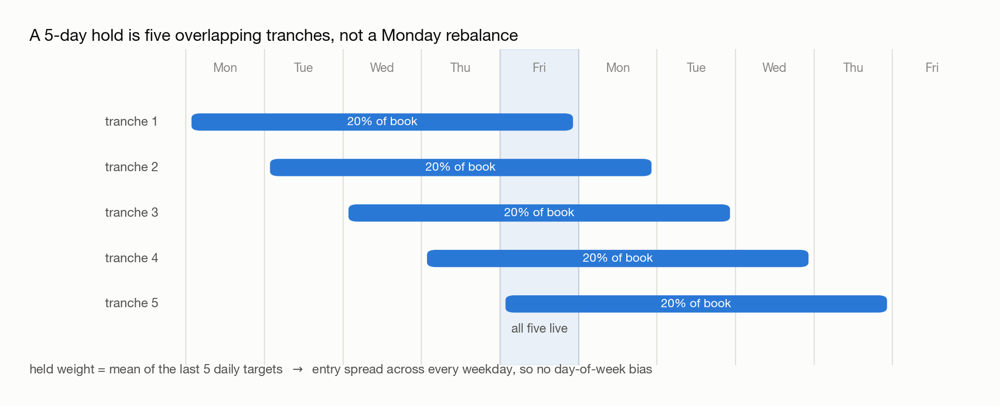

# 04 · From Signal to Position

> - **Answers:** how a signal becomes "how many dollars, then how many shares, of each asset."
> - **Prerequisites:** [03 · Building Your Own Signal](03-building-signals.md).
> - **After reading:** trace the weight → dollar → shares chain, and explain how a holding period is implemented through weights.

---

## How Momentum and the Backtest Relate

**Upstream / downstream.** Momentum decides what to hold and how much; the backtester assumes you
traded that and computes the PnL. Fully decoupled — swap either without touching the other.

```text
close prices
   │  ① signal          momentum(21-day mean of daily returns)   who is rising / falling
   ▼
momentum signal
   │  ② target weights  Portfolio 1 / Portfolio 2                long/short whom, and how much
   ▼
target weights
   │  ③ 5-day overlap   overlap_weights = target.rolling(5).mean()
   ▼
held weights
   │  ④ weight × capital → dollar exposure                       weight → dollar exposure
   ▼
multi_asset_backtester (loop over 37 assets)
   │  ⑤ dollar ÷ close → shares → simulate → PnL
   ▼
per-asset PnL → summed → equity curve + Sharpe / drawdown
```

**The bridge is weight → dollar → shares**, one-directional:

| Quantity | Meaning | Formula | Unit |
| --- | --- | --- | --- |
| `weight` | how much of the book to allocate | from the momentum signal | fraction (%) |
| `dollar` | that allocation in money | `weight × capital` | USD |
| `shares` | shares that money buys | `dollar / close` | shares |

Weight is the **cause**, dollar and shares the **effect**.

**Note.** Positions are expressed in weights rather than share counts because the 37 ETFs trade at
very different price levels; only a percentage exposure is comparable across them.

**Note.** Since `shares = dollar / close`, the share count drifts daily even at constant dollar
exposure — hence the small daily rebalancing trades.

Everything downstream of ⑤ is [05 · Understanding Backtesting](05-understanding-backtesting.md).

## Momentum Signal

**Definition (Momentum signal).** The trailing **21-trading-day** mean of daily returns per asset:
`close.pct_change().rolling(21).mean()`. Positive indicates a recent uptrend.

Designing and validating it is [03](03-building-signals.md)'s job; here it is a given input.

## Holding Period: Why Weights Change

**Definition (Overlapping portfolios).** Under the Jegadeesh–Titman *overlapping portfolio*
construction with holding period `k`, each day commits `1/k` of the book to that day's signal and
holds that tranche for `k` days. The held weight is therefore the mean of the last `k` daily
targets:

```text
held_weight[t] = mean(target[t], target[t-1], ..., target[t-k+1])
```

Here `k = 5`. Code: `overlap_weights = target.rolling(5).mean()`.

**Note.** A 5-day holding period is *not* a hard rebalance every fifth day. Weights evolve
smoothly as old signals roll off, which lowers turnover.

**Claim.** Overlapping reduces gross exposure below the single-day target.

Gross exposure falls whenever longs and shorts from different tranches offset each other — for
Portfolio 1, gross ≈ 1.83 rather than 2.0. See the pitfalls section for why net exposure is
nonetheless unaffected.

### Why overlap rather than a fixed rebalance day

**It stops throwing signals away.** Rebalancing only on Mondays discards the fresh signal Tuesday
through Friday each produce.

**It neutralizes the weekday effect.** Under weak-form efficiency, day-of-week effects persist: many
funds close on Friday and re-open Monday to avoid weekend gap risk, lifting Monday returns and
depressing Friday's. Trade always on one weekday and you inherit that bias, indistinguishable from
your signal's edge. Spreading entry across all five averages it out.

So the tranche structure is bias control, not just turnover smoothing:

<picture>
  <source media="(prefers-color-scheme: dark)" srcset="figures/overlap-tranches-dark.png">
  
</picture>

## The Two Portfolios

| | Portfolio 1 | Portfolio 2 |
| --- | --- | --- |
| Long/short rule | **absolute** MOM (>0 long / <0 short) | **relative** MOM (vs peers) |
| Weights | long leg 150% equal-weight, short leg 50% equal-weight | equal magnitude, sign by relative rank |
| Net exposure | +100% (long-biased) | ≈ 0 (market-neutral) |
| Gross exposure | 200% (before overlap) | ~200% (before overlap) |

**Portfolio 1 — Long 150% / Short 50%.** With `n_pos` longs and `n_neg` shorts: each long =
`1.5/n_pos`, each short = `−0.5/n_neg`. Net = +1.5 − 0.5 = **+1.0**.

### Weights Are Money, Not Shares or Price

**Definition (Weight).** A *weight* is a fraction of capital allocated to an asset — not a share
count and not a price. "Equal weight" therefore means **equal dollars**.

**Claim.** *"SPY, GLD and XLK have different prices — how can they each be +50% and still sum to
150%?"* They necessarily do.

Slicing a fixed budget into `n_pos` equal money slices is an identity, not a coincidence:
`(1.5 / n_pos) × n_pos = 1.5`. Price does not appear in the expression.

Price never enters the weight formula; it enters later at `shares = dollar / close`, where the same
dollars buy fewer shares of an expensive asset:

| Long asset | Weight (money) | $ on 1000 capital | Price | Shares bought |
| --- | --- | --- | --- | --- |
| SPY | +50% | $500 | $600 | 0.833 |
| GLD | +50% | $500 | $200 | 2.500 |
| XLK | +50% | $500 | $150 | 3.333 |
| **Sum** | **150%** | **$1500** | — | (all different) |

Same dollars, wildly different share counts — as intended.

**Note.** Price is consumed earlier (the signal picked the members) and later (the share
conversion), never in the money split. Dividing capital does not require knowing unit prices.

**Portfolio 2 — Relative MOM (market-neutral).** Equal-magnitude weights whose **sign** comes from
momentum relative to the cross-section. Long if MOM is **at or above the cross-sectional median**
that day, else short — so an asset can be shorted while its own momentum is positive. Each leg is
`2/N`, so gross ≈ 2.0 and net ≈ 0.

**Note.** The defining property is *relative* ranking: even in a market where every asset is
rising, the weakest half is shorted.

**Claim.** The split must use the median, not the mean.

The brief's example is 10% / 5% / 1% → +66 / +66 / −66. The median is 5%, so the two assets at or
above it go long, reproducing the example. The mean is 5.33%, which would give + / − / − and
contradict it.

## From a Continuous Signal to Weights

Both portfolios discard information: they reduce the signal to a **sign**, so overwhelming momentum
earns the same weight as a marginal reading.

The generalization maps the normalized signal onto position size directly:

1. **Demean** cross-sectionally, so positive is the long side and negative the short side.
2. **Scale** to the exposure constraint — long 150%, short 50%, net +100%, gross 200%.

```python
s = signal.sub(signal.mean(axis=1), axis=0)       # demean cross-sectionally
w = s.div(s.abs().sum(axis=1), axis=0) * 2.0      # scale to 200% gross
w = w + (1.0 - w.sum(axis=1).values[:, None]) / w.shape[1]   # shift net to +100%
```

These weights feed the backtester unchanged. Which version wins is empirical: sign-based weighting is
robust to a noisy signal since it only needs the ranking; proportional weighting extracts more when
magnitude is informative and is punished harder when it isn't. Test both against the bucket chart in
[03 § 4](03-building-signals.md).

---

## Common pitfalls

- **"A 5-day hold means rebalancing every 5th day."** Overlapping portfolios rebalance a little every day.
- **"Gross should be exactly 200%."** Since `|mean| ≤ mean|·|`, gross drops (≈183%) whenever an asset flips sign inside the window — the honest footprint of smooth rebalancing, not a bug. Net *is* invariant: `Σ mean = mean Σ` keeps it at exactly +100%.
- **"Weights should account for price."** Price enters only at `shares = dollar / close`.
- **Mean instead of median for relative MOM.** The mean gives 1 long / 2 short, contradicting the brief's example.
- **"Positive MOM means go long."** Only under Portfolio 1. Portfolio 2 shorts the weakest even if it's rising.

## Open questions

- Where does 150/50 come from — risk budgeting, or convention?
- Would inverse-volatility weighting (risk parity) beat equal weight here? Volatility varies enormously (UNG vs SHY).
- How sensitive are results to sweeping the 5-day hold and 21-day lookback together? See [07](07-overfitting-and-robustness.md).

---

## Next → [05 · Understanding Backtesting](05-understanding-backtesting.md)

Before moving on, **produce the weight matrix for both portfolios** and verify two things numerically:
net exposure is exactly +100%, and gross falls below 200% after the 5-day overlap. If gross comes out
at exactly 2.0, the overlap is not being applied.

You should be able to explain:

- [ ] The weight → dollar → shares chain, and why price enters only at the last step
- [ ] Why net is invariant under overlap but gross shrinks
- [ ] Why the median, not the mean, defines Portfolio 2's long/short split

[← 03](03-building-signals.md) · [Index](00-index.md)
