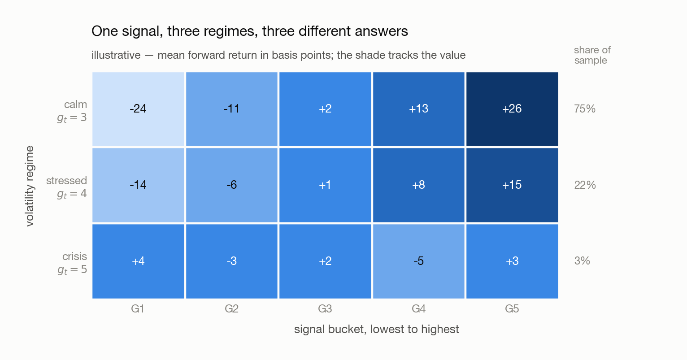

# 04 · Volatility Regimes

---

Three steps, in order. **MACD stops working when the tape gets loud** (§ 1). **The option market
prices that loudness before any trailing estimate can measure it** (§ 2). **The resulting label is
used by conditioning on it, not by adding it to the signal** (§ 3).

## 1. Why MACD breaks when the tape gets loud

<picture>
  <source media="(prefers-color-scheme: dark)" srcset="figures/macd-out-of-phase-dark.png">
  
</picture>

One path, one rule, two regimes. In the calm stretch the fast average pulls clear of the slow one
and stays there: no crossings, one position, held. In the shaded stretch the trend is gone and the
swings are four times wider, so the two legs stay tangled and noise carries one across the other
again and again.

**Every flip also lands after the turn it is chasing**, since an average only confirms a move that
has already happened — so the rule goes short at the bottom of the spike and long at the top of the
snap-back. Whipsaw is not scatter around the right answer; it is the opposite of it, repeated.

Standardizing the signal ([02 § 4](02-testing-a-signal.md)) rescales it without moving a crossing
date, and [03 § 4](03-shaping-the-lookback.md)'s smoother and deadband damp every date alike
because neither knows the tape is violent. Clearing that ceiling means promoting the state of the
market to a **variable**.

## 2. What the option market already knows

### 2.1 Why a trailing estimate is too late

The obvious meter is the volatility you have just lived through.

**Definition (Realized volatility).** The standard deviation of the last $L$ returns, annualized.
Taking the returns as centred,
$\sigma^{\text{real}}_t = \left( \frac{1}{L} \sum_{i=0}^{L-1} r_{t-i}^2 \right)^{1/2}$, where $L$ is
the window length in periods and $r_{t-i}$ the return at lag $i$.

**Claim.** It reaches half of its eventual level about $L/2$ periods after a shift and its full
level only after $L$ — so a monthly window reports a burst that has already ended.

**Proof.** Squared, it is a flat average of the last $L$ squared returns — the boxcar kernel of
[03 § 1.1](03-shaping-the-lookback.md). If the tape jumps from $\sigma_{\text{calm}}$ to
$\sigma_{\text{high}}$ at date 0, then at date $t < L$ exactly $t+1$ of the $L$ terms are drawn from
the new regime:

$$
E\left[ \left(\sigma^{\text{real}}_t\right)^2 \right] = \frac{t+1}{L} \sigma_{\text{high}}^2 + \frac{L-t-1}{L} \sigma_{\text{calm}}^2
$$

The estimate therefore climbs **linearly** from the old level to the new, reaching half the rise at
$t \approx L/2$ and all of it only at $t = L-1$. At $L = 21$ that is ten sessions to half and
twenty-one to full.

<picture>
  <source media="(prefers-color-scheme: dark)" srcset="figures/regime-lag-dark.png">
  
</picture>

The two lines are also the shape of a regime: entered inside a session and left over weeks. By the
time the trailing line peaks, the burst it describes has been over for a fortnight, and a position
sized off it would be de-risking into the recovery.

**Note (Shortening the window does not rescue it).** The lag falls with $L$ and the noise rises with
it — the relative standard error of a variance estimate from $L$ observations runs about
$\left( 2/L \right)^{1/2}$, so $L = 5$ buys a two-session lag at the price of a 63 percent error on
the level. An EWMA only re-shapes the same trade-off. **The problem is not the window; it is that a
backward-looking estimator has no term for news that has just arrived.**

### 2.2 Implied volatility, and the index built from it

Somebody does have such a term. An option's value depends on how far the underlying might travel
before it expires, so anyone quoting one is quoting a volatility forecast whether they name it or
not.

**Definition (Implied volatility).** The value of $\sigma$ that makes a pricing model reproduce an
option's traded price — a forecast for the life of the contract, read out of a price rather than
estimated from history.

**Claim.** An option's price is strictly increasing in $\sigma$, so that inversion is well defined:
one price, one implied volatility.

**Proof.** A call pays $\text{max}(S_T - K, 0)$ at expiry, a convex function of $S_T$. Raising
$\sigma$ spreads the distribution of $S_T$ while leaving its forward mean where it was, and the
expectation of a convex function rises under a mean-preserving spread. The price is therefore
monotone in $\sigma$, and a monotone map is invertible.

**Definition (VIX).** A constant-30-day implied volatility for the S&P 500. Pick the two expiries
whose time to expiry $\tau$ falls between **23 and 37 days** — listed contracts do not fall on a
30-day schedule, so the band is what guarantees one on each side — compute each expiry's implied
variance from its **whole strip** of out-of-the-money strikes rather than one contract, interpolate
the two linearly in $\tau$ onto exactly 30 days, then annualize and take the square root.

**Note (Decide whether your formula wants the variance or the volatility).** The published level is
already a volatility in percentage points — a VIX of 20 means an annualized 20 percent — because
step 2 computes a variance and the last step takes its root. Variance is what is additive, across
time and across independent sources of risk; volatility is not. Anything that rescales a horizon or
adds contributions needs $\left( \text{VIX}_t / 100 \right)^2$; anything compared against a return
in the same units needs the level. The error is invisible when made: a missing square root still
leaves a plausible positive number.

**Note (What the forecast is worth is a separate question).** Implied volatility is what the market
charges, not what will happen — insurance is sold above its expected cost, and that gap is a
strategy in its own right. Here the index is only a **state label**, for which a live consensus is
enough.

### 2.3 One index for equities, another for rates

**Claim.** One equity index's implied volatility labels most sleeves, even though it is computed
from one market.

The reason is what a panic does to correlations. In calm markets the sleeves move mostly apart; in a
large enough shock the same levered participants sell all of them at once to raise cash and the
cross-asset correlations run toward one. The states in which the label matters most are exactly the
states in which one market's fear is every market's fear — an empirical regularity rather than a
theorem, and better at the extremes than in the middle.

| Sleeve                                   | Regime index   | What its spikes are about                           |
| ---------------------------------------- | -------------- | --------------------------------------------------- |
| Equities, credit, most commodities       | **VIX**  | growth and earnings shocks, and forced deleveraging |
| Rates, and anything priced off the curve | **MOVE** | policy surprises, inflation prints, auction stress  |

**Note (Rates are the genuine exception).** Treasury volatility is close to unrelated to equity
volatility, because the two are frightened by different things. A rate sleeve labelled by VIX is
labelled wrongly, and **MOVE** is the same construction run on Treasury options. Neither index is in
`CTA_data/` ([100](100-dataset.md)), so both have to be fetched before § 3 can be run.

### 2.4 From a level to a label

**Definition (Volatility regime).** A stretch of dates over which the amplitude of returns is
roughly constant and materially different from the stretch on either side; a **regime shift** is
the boundary between two of them.

§ 3 needs a small set of such states, named, because a continuous variable cannot be a row of a
table. Write $v_t$ for the index level on date $t$; its distribution is the obstacle.

<picture>
  <source media="(prefers-color-scheme: dark)" srcset="figures/vix-bucketing-dark.png">
  
</picture>

The level spends most of its life in a band a few points wide and occasionally reaches four times
that, so equal-width bins put nearly everything in the first one — the opposite of what
[02 § 3.2.2](02-testing-a-signal.md)'s bucket test needs.

**Definition (Log-ceiling bucket).** Take the natural log of the level and round up to the next
integer, $g_t = \text{ceil}\left( \ln v_t \right)$, where $g_t$ is the regime label on that date.
Because $\ln$ compresses the sparse upper tail and stretches the crowded lower band, the integer
cuts land at multiplicatively spaced levels:

| Label$g_t$ | Level range               | Reads as                  |
| ------------ | ------------------------- | ------------------------- |
| 3            | $v_t \in (7.4, 20.1]$   | calm — the ordinary tape |
| 4            | $v_t \in (20.1, 54.6]$  | stressed                  |
| 5            | $v_t \in (54.6, 148.4]$ | crisis                    |

The boundaries are $e^3$ and $e^4$, close to where a practitioner would have drawn them by hand.
That is the construction's virtue: **the cuts use no data, so a date's label means the same thing in
2015 and in 2020.** Writing $g_t = \text{ceil}\left( c \ln v_t \right)$ puts the boundaries at
$e^{k/c}$ and recovers as many buckets as wanted; $c$ is a hyperparameter like any other, and
choosing it by which value produces the best-looking grid is what
[07](07-overfitting-and-robustness.md) is about.

The alternative is [02 § 3.2.1](02-testing-a-signal.md)'s own machinery applied to the index: rank
the dates by $v_t$ and cut at the quintiles.

|                                  | Log-ceiling                                           | Rolling quantile                                         |
| -------------------------------- | ----------------------------------------------------- | -------------------------------------------------------- |
| **Boundaries**             | fixed, the same in every year                         | move with the window                                     |
| **Group sizes**            | very unequal — crisis may be 3 percent of the sample | equal by construction                                    |
| **A label means**          | an absolute level of market fear                      | a rank against the recent past                           |
| **Comparable across time** | yes                                                   | no — the same$v_t$ can be G5 one year and G3 the next |
| **Look-ahead risk**        | none, the cuts use no data                            | real, if the window is not trailing                      |

**Note (The ranking must be rolling, never full-sample).** A quintile computed over the whole
history uses 2020's levels to label 2015's dates, which is look-ahead bias of the plainest kind
([02 § 6](02-testing-a-signal.md)) — and it is easy to commit here, because the index feels like
context rather than like data.

## 3. Using the label

Each date now carries three numbers: a signal value, a forward return, and a regime label $g_t$. Two
different questions can be asked of that — whether the edge **differs** by regime (§ 3.1), and
whether the regime is **new information** the signals do not already carry (§ 3.2).

### 3.1 Conditioning — the two-way sort

Put the signal buckets across and the regime labels up, and report the mean forward return in every
cell. It is [02 § 3.2](02-testing-a-signal.md)'s bar plot run once per regime — equivalently a
**conditional model**: sort on the state first, then on the signal within it.

<picture>
  <source media="(prefers-color-scheme: dark)" srcset="figures/regime-signal-grid-dark.png">
  
</picture>

Read it by rows, and the reading is the finding. A staircase in the calm row that flattens through
the stressed row and disappears in the crisis row is § 1's picture measured on your own data:
same rule, same parameters, less and less to show for them. The one-dimensional plot of
[02](02-testing-a-signal.md) is the sample-weighted average of the three rows — it reports the calm
row lightly diluted and never mentions that the other two exist.

**Note (Keep the regime axis coarse, and print the counts).** The cells partition the same sample,
so a one-way bar's $N/5$ dates become $N/15$ across three rows and every error bar
([02 § 3.2.3](02-testing-a-signal.md)) widens by $3^{1/2} \approx 1.7$ — at five rows,
$5^{1/2} \approx 2.2$. Worse, the row you most want is the thinnest: crisis cells hold roughly
$N/167$ dates, error bars about 5.8 times wider, so **a flat crisis row is equally consistent with
an edge nobody has enough crisis days to measure.** Report the count beside every mean, and treat a
row you cannot measure as unknown rather than as zero.

### 3.2 Residualizing — is any of it new?

Regress the candidate on the incumbents and keep what is left:

$$
x_t = \beta_0 + \sum_j \beta_j x_{j,t} + \epsilon_t
$$

where $x_t$ is the candidate signal on date $t$, $x_{j,t}$ the signals already in the book — momentum
and MACD, here — $\beta_j$ their fitted coefficients, and $\epsilon_t$ the residual. Then run
[02 § 3.2](02-testing-a-signal.md)'s bar plot on $\epsilon_t$ in place of $x_t$.

**Claim.** If the staircase survives on $\epsilon_t$, the candidate carries an edge the existing
signals do not already own.

**Proof.** Least squares sets the derivative of the summed squared error to zero, giving one normal
equation per regressor — $\sum_t \epsilon_t x_{j,t} = 0$ for every $j$, and $\sum_t \epsilon_t = 0$
from the intercept. Zero sum of products on a centred variable is zero sample covariance, so
$\rho(\epsilon, x_j) = 0$ for every incumbent. By [02 § 1.1](02-testing-a-signal.md) a portfolio's
expected return runs entirely through the correlation between what sets the weights and the forward
return, so weights built on $\epsilon_t$ earn whatever they earn somewhere the book is not standing.

**Note (Orthogonal is not independent).** Zero *linear* correlation is all least squares buys. A
residual that is large exactly when MACD is large **in absolute value** is a function of MACD the
regression cannot see — and that is not a corner case here, since the candidate is a variable about
$\sigma$ and $|\text{MACD}|$ widens with $\sigma$ too. Add the transform you suspect as an extra
regressor and residualize against that too.

**Note (With fifty signals, regress against the model's output).** Fitting a candidate against fifty
regressors on overlapping daily data fits noise long before it exhausts the information, and fifty
pairwise regressions give answers that do not compose. The book already produces one number per
asset per date — its combined prediction $p_t$. Use that single series as the regressor: one
residual, and the question it answers is the one actually being asked.

### 3.3 Where the answer is spent

**Often not in the return model at all.** The natural home for § 3.1's grid is the **optimizer** — a
penalty that rises with the regime, an exposure cap that binds in the crisis row, a volatility
target that scales the whole book — which is why the grid earns its place even when § 3.2's residual
comes back flat. Answering *yes* to § 3.1 and *no* to § 3.2 is a common and perfectly good result,
and [06](06-evaluating-performance.md) is where it is spent.

**Add one dimension per experiment, and record what it bought** — what the step adds alone, whether
it overlaps what is already there (§ 3.2's residual), and which direction it is useful in, since a
variable can predict return poorly and volatility well. The record has to pass interpretability in
an operational sense: move an input and you should be able to say in advance, roughly, what the
output does. Measuring 8 bp where you expected 10 is fine; *"it moved and I do not know by how
much"* is not, and it is what adding several things at once guarantees.

**Note (The scorecard is regime-dependent too).** Every chart above reports mean forward return with
an error bar, for the reasons [02 § 5](02-testing-a-signal.md) sets out. A Sharpe ratio has the
tape's volatility in its own denominator, so the same number means different things in different
rows: 0.8 earned in a year when the index itself ran at 0.4 is a far harder result than 0.9 earned
in a year when buying the index and doing nothing paid 0.8. Collapsing the regime axis into one
ratio destroys exactly the context needed to read the ratio.

## Background

### What is an option, and what does the buyer actually get?

A contract fixing a price today for a trade that may happen later — and the buyer chooses whether it
happens. That choice is the whole instrument; it is what *option* names.

|                       | **Call**                        | **Put**                          |
| --------------------- | ------------------------------------- | -------------------------------------- |
| The holder may        | **buy** the underlying at $K$ | **sell** the underlying at $K$ |
| Worth exercising when | $S_T > K$                           | $S_T < K$                            |
| Payoff at expiry      | $\text{max}(S_T - K, 0)$            | $\text{max}(K - S_T, 0)$             |
| Bought by someone who | wants upside without owning it        | wants a floor under something they own |

with $K$ the **strike**, $S_T$ the underlying's price at expiry, and the expiry the date the choice
must be made. Hold a call struck at \$100: at \$150 you exercise and it is worth \$50; at \$90 you do
not, and it expires worthless. So the payoff is **flat at zero up to the strike, then rises
one-for-one**, and that kink is why the next question has an answer.

### Why is an option the instrument a volatility forecast comes from?

- **Its value depends on the range, not the direction.** The flat half of the payoff truncates the
  losses, so a wider distribution of outcomes is worth strictly more — which makes an option the
  most volatility-sensitive thing quoted, and § 2.2's inversion stable enough to be worth doing.
- **Out-of-the-money contracts are close to pure volatility bets.** One struck far above the price
  pays only if the underlying travels an unusual distance, so its price is almost entirely a
  statement about the tails — which is why VIX reads the whole strip, not the at-the-money contract.
- **The forecast has a fixed horizon attached.** Every contract has an expiry, so an implied
  volatility is always *volatility over the next $\tau$ days* — which is what allows two of them to
  be interpolated onto a constant 30-day horizon.

## Appendix · Notation

Throughout, $t$ is the date. The regime index is a property of the market rather than of one asset,
so it carries no asset subscript $s$.

| Symbol                                                         | Means                                                                                                        | First used |
| -------------------------------------------------------------- | ------------------------------------------------------------------------------------------------------------ | ---------- |
| $\sigma$, $\sigma_{\text{calm}}$, $\sigma_{\text{high}}$ | the amplitude of the tape — the standard deviation of the period's move, without regard to sign — and its levels either side of a regime shift | § 2.1 |
| $\sigma^{\text{real}}_t$, $L$                              | realized volatility, and the trailing window in periods it is computed over                                  | § 2.1     |
| $K$, $S_T$, $\tau$                                       | an option's strike, the underlying's price at expiry, and the time to expiry in days                         | § 2.2     |
| $v_t$, $g_t$, $c$                                        | the index level on that date, the regime label cut from it, and the multiplier setting how fine the cuts are | § 2.4     |
| $x_t$, $x_{j,t}$, $\beta_j$, $\epsilon_t$              | the candidate signal, the signals already in the book, their fitted coefficients, and the residual           | § 3.2     |
| $p_t$, $N$                                                 | the model's combined prediction, and the number of dates in the sample                                       | § 3       |

**Note (Collisions to watch).** $\sigma$ is market-wide here — the amplitude of the tape — where
[02 § 4](02-testing-a-signal.md)'s $\sigma_{s,t}$ is one asset's trailing volatility. Lowercase
$g_t$ is a regime label on the vertical axis while [02 § 3.2](02-testing-a-signal.md)'s uppercase
G1 … G5 are signal buckets on the horizontal one, and § 3.1's grid has both at once. $\epsilon_t$
here is a signal residual after regressing on other **signals**;
[02 § 2](02-testing-a-signal.md)'s $\epsilon$ is the part of the forward **return** no signal
reaches. § 2.1's window is $L$ rather than $k$, which [03 § 3.2](03-shaping-the-lookback.md)
reserves for MACD's kernel weight.

---

## Next → [05 · Understanding Backtesting](05-understanding-backtesting.md)

Before moving on, **build the log-ceiling regime label on VIX and on MOVE, then draw § 3.1's grid
twice** — your 21-day risk-adjusted momentum against VIX on the equity ETFs, and against MOVE on the
bond ETFs. Print the observation count in every cell beside the mean, and say for each row whether
you have measured it or merely populated it.

You should be able to explain:

- [ ] Why a loud tape multiplies a fast/slow rule's crossings, and why each one lands after the turn
- [ ] Why standardizing the signal moves no crossing date, and why a smoother and a deadband are blind
- [ ] Why a 21-day realized volatility peaks after the burst it is measuring, and why a shorter window does not fix it
- [ ] Why an option price can be inverted for a volatility forecast, and when VIX must be squared
- [ ] Why the log of the level buckets and the level itself does not
- [ ] Why a flat crisis row may mean no edge or may mean no data, and what to print to tell them apart

[← 03](03-shaping-the-lookback.md) · [Index](00-index.md) · reference: [08 · Toolbox](08-toolbox-pandas.md)
