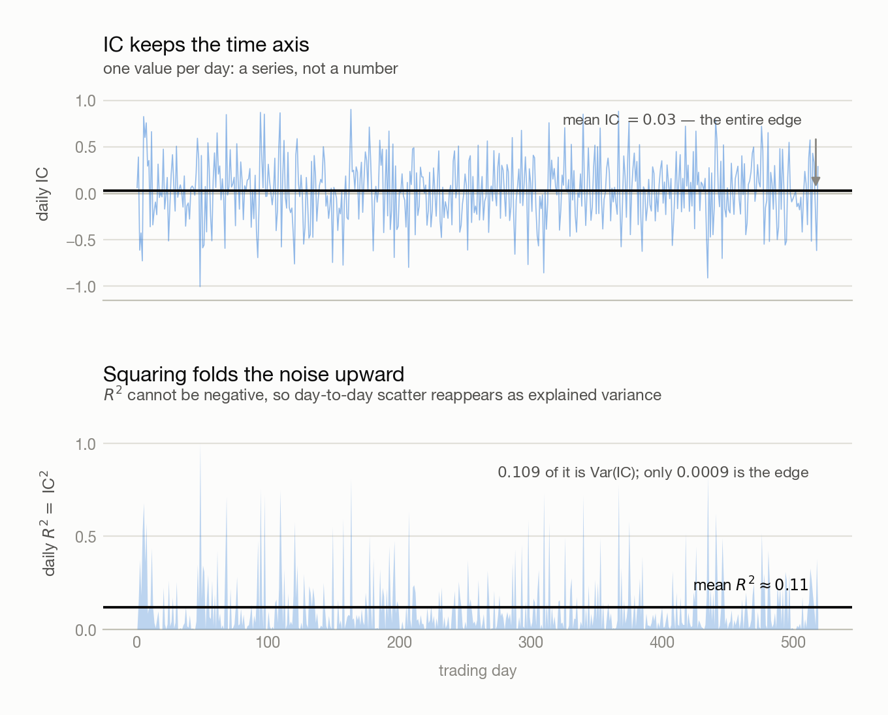
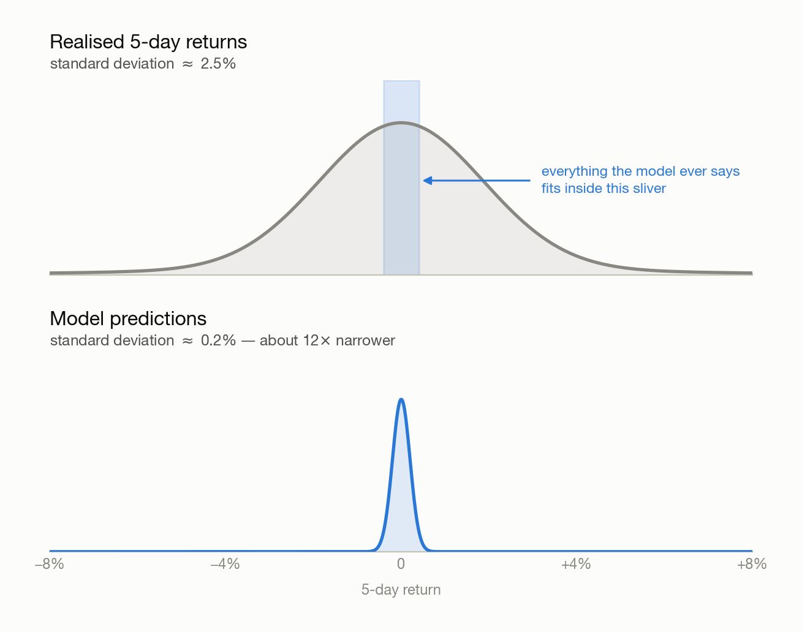

# 08 · IC and R²

> - **Answers:** what the Information Coefficient and R² each measure, what they look like on the same prediction, and why a signal is judged by the first.
> - **Prerequisites:** [02](02-building-signals.md) for the bucket test, [00 · pipeline](00-pipeline.md) for where a prediction sits in the chain.
> - **After reading:** compute a rank IC series, deflate its t-statistic for overlapping windows, and explain why a daily R² of 0.18 can belong to a signal with no edge at all.

---

## 1. The Two Definitions

Both numbers answer "does the prediction track the outcome?" They are not two views of one
quantity — they live on different layers and can disagree completely.

### What IC is

**Definition (Information Coefficient).** For a single date $t$, the *IC* is the correlation
between the prediction and the realised forward return, taken **across assets**:

$$
\text{IC}_t = \text{Corr}_i \left( p_{it}, y_{it} \right)
$$

where $p_{it}$ is the prediction for asset $i$ made at $t$, and $y_{it}$ the return that asset went
on to deliver over the forecast horizon.

**Note (IC is a series, not a number).** The definition fixes one date, so a sample of $T$ dates
gives $T$ values. "The IC of this signal" is shorthand for the *mean* of that series. Everything
useful about IC follows from the fact that the time axis survives.

**Definition (Rank IC).** The same quantity with Spearman rather than Pearson correlation — both
columns converted to ranks first. This is the default, for the reason in § 3.

### What R² is

**Definition (Coefficient of determination).** The fraction of the outcome's variance the
prediction accounts for:

$$
R^2 = 1 - \frac{\sum \left( y - p \right)^2}{\sum \left( y - \mu_y \right)^2}
$$

**Note (Which observations go into the sum).** Two conventions, and they are different numbers:

| | Summed over | Yields |
| --- | --- | --- |
| **Pooled R²** | every $(i, t)$ pair at once | one number for the whole sample |
| **Cross-sectional R²** | one date's assets, then averaged over dates | one number per date, like IC |

Unqualified, "R²" means the pooled version. It is a **single number for the entire sample** — the
time axis is summed away.

### Where the two coincide

**Claim.** Within one cross-section, for a single-regressor least-squares fit, $R^2 = \text{IC}^2$
exactly, with IC the Pearson version.

**Proof.** Fitting $y = a + b p$ by least squares gives $b = \text{Cov}(p, y) / \text{Var}(p)$, so
the explained sum of squares is $b^2 \text{Var}(p) = \text{Cov}(p,y)^2 / \text{Var}(p)$. Dividing
by the total $\text{Var}(y)$ gives $\text{Cov}(p,y)^2 / \left( \text{Var}(p) \text{Var}(y) \right)$,
which is the squared correlation.

**Note (Where it stops holding).** The identity is per-date and per-cross-section. It does **not**
survive aggregation: the mean of daily $R^2$ is not the square of the mean IC, and neither equals
the pooled $R^2$. Squaring and averaging do not commute — § 3 turns that gap into the chapter's
main result.

### The three choices IC forces

The definition above is one of several defensible ones. Fix all three before comparing two numbers:

| Choice | Options | Default here |
| --- | --- | --- |
| **Axis** | across assets on one date; or across dates for one asset | **across assets** — a cross-sectional book ranks names |
| **Method** | Pearson; Spearman | **Spearman** — returns are fat-tailed |
| **Alignment** | which return follows which prediction | $y$ starts **after** the prediction is knowable |

**Note (Time-series IC).** Fixing an asset and correlating across dates answers a different
question — "does this signal time this market?" — and is the right axis for a single-instrument
trend follower. It is not interchangeable with the cross-sectional number.

## 2. The Same Prediction, Seen Two Ways

### One day, computed by hand

**Example.** Five assets on one date. Ranks are assigned within the column, $d$ is the rank
difference, and Spearman's formula is $\rho = 1 - 6 \sum d^2 / \left( n (n^2 - 1) \right)$.

| Asset | $p$ | rank | $y$ | rank | $d$ | $d^2$ |
| --- | --- | --- | --- | --- | --- | --- |
| GLD | +0.30% | 1 | +1.8% | 1 | 0 | 0 |
| TLT | +0.10% | 2 | −0.4% | 4 | −2 | 4 |
| SPY | −0.05% | 3 | +0.6% | 2 | 1 | 1 |
| USO | −0.20% | 4 | +0.2% | 3 | 1 | 1 |
| UNG | −0.40% | 5 | −2.1% | 5 | 0 | 0 |

$$
\rho = 1 - \frac{6 \left( 6 \right)}{5 \left( 24 \right)} = 1 - 0.30 = 0.70
$$

**Note (One day's IC carries almost no information).** Under the null of no skill, a correlation on
$n$ observations has standard deviation about $\left( n - 1 \right)^{-1/2}$ — here $0.5$. An IC of
0.70 is 1.4 standard deviations from zero: unremarkable. At $n = 37$ the noise is still $0.167$,
against an edge worth hunting of perhaps $0.03$. **Single dates are raw material; only the average
over many of them is evidence.**

### From daily values to one number

Three statistics, and the third is the one people get wrong:

| Statistic | Formula | Reads as |
| --- | --- | --- |
| **Mean IC** | $\mu_{\text{IC}}$ | how large the edge is |
| **ICIR** | $\mu_{\text{IC}} / \sigma_{\text{IC}}$ | how reliable it is — usually the more important |
| **t-statistic** | ICIR times the square root of the *independent* observation count | whether it is distinguishable from luck |

**Claim.** Reading a t-statistic off $T$ daily ICs overstates significance whenever the forecast
horizon exceeds one day.

**Proof.** A horizon-$h$ return computed each day shares $h - 1$ of its $h$ days with its
neighbour, so consecutive ICs are not independent draws. The count of independent observations is
about $T / h$, and the t-statistic scales with the square root of that count, so the naive figure
is inflated by roughly $h^{1/2}$.

| | Independent observations | t-statistic at ICIR $= 0.48$ |
| --- | --- | --- |
| Naive, $T = 1500$ | 1500 | 18.6 — **not real** |
| Deflated, $h = 5$ | 300 | 8.3 |

**Note.** A Newey–West correction with lag $h - 1$ is the rigorous version; dividing by $h$ is the
cheap one and blocks most of the self-deception. The same overlap discipline governs the purge gap
between train and validation folds — [06 § 2](06-overfitting-and-robustness.md).

**Note (Plausible magnitudes).** On daily data with a horizon of days to weeks:

| Measure | Plausible | Almost certainly a bug |
| --- | --- | --- |
| Mean rank IC | 0.02 – 0.05 is already good | above 0.15 |
| Pooled R² | 0.001 – 0.01 | above 0.1 |

An R² of 0.3 on daily returns is not a discovery; it is a look-ahead bug. Check the target's shift
first — it is the cheapest sanity check in the pipeline.

### What the series looks like

Plot every day's IC and the picture is almost entirely noise with a mean line hiding inside it.
Square it, and the noise reappears as explained variance:

<picture>
  <source media="(prefers-color-scheme: dark)" srcset="figures/ic-series-vs-r2-dark.png">
  
</picture>

The two panels are the same data. The top one shows an edge of $0.03$ against day-to-day scatter of
$0.33$; the bottom one reports "11% of variance explained" for that identical, nearly worthless
signal.

### How wide a correct prediction should be

**Claim.** A prediction that is optimal in the least-squares sense has standard deviation
$R$ times that of the outcome, where $R$ is the correlation between them. It is **narrower than
reality**, and the weaker the signal the narrower it gets.

**Proof.** The optimal prediction is the conditional mean, $p = E[y | x]$. The law of total
variance decomposes the outcome as

$$
\text{Var}(y) = \text{Var} \left( E[y | x] \right) + E \left[ \text{Var}(y | x) \right]
$$

The first term is $\text{Var}(p)$ and the second is non-negative, so
$\text{Var}(p) = R^2 \text{Var}(y)$ and hence $\sigma_p = R \sigma_y$ with $R \in [0, 1]$.

<picture>
  <source media="(prefers-color-scheme: dark)" srcset="figures/prediction-shrinkage-dark.png">
  
</picture>

**Note (The ratio is a calibration check).** $\sigma_p / \sigma_y$ should equal the IC you measured.
Larger means the model is overconfident and will be sized too aggressively; smaller means it is
shrinking away signal it has.

**Note (Consequences for the rule downstream).** A prediction living inside ±0.5% will never clear
an absolute threshold like `prediction > 1%`. Threshold on the prediction's own quantiles, or rank
cross-sectionally and take the extremes. And **predictions as wide as reality mean overfitting, not
skill** — check the split before celebrating.

## 3. Why IC Rather Than R²

### Why squaring manufactures explained variance

**Claim.** The average daily R² of a signal with no edge at all is not zero — it is set by the
width of the cross-section.

**Proof.** By the definition of variance, for any random variable,
$E[\text{IC}^2] = \text{Var}(\text{IC}) + \left( E[\text{IC}] \right)^2$. Since daily R² *is*
IC² (§ 1), its average is $\sigma_{\text{IC}}^2 + \mu_{\text{IC}}^2$. Under the null
$\mu_{\text{IC}} = 0$, leaving $\sigma_{\text{IC}}^2 \approx 1 / (n_{\text{eff}} - 1)$, where
$n_{\text{eff}}$ is the number of genuinely independent assets in the cross-section.

**Note (Reading the figure again).** At $\mu_{\text{IC}} = 0.03$ and $\sigma_{\text{IC}} = 0.33$,
the average daily R² is $0.109 + 0.0009 \approx 0.11$ — of which **99.2% is the variance term**.
R² cannot go negative, so every unlucky day contributes upward just as every lucky one does. The
statistic has no way to distinguish an edge from scatter.

**Note (Correlated assets make it worse).** $n_{\text{eff}}$ is far below the ticker count when the
universe moves together — a panel of broad-market and sector ETFs behaves like a handful of
independent bets, not dozens. The floor rises accordingly.

### Why the two can disagree completely

**Example.** Two signals, each strong on one metric and empty on the other. The gap between them is
exactly the market factor.

| | Signal A: ranks names, no view on the market | Signal B: times the market, identical value for every asset |
| --- | --- | --- |
| Realised $y$ | common move ±3%, plus a ±0.4% spread | same |
| What $p$ contains | the spread only | the common move only |
| **Cross-sectional IC** | **high** — the common move is constant within a date, so it cancels | **undefined** — $p$ has zero cross-sectional variance |
| **Pooled R²** | **near zero** — $y$ is dominated by a move $p$ never mentions | **high** |

**Note.** Cross-sectional IC automatically removes whatever is common to the date; pooled R² counts
it as explained variance. A pooled R² that looks respectable may be measuring nothing but beta.

### Why a scale error is free and a ranking error is fatal

Suppose the prediction is exactly half the true return:

| | True $y$ | Prediction |
| --- | --- | --- |
| SPY | +3.0% | +1.5% |
| GLD | +1.0% | +0.5% |
| TLT | −2.0% | −1.0% |

The ordering is perfect, so IC = 1, while R² is penalised to about 0.72. Yet the model is entirely
tradeable — double the position size. Sizing is a **separate layer** of the chain
([03](03-from-signal-to-position.md)), so a scale error is corrected for free downstream while a
ranking error cannot be corrected at all. R² penalises both; IC measures only the part that
survives to the P&L.

### Why R² is decided by a handful of days

Returns are fat-tailed, so a sum of squares is dominated by its largest terms. Take 100
observations where 99 move about 1% and one moves 20%:

```text
SST = 99 × (0.01)²  +  (0.20)²
    =    0.0099     +   0.04      →  that single point is 80% of the variance
```

R² is then essentially asking "did you get that one day right?" A model that ranks correctly every
ordinary day but misses the crash scores badly; one that catches only the crash scores well. Rank
correlation is immune — the 20% day is simply *first*, worth no more than a 3% day. That matters
here in particular: the unadjusted splits in [100](100-dataset.md) leave phantom returns near
−50%, which would dominate an R² and barely register in a rank IC.

### Why the time axis is the whole point

IC is computed per date, so the conditional questions stay answerable:

| Question | What to look at |
| --- | --- |
| Is the edge stable? | $\mu_{\text{IC}} / \sigma_{\text{IC}}$ — the **ICIR** |
| Which year did it stop working? | IC grouped by year |
| Is it better in high volatility? | IC grouped by regime |
| What holding period is best? | IC against horizon $h$ |

One pooled R² answers none of these. A signal whose IC is positive every year at $0.02$ is worth
far more than one averaging $0.05$ on the back of a single good year, and only the series can tell
them apart.

**Note (IC converts to an expected Sharpe).** As a rule of thumb

$$
\text{IR} \approx \text{IC} \left( B \right)^{1/2}
$$

with $B$ the number of *independent* bets per year — far below `assets × rebalances`, since the
assets move together. There is no comparable formula for R².

### What R² is still worth computing for

**Note.** One genuine use survives. Because the average daily R² under the null is
$1 / (n_{\text{eff}} - 1)$, measuring it on a signal you believe to be worthless **backs out the
effective breadth of the universe** — the $B$ the Sharpe rule of thumb needs, and a number that is
otherwise awkward to estimate.

→ Everything above is the theory. The measured version — IC on this project's own signal, its
per-year breakdown, the effective breadth this universe actually has — belongs beside the code, in
[Backtest Prototype — Implementation Notes](../Backtest_prototype/Backtests.md).

---

## Common pitfalls

| Belief | Correction |
| --- | --- |
| "R² = 0.005, the model is useless." | Normal for daily returns. An IC of 0.07 over enough independent bets is a tradeable strategy. |
| "Daily R² of 0.18 means 18% of variance explained." | Under the null the average is $1/(n_{\text{eff}}-1)$. Almost all of it is $\text{Var}(\text{IC})$, not edge. |
| "IC and R² are the same statistic squared." | True within one cross-section only. Averaging breaks it: the mean of $\text{IC}^2$ is not the square of the mean IC. |
| "Predictions this narrow must be broken." | $\sigma_p = R \sigma_y$ is forced. Predictions as wide as reality indicate overfitting. |
| "Mean IC of 0.04 — the signal works." | Check the series. Sign-flipping by year averages to the same number as a steady edge. |
| "t = 18, overwhelmingly significant." | With an $h$-day horizon sampled daily, divide the observation count by $h$ first. |
| "Pooled R² is decent, so the signal ranks well." | It may be measuring only the common market move, which cross-sectional IC discards. |
| "One day's IC was 0.7, the signal is strong." | At $n$ assets the null noise is $(n-1)^{-1/2}$. A single date is never evidence. |

## Open questions

- $n_{\text{eff}}$ backed out of the null R² and $n_{\text{eff}}$ implied by the correlation matrix's eigenvalues need not agree — which one belongs in the Sharpe rule of thumb?
- Rank IC discards magnitude entirely. For a book that sizes by conviction, how much is that costing?
- Is a horizon's IC best read from the IC-versus-$h$ curve, or from the P&L of actually trading each horizon after costs?

---

## Next → [Backtest Prototype — Implementation Notes](../Backtest_prototype/Backtests.md)

Take the momentum signal from [02](02-building-signals.md) and compute its rank IC series against
5-day forward returns. Report four things: the mean, the ICIR, the t-statistic **after** dividing
the observation count by the horizon, and the mean IC per calendar year. The last one is the one
that will surprise you.

You should be able to explain:

- [ ] Why IC is a series and pooled R² is a single number, and what that costs R²
- [ ] Why $\sigma_p = R \sigma_y$ is forced rather than a symptom of a weak model
- [ ] Where the average daily R² of a no-edge signal comes from, and what it reveals about the universe
- [ ] Why a signal can have high cross-sectional IC and near-zero pooled R², and vice versa
- [ ] Why the naive t-statistic on overlapping horizons is inflated by about $h^{1/2}$

[← Index](00-index.md)
