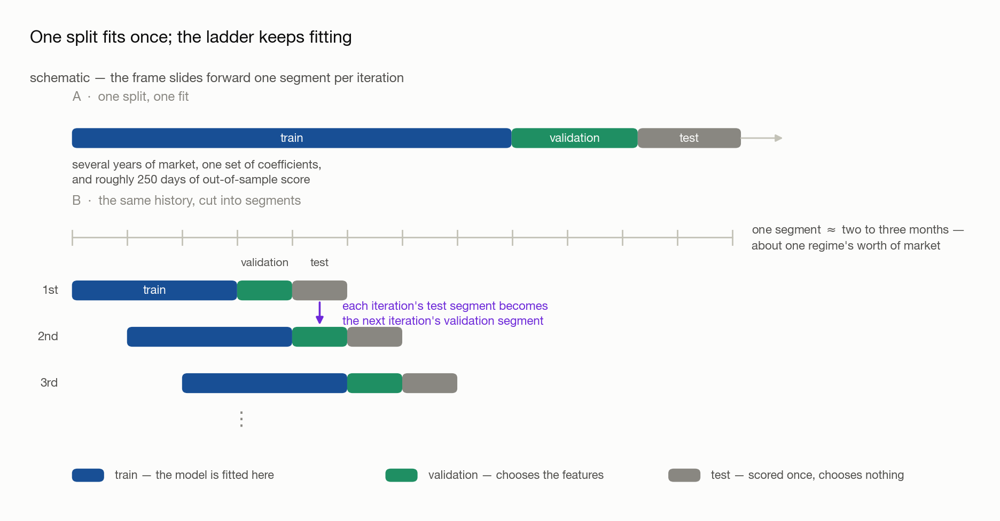
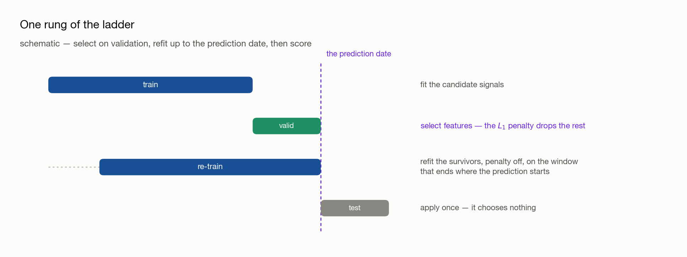
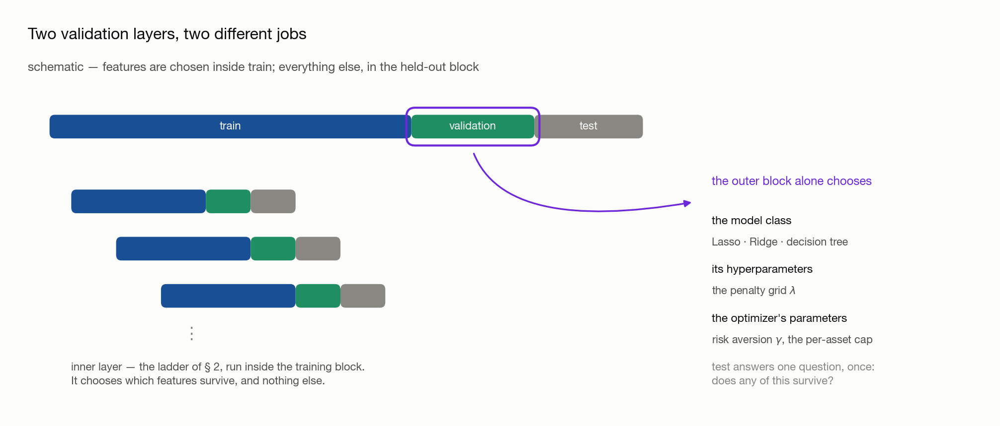
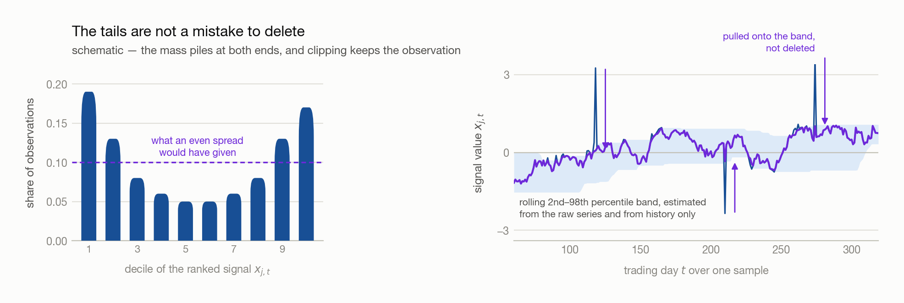
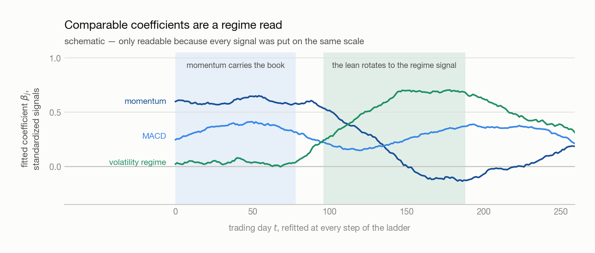

# 05 · Modelling

## 1. Why one split is not a backtest

### 1.1 The textbook split

**Definition (Split).** A *split* cuts the sample by date into three contiguous blocks:
**train**, on which coefficients are estimated; **validation**, on which choices between fitted
models are made; and **test**, which is scored once and never chosen on.

<picture>
  <source media="(prefers-color-scheme: dark)" srcset="../../figures/05_figures/split-vs-ladder-dark.png">
  
</picture>

The order matters and is not a convention: the blocks run forward in time, because a model that
was fitted on next year and scored on last year has learned something no live book could have
known.

### 1.2 What the single split costs

Three defects, and they compound.

| Defect                                                | What goes wrong                                                                                                                                                                                                                                                                                                                                                        |
| ----------------------------------------------------- | ---------------------------------------------------------------------------------------------------------------------------------------------------------------------------------------------------------------------------------------------------------------------------------------------------------------------------------------------------------------------- |
| **One fit discards time**                       | A single set of coefficients over several years asserts that those years were one market. Early in the pandemic the world locked down at once and nobody wanted oil; the consensus was that demand had permanently moved online. It had not — the economy reopened, and energy then flew on war. A coefficient estimated across both states describes neither.        |
| **Almost nothing is left to score**             | Give validation a year and test a year and validation is roughly 250 dates. A year is also too little market: the regimes it contains are whichever ones happened to fall inside it, so the split never asks what the strategy does when the regime turns. A maximum drawdown measured over one calm year is not a risk estimate.                                      |
| **The sample is small and the signal is faint** | A school dataset with a thousand points and an R² of 0.5 is ordinary, and in physics 0.9 is ordinary. In finance**0.1 to 0.2 is already a good R²** — see [09](../../09_ic_and_r_squared/09_ic_and_r_squared.md). Weak true dependence plus few observations is precisely the regime in which a fit lands on noise: a line through ten points drawn from a cloud reaches R² 0.8 easily. |

### 1.3 The fix that is not one

**Claim.** Duplicating the sample changes no coefficient, and inflates every t-statistic by roughly
$\sqrt{2}$.

**Proof.** Write the fit as $b = (X^{T} X)^{-1} X^{T} y$, with $X$ the $n \times p$ matrix of
signal values, $y$ the forward returns, and $b$ the estimated coefficients. Stacking the sample
twice gives $X_2^{T} X_2 = 2 X^{T} X$ and $X_2^{T} y_2 = 2 X^{T} y$, so

$$
b_2 = \left(2 X^{T} X\right)^{-1} 2 X^{T} y = b .
$$

The residuals repeat as well, so the residual sum of squares doubles while the degrees of freedom
go from $n - p$ to $2n - p$; for $n$ large the variance estimate $s^2$ is therefore essentially
unchanged. But the reported covariance is $s^2 (X_2^{T} X_2)^{-1} = s^2 (X^{T} X)^{-1} / 2$ —
halved. Standard errors fall by $\sqrt{2}$ and t-statistics rise by the same factor, on evidence
that never arrived.

**Note.** This is the standard interview question, and the reason it is asked is that people
reach for it. Manufacturing rows is overfitting with extra steps; the answer to too few
observations is to score more of the ones you have, which is § 2.

## 2. The walk-forward ladder

### 2.1 How long a segment should be

**Definition (Segment).** A *segment* is a short contiguous block of dates — here **two to three
months** — treated as one regime.

The length is set by how fast the market can change its mind, and the market is made of people.
Within a day a regime shift is implausible: individuals change their view constantly, the crowd
does not. Within a month, after a run of large news, one shift is plausible. Within a year or two
there is room for several, because that is enough time for the same participants to change their
minds repeatedly. So a segment must be short enough that one segment is approximately one regime,
and long enough to hold a usable sample.

### 2.2 The slide

Cut the history into segments $1, 2, 3, \ldots$ and slide a frame across them:

| Iteration | Train | Validation | Test |
| --------- | ----- | ---------- | ---- |
| 1         | 1–3  | 4          | 5    |
| 2         | 2–4  | 5          | 6    |
| 3         | 3–5  | 6          | 7    |

**Claim.** The ladder repairs all three defects of § 1.2 at once.

Each fit now sees one regime's worth of data and is re-estimated as the market moves on, so time
is no longer averaged away. Every segment past the first frame is eventually scored out of sample,
so the out-of-sample record grows with the length of the history instead of being fixed at one
year. And a regime shift that lands inside a validation segment is now a *test* the strategy has
to pass, rather than an event the single split happened to miss.

**Note.** Read the table down its two right columns: **each iteration's test segment is the next
iteration's validation segment.** Nothing is discarded between rungs, and no segment is ever
scored twice under the same coefficients.

### 2.3 One rung, in full

A rung is not a single fit. Train ends, a validation segment intervenes, and only then does test
begin — so a model fitted on train alone is asked to predict across a gap of market it has never
seen, and pays for it.

The repair is the two-step shape that Lasso already imposes. Lasso adds an $L_1$ penalty to the
least-squares objective,

$$
\min_{\beta} \quad \sum_t \left( y_t - \sum_j \beta_j x_{j,t} \right)^2 + \lambda \sum_j |\beta_j|
$$

where $y_t$ is the forward return on date $t$, $x_{j,t}$ signal $j$'s value on that date,
$\beta_j$ its coefficient, and $\lambda \geq 0$ the penalty strength. The penalty drives
coefficients exactly to zero, which makes it a **feature selector**; and because the surviving
coefficients are biased toward zero by that same penalty, the standard practice is to **refit**
the survivors without the penalty before predicting.

<picture>
  <source media="(prefers-color-scheme: dark)" srcset="../../figures/05_figures/fold-anatomy-dark.png">
  
</picture>

So each rung runs: **fit on train**, **select features on the validation segment**, **refit the
survivors on a window ending where the prediction starts**, **apply once to test**.

**Note (Two house styles).** The refit window is either the training window shifted forward, or
the training window plus the validation segment. The sample sizes differ little and both are used
in industry; it is a preference, not a correctness question. What is not optional is that the
window ends at the prediction date — see § 4.3.

## 3. Two validation layers

The validation *segment* inside each rung and the large held-out validation *block* at the end of
the history are different objects with different powers.

<picture>
  <source media="(prefers-color-scheme: dark)" srcset="../../figures/05_figures/outer-validation-dark.png">
  
</picture>

| Layer                                                      | May choose                                                                                                      | May not                                   |
| ---------------------------------------------------------- | --------------------------------------------------------------------------------------------------------------- | ----------------------------------------- |
| **Inner** — the validation segment inside each rung | which**features** survive, and the refit that follows                                                     | anything held constant across rungs       |
| **Outer** — the held-out validation block           | the**model class**, its **hyperparameters** ($\lambda$), and the **optimizer's parameters** | coefficients — those are fitted on train |
| **Test**                                             | nothing                                                                                                         | everything                                |

### 3.1 Why the inner layer cannot be skipped

Exploration already looked at which signals worked *in the training period*. Of course the fit
then describes that period well: momentum was selected partly because it was seen to work there.
That says nothing about whether it was useful going in, and the only way to find out is to select
on dates the selection did not see — which is what the validation segment is for.

**Note.** A signal's usefulness is not a constant either. When more signals enter the book, or
when one starts to fail, momentum should no longer carry the weight it carried alone. Because the
ladder re-selects at every rung, that adjustment happens on its own rather than being asserted
once.

### 3.2 What only the outer block may decide

$\lambda$ is not fitted, it is searched: run the ladder once per value on a grid — 0.1, 0.5, 0.7,
1 — and compare. The same is true of the model class itself (Lasso, Ridge, a decision tree). Both
comparisons need dates that no rung of the ladder consumed, which is exactly what the held-out
block is.

### 3.3 The optimizer's parameters

The prediction is not yet a portfolio. Weights come from a mean–variance problem: choose $w$ to

$$
\max_w \quad E[r_p] - \gamma \cdot \text{Var}[r_p]
$$

subject to constraints such as

$$
\sum_i w_i = 1.0 \qquad \sum_i |w_i| \leq 2.0 \qquad |w_i| \leq 0.20
$$

— net exposure 100 percent, gross exposure at most 200 percent, and no single asset above 20
percent — where $w_i$ is the weight on asset $i$, $E[r_p]$ and $\text{Var}[r_p]$ the portfolio's
expected return and variance, and $\gamma \geq 0$ the **risk-aversion coefficient**.

Two of these are free parameters, and neither can be reasoned to:

- **$\gamma$.** Nobody can say from first principles whether a risk appetite is 0.3, 0.5 or 1. The
  number has no interpretable units — it is a trade rate between two quantities measured in
  different things — so it is chosen by running the grid and reading the result.
- **The per-asset cap.** With 37 assets, a 20 percent cap may be too tight for the book to hold
  enough of whichever names are paying; 25 or 30 percent may be the right ceiling. Gross and net
  exposure, by contrast, are set by mandate and are not tuned.

**Note.** All of this tuning belongs in the **outer** block. Tuning $\gamma$ inside the rungs
would let a portfolio parameter be chosen on the same dates the features were chosen on, and the
held-out block would then be measuring a strategy that had already been fitted to it.

## 4. Preparing a signal for a model

Two transformations stand between a raw signal and a model, and both exist to stop the fit from
tracking things that are not the market.

### 4.1 Clipping: keep the observation, cap the value

**Claim.** A ranked signal does not fill its range evenly — the mass piles at both ends — and
those ends move the fit far more than their count suggests.

The first half is empirical: momentum in particular pins at an extreme whenever a name runs, so
the histogram is a barbell rather than a plateau. The second half is mechanical. In a
least-squares fit each observation's pull on the slope grows with its distance from the mean of
$x$, so a handful of far points can swing a coefficient that hundreds of central points barely
move. The coefficient then jumps for reasons that have nothing to do with the market.

<picture>
  <source media="(prefers-color-scheme: dark)" srcset="../../figures/05_figures/winsorize-band-dark.png">
  
</picture>

Deleting the far points, which is the textbook move, fails twice here:

- **The sample is already small.** Every deletion sharpens § 1.2's third defect, and in a messy
  sample it is not even clear which points are outliers.
- **The tail carries information.** What the book does when a signal goes extreme is exactly what
  the model should learn. Delete those dates and it never can.

**Definition (Winsorization).** Replacing any value outside a chosen quantile band by the nearer
edge of the band:

$$
x^{\text{clip}}_{j,t} = \min\left( \max\left( x_{j,t},  Q^{\text{lo}}_{j,t} \right),  Q^{\text{hi}}_{j,t} \right)
$$

where $Q^{\text{lo}}_{j,t}$ and $Q^{\text{hi}}_{j,t}$ are quantiles of signal $j$ over the
trailing $L$ dates — 1 and 99 percent, or 2.5 and 97.5 percent; there is no canonical pair.

**Note (Compare raw to raw).** The band for date $t$ must be estimated from the **unclipped**
history. Feed yesterday's capped value into today's quantile and the band walks inward on itself,
a little further every step. Keep the raw column and produce the clipped one beside it.

**Note (Why the band rolls).** A value that is extreme against the last three months may be
unremarkable six months later, once the market has moved to it. A fixed threshold pins such a
signal at the 99th percentile forever; a rolling one releases it as soon as the surrounding
distribution catches up.

→ `rolling`, `quantile` and `clip` as pandas calls: [08 · Toolbox](../../08_toolbox_pandas/08_toolbox_pandas.md).

### 4.2 Standardizing: put every signal on one scale

Momentum lives in roughly $[-0.05, 0.05]$. VIX lives in $[0, 100]$. Fit both and the coefficients
absorb the mismatch.

**Claim.** Coefficient magnitudes carry no information about a signal's importance until the
signals share a scale.

**Proof.** Replace $x_j$ by $c x_j$ for some $c > 0$. The fitted values are unchanged if
$\beta_j$ is replaced by $\beta_j / c$, and least squares chooses fitted values — so the fit is
identical and the coefficient is whatever the units make it. A comparison of $\beta$ magnitudes
across differently scaled signals is therefore a comparison of units.

The consequence is not merely aesthetic. Every input is an **estimate** and carries error: a
momentum measured from returns is the residue of participants entering and leaving, and a jump in
it is as likely to be noise as news. A large $\beta$ multiplies that noise into the prediction,
while the small $\beta$ on the wide-ranging signal cannot respond when it genuinely moves.

**Definition (Standardized signal).**

$$
z_{j,t} = \frac{x_{j,t} - \mu_j}{\sigma_j}
$$

with $\mu_j$ and $\sigma_j$ the mean and standard deviation of signal $j$ over the estimation
window. Dividing by a rolling standard deviation, or by a cross-sectional sum, are alternatives;
what matters is that **every signal is treated the same way**.

<picture>
  <source media="(prefers-color-scheme: dark)" srcset="../../figures/05_figures/beta-paths-dark.png">
  
</picture>

Three things follow, in increasing order of usefulness:

| Consequence                                | Why                                                                                                                                                                                                                                                |
| ------------------------------------------ | -------------------------------------------------------------------------------------------------------------------------------------------------------------------------------------------------------------------------------------------------- |
| Coefficients become comparable             | With units removed,$\beta_j$ measures response per standard deviation of signal — the same question for every signal.                                                                                                                           |
| The coefficient path becomes a regime read | Plot every$\beta_j$ from every rung on one axis. Momentum dominating one stretch and volatility another **is** the change in market sentiment, in a form you can look at.                                                                  |
| Errors partly cancel                       | On one scale, with comparable coefficients and errors that are close to independent across signals, the noise in the combined prediction averages down as signals are added, instead of being dominated by whichever signal has the largest units. |

### 4.3 Which mean and standard deviation you may use

$\mu_j$, $\sigma_j$ and the quantile band all have to be estimated from somewhere, and that choice
is where look-ahead enters.

The rule follows from **where the model is built**: at the *end* of the training window. Every
date inside that window is history at that moment, so standardizing with the whole training
window's mean and standard deviation is legitimate — even though, from the point of view of an
individual date early in the window, the statistic used to scale it was computed partly from its
own future.

| At this point of construction | These statistics are available                         |
| ----------------------------- | ------------------------------------------------------ |
| End of the training window    | the whole training window                              |
| End of the training window    | **never** the validation segment, and never test |
| End of a refit window         | the whole refit sample, validation segment included    |

**Note.** The distinction is between *a signal's* information set and *the model's*. A signal
computed on date $t$ may use only data up to $t$, because it has to be computable live. The model
is not computed on date $t$; it is computed once, at the end of its window, and then applied
forward. Confusing the two costs either a leak or an estimate worse than the one you were
entitled to.

**Note.** This is the failure worth being paranoid about. In a time series the smallest leak makes
the result beautiful, and the gap between a beautiful backtest and the live book is where the
money goes.

## Appendix · Notation

Throughout, $t$ is the date, $i$ indexes assets and $j$ indexes signals.

| Symbol                                              | Means                                                                                                                                   | First used             |
| --------------------------------------------------- | --------------------------------------------------------------------------------------------------------------------------------------- | ---------------------- |
| $x_{j,t}$, $x^{\text{clip}}_{j,t}$, $z_{j,t}$ | signal$j$ on date $t$: raw, after clipping, after standardizing                                                                     | § 2.3, § 4.1, § 4.2 |
| $y_t$, $\beta_j$                                | the forward return being predicted, and the coefficient the fit puts on signal$j$                                                     | § 2.3                 |
| $X$, $y$, $b$, $n$, $p$, $s^2$          | the design matrix, the response, the estimated coefficients, the number of dates, the number of signals, the residual variance estimate | § 1.3                 |
| $\lambda$                                         | the$L_1$ penalty strength — searched on a grid, not fitted                                                                           | § 2.3                 |
| $L$                                               | the trailing window, in dates, that the clip band is estimated over                                                                     | § 4.1                 |
| $Q^{\text{lo}}_{j,t}$, $Q^{\text{hi}}_{j,t}$    | the low and high quantiles of that window                                                                                               | § 4.1                 |
| $\mu_j$, $\sigma_j$                             | the mean and standard deviation used to standardize signal$j$                                                                         | § 4.2                 |
| $w_i$, $\gamma$, $E[r_p]$                     | the portfolio weight on asset$i$, the risk-aversion coefficient, and the portfolio's expected return                                  | § 3.3                 |

**Note (Collisions to watch).** $\sigma_j$ here is one **signal's** dispersion, used only to
rescale it — not [02 § 4](../../02_testing_a_signal/02_testing_a_signal.md)'s $\sigma_{s,t}$, an asset's trailing
volatility, and not [04 § 1.1](../../04_volatility_regimes/04_volatility_regimes.md)'s $\sigma$, the amplitude of the tape.
$\beta_j$ is a coefficient on a **signal**, as in [04 § 3.2](../../04_volatility_regimes/04_volatility_regimes.md), never a
market beta. $\lambda$ is the penalty and $\gamma$ the risk aversion: the lecture wrote both as
$\lambda$ and then renamed the second, and they are unrelated. $L$ is a trailing window as in
[04 § 2.1](../../04_volatility_regimes/04_volatility_regimes.md), here over a signal rather than over returns.

## Common pitfalls

| Belief                                                        | Correction                                                                                                                                  |
| ------------------------------------------------------------- | ------------------------------------------------------------------------------------------------------------------------------------------- |
| "More rows will fix the small sample."                        | Duplicating them changes no coefficient and shrinks the standard errors by$\sqrt{2}$ — § 1.3. Score more of the dates you have instead. |
| "Outliers are contamination; drop them."                      | They are the dates you most want the model to have seen. Clip them onto a rolling band — § 4.1.                                           |
| "Clip against the series I am building."                      | The band must come from the raw history, or it walks inward on itself — § 4.1.                                                            |
| "Standardizing with the whole training window is look-ahead." | The model is constructed at the end of that window, so the window is history to it. Using the*validation* segment is the leak — § 4.3.  |
| "The validation block is a second test set."                  | It chooses the model class,$\lambda$, $\gamma$ and the cap. Everything it chooses on, it has been fitted to.                            |
| "A bigger$\beta$ means a more important signal."            | Only after § 4.2. Before it,$\beta$ is a statement about units.                                                                          |

## Open questions

- **Rolling or expanding train?** The ladder above drops the oldest segment each step. Keeping it
  gives more data at the cost of holding on to regimes that have gone.
- **How long is a segment, really?** Two to three months is asserted from how fast a crowd changes
  its mind, not measured. It could be estimated — from how quickly fitted coefficients decay.
- **Does $\gamma$ survive?** It is tuned on the outer block. Nothing yet says a risk appetite
  chosen in one regime is the right one in the next.

---

## Next → [Backtest Prototype — Implementation Notes](../../Backtest_prototype/Backtests.md)

Before moving on, **build the ladder end to end and put the simplest possible model in it**: cut
the sample into 63-day segments, run three-train / one-validation / one-test frames forward, clip
and standardize every signal inside each rung, and fit one Lasso. Report, per rung, how many
features survived and what the test IC was — then plot every $\beta_j$ against time, which is § 4.2's
figure drawn from your own numbers rather than from an illustration. Choose $\lambda$, $\gamma$
and the cap only after that runs.

Expect the result to be weak. A single public signal that was strongly significant would be a
signal nobody else had, which is not the situation — see the lecture note below for why that is
the correct outcome rather than a bug.

→ The lecture this chapter is drawn from, including the market history behind it:
[Walk-Forward Modelling, Winsorization, and Standardization](../../market_knowledge/walk-forward-modelling.md).

You should be able to explain:

- [ ] Why a single split ignores time, and why one year of validation is not a risk estimate
- [ ] What duplicating the sample does to the coefficients and to their standard errors
- [ ] Why each rung's test segment is the next rung's validation segment
- [ ] Which decisions belong to the validation segment, which to the held-out block, and which to neither
- [ ] Why an outlier is clipped rather than deleted, and why the band is computed from the raw series
- [ ] Why coefficients are meaningless across signals of different scale, and what the coefficient paths show once they are not

[← 04](../../04_volatility_regimes/04_volatility_regimes.md) · [How a Strategy Is Built](../../00_pipeline/00_pipeline.md) · reference: [08 · Toolbox](../../08_toolbox_pandas/08_toolbox_pandas.md)
