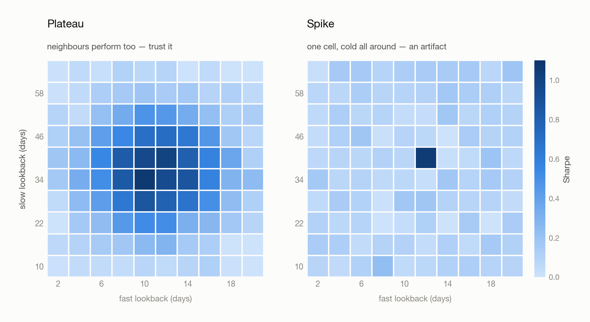

# Lecture 02 · Reversal, Portfolio Weights, and Combining Horizons

> **Source:** Zoom recording "20260705 量化小班课" · 主讲 Andy · ~58 min
> **Standalone class summary.** This file records what the session covered, in the order it
> was covered. The concepts are developed properly in the numbered chapters — see the map below.

| Topic here | Developed in |
|---|---|
| Horizon assumptions, reversal, fast/slow combination, EWMA, smoothing | [03 · Building Your Own Signal](03-building-signals.md) §§ 2, 5, 8, 9, 10 |
| Signal → portfolio weights | [04 · From Signal to Position](04-from-signal-to-position.md) |
| Losing the time dimension in a single statistic | [06 · Evaluating Performance](06-evaluating-performance.md) § 1 |
| Grid search, heat maps, empirical parameters | [07 · Overfitting & Robustness](07-overfitting-and-robustness.md) § 4 |
| Assignment | [Backtest_prototype/Backtests.md](../Backtest_prototype/Backtests.md) § Next Steps |

---

## 1. Signal horizons: the frequency-band assumption

If a signal works at the **yearly** horizon, the working assumption is that it also works at
neighbouring **monthly / quarterly** horizons — a long trend is built out of shorter fluctuations
accumulating in the same direction.

So when a horizon test does **not** produce the expected low-to-high monotone ordering, the first
move is **not** to reject the signal. Go back and re-read the assumptions in the source paper —
universe, period, skip, weighting. Most "this signal doesn't work" results are really "I
implemented a different signal than the one that was tested."

## 2. Reversal, and the whiteboard

<picture>
  <source media="(prefers-color-scheme: dark)" srcset="figures/reversal-buckets-dark.png">
  
</picture>

The two bar groups on the board are bucket charts — samples sorted by signal, cut into groups
(e.g. quintiles), each group's mean return plotted. The expected result is a monotone staircase.
**What actually appears is a break at the bottom bucket: the biggest losers do not keep losing,
they bounce.** That is **reversal**, and it shows up more strongly the higher the data frequency —
at fine resolution prices zigzag (锯齿状涨跌) rather than trend.

**The standard fix, and the argument about it.** AQR's convention is to skip the most recent month
when computing momentum, reasoning that a trend must *form* before it is tradeable. The board's
heading is a caution against copying that blindly ("并不是直接沿用 AQR 第一个月会 reverse"). AQR has
drawn considerable pushback for over-committing to that idea — because **momentum money and
reversal money are both money**, and the reasonable position is to try to earn both.

**Make the skip empirical.** The fix is a `shift` on the signal, but its size is something you
determine by experiment, not inherit: 1 day? 1 week? 1 month? Run the bucket chart at each and
watch what happens to the bottom group.

**The board's other annotation — `risk-adjusted MOM → rolling quantile`.** That is the recipe for
a broken bucket chart: standardize the signal so values are comparable across regimes and assets,
then bucket by **rolling historical quantile** rather than by raw value.

## 3. Signal → portfolio weights

Normalize the sorted signal and map it directly onto position size.

Worked constraint from the session: **long leg 150%, short leg 50%** — net exposure 100%, gross
exposure 200%. Getting there is two steps:

1. **Demean** the signal cross-sectionally, so positive values become the long side and negative
   the short side.
2. **Scale proportionally** to hit the exposure target.

The resulting weights go straight into the existing backtest framework — nothing downstream
changes, only the allocation rule.

## 4. Averaging across time throws away the regime

A single headline statistic is an average over the whole sample, and averaging across time
destroys the information you most need: **which market regime the strategy was working in.**

So plot the **performance curve** and look at *where* it failed, then tie each failure to what the
market was doing — a liquidity shock, an extreme-volatility episode, a regime break. The point is
to explain *why* it broke.

**What not to do: drop the offending asset.** Finding the ticker responsible for the worst
drawdown and excluding it improves every statistic, but it is fitting to the sample — and it does
not transfer to practice, because a real asset-management product cannot arbitrarily exclude
holdings from its stated universe.

## 5. Combining a slow and a fast momentum (a MACD-style pairing)

Use a **fast** momentum to time the turns in a **slow** one, giving an earlier entry/exit than the
slow signal alone — structurally what MACD does.

- **Ratio:** slow:fast is conventionally about **2:1** (MACD's 26:12 is the familiar case), but the
  actual pairing has to be found by **grid search**, read as a **heat map**.
- **Where it pays:** best in **commodities**, where supply-and-demand cycles drive long, persistent
  trends (large capacity, more continuous trends). **Equities** second. **Bonds** weakest — the most
  heavily arbitraged, so deviations get closed fastest.

## 6. EWMA — exponentially weighted moving average

To make the signal more responsive to recent prices, replace the simple moving average with an
EWMA. The **half-life** (e.g. 1/2, 1/3, 1/5, 1/8 of the lookback) is found by grid search.

The reasoning is the same as MACD's 9-day signal line: these are **empirical solutions**
(经验解) — values that happened to work on historical backtests. That carries no guarantee about
the future.

## 7. Volatility clustering and smoothing

Fast momentum is easily disturbed by short-lived noise, causing frequent long/short flips that eat
the return in transaction costs.

The fix is to **smooth** the fast signal, filtering out the shortest cycles. **Constraint:** the
smoothing window must be **shorter than the original signal's period** — smooth with a long window
and you have not denoised it, you have built another slow momentum signal.

## 8. Where this goes next

A possible **volatility forecasting** model, to filter market noise further and improve the
combined portfolio's performance.

## 9. Assignment

<picture>
  <source media="(prefers-color-scheme: dark)" srcset="figures/param-heatmap-dark.png">
  
</picture>

1. Plot the new portfolio's performance using the **risk-adjusted + rolling-quantile** bucketing.
2. Add the **MACD-style fast momentum** factor to the grid search.
3. Apply a **smoother** to the fast momentum.
4. Reuse the pipeline already built — feed the new signal in and produce the corresponding charts.
